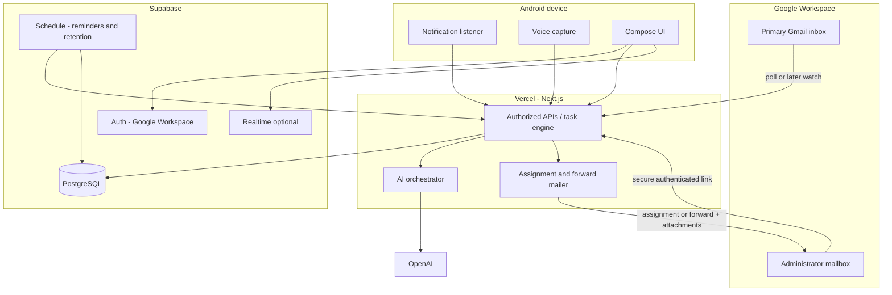

# Architecture

Governed by [PROJECT_CONSTITUTION.md](PROJECT_CONSTITUTION.md) and [AI_CONSTITUTION.md](AI_CONSTITUTION.md). Terms: [GLOSSARY.md](GLOSSARY.md). Binding choices: [DECISIONS.md](DECISIONS.md).

## Architecture summary

Version one is a private, Android-first system with a thin Next.js backend on Vercel, Supabase PostgreSQL as the system of record, Prisma used only through authorized server APIs, Gmail API for inbox ingest and assignment forwarding, and OpenAI for structured extraction and transcription.

**Design posture:** AI recommends; humans approve; reminders and retention are deterministic and auditable. Temporary communication content is minimized and deleted on schedule. Durable learning excludes raw message bodies. Android notification and call capture are best-effort with mandatory manual/voice fallbacks.

**Not in this repository yet:** application shells, dependencies, schemas applied to a live database, or connected external services. This document records the intended architecture for later milestones.

## Component responsibilities

| Component         | Responsibility                                                                                                             |
| ----------------- | -------------------------------------------------------------------------------------------------------------------------- |
| Android app       | Notification capture, call prompts, voice recording, suggestion review, task actions, secure credential storage            |
| Next.js web + API | Auth callbacks, authorized APIs, minimal admin task pages, Gmail poll workers (Pub/Sub deferred), AI orchestration, mailer |
| Supabase Postgres | Durable and temporary operational data                                                                                     |
| Supabase Auth     | Google Workspace sign-in                                                                                                   |
| Supabase Realtime | Optional live updates to Android/web when online                                                                           |
| Prisma            | Server-side data access only (never as a substitute for app authorization)                                                 |
| Gmail API         | Read minimal inbox content; send assignment emails; forward originals with attachments                                     |
| OpenAI            | Relevance filter, structured summarization/recommendations, transcription, outcome structuring                             |
| Reminder engine   | Deterministic schedule, idempotent attempts, escalation                                                                    |
| Retention worker  | 7-day excerpt purge, 30-day task content scrub, immediate audio deletion                                                   |
| Learning profile  | Preferences, proposed rules, anonymized signals                                                                            |

## Recommended monorepo strategy (future scaffolding)

A single Git repository (this project) should later contain:

- `apps/android` — Kotlin + Jetpack Compose
- `apps/web` — Next.js + TypeScript
- `packages/contracts` — canonical **OpenAPI** specification (source of truth)
- `packages/db` — Prisma schema and client (server use)
- `packages/domain` — state machine, retention, reminder policy
- `packages/ai` — prompt versions and validators

**Do not** share Zod types directly with Kotlin. Generate TypeScript and Kotlin models/clients from OpenAPI. JSON Schema may be generated from OpenAPI where useful; it is **not** the source of truth. Contract tests belong in CI.

Neon is **not** used in version one while Supabase provides Postgres.

## Android architecture direction

- Kotlin, Jetpack Compose, feature modules (capture, suggestions, tasks, voice, auth, settings)—modules appear in later milestones; A1 is a single `:app` shell only.
- **Minimum SDK:** Android 12 / API **31** (`minSdk = 31`) (D040).
- **Primary device for optimization and validation:** Samsung Galaxy S24+ (D040). Dialer app for call-notification parsing remains OPEN #1.
- **Application id / namespace (A1):** `com.aicommunication.assistant` (neutral; derived from product working title).
- Distribution: private sideload / internal testing only (D019, D040)—no Play Store in v1.
- `NotificationListenerService` for Google Messages and call-related notifications (later milestones).
- Local outbox (Room or equivalent) for offline event/action queues (later).
- Encrypted storage for tokens (Android Keystore / EncryptedSharedPreferences) (later).
- Android does **not** write core business records directly to Supabase tables; it calls authorized server APIs.
- FCM deferred unless core workflow proves insufficient (email + pull/Realtime first).

## Web and backend direction

- Next.js (App Router) with TypeScript on Vercel.
- Authenticated routes for primary and administrator.
- Minimal task view at secure task URLs (authenticated).
- Internal authenticated endpoints for scheduled reminder and retention work.
- Server-side Zod validation where useful, aligned with the canonical contract.

## Gmail architecture

- Connect **one** primary Workspace inbox via OAuth; store tokens encrypted server-side.
- **Polling-first** is an acceptable initial approach; Pub/Sub watch deferred pending confirmation (see [OPEN_QUESTIONS.md](OPEN_QUESTIONS.md) and [DECISIONS.md](DECISIONS.md)).
- Fetch minimum thread/message content for AI; avoid attachment bodies in app storage for v1 ingest.
- On approved administrator assignment for Gmail-origin tasks: **forward** the original message (summary above) including **all attachments** via Gmail API; record forwarded message id; prevent duplicate forwards.
- Outbound assignment and reminder mail also use the connected Gmail account.
- Schema supports future multiple `CommunicationAccount` rows without implementing them in v1.

## AI pipeline

Separate jobs (cost-tiered):

1. Cheap relevance filtering (plus heuristic prefilters for newsletters, OTP patterns, bulk mail).
2. Task extraction and point-form summarization with typed point kinds (fact / inference / missing / risk / etc.).
3. Recommendations: assignee, priority, due date, follow-up timing.
4. Transcription (OpenAI).
5. Completion-outcome structuring.
6. Periodic learning-rule _suggestions_ (human approve).

Strict JSON schemas, prompt versioning, confidence metadata, retries with quarantine on persistent invalid output. Recommendations never silently become tasks, assignments, or emails.

## Task engine

- Suggestions and tasks are distinct entities.
- Persisted statuses plus derived UI labels (`due soon`, `overdue`).
- Actions: approve, edit, dismiss, merge, assign, complete, waiting, snooze, notes, voice, follow-up; administrator may also return to primary and request clarification (D039).
- Assignment email / Gmail forward: one Primary User confirmation for the bundled business action (D037).
- Voice never creates a Task directly; voice yields proposals / Task Suggestions requiring approval (D038).

## Reminder engine

- Deterministic policies by task type and urgency; timezone `America/Vancouver`.
- Idempotent `ReminderAttempt` records.
- First overdue → administrator only; later overdue may CC primary (configurable threshold).
- Waiting pauses; snooze recalculates; completion stops; duplicates prevented.

## Retention worker

- Schedules purge dates on events and tasks.
- Deletes temporary excerpts 7 days after complete/dismiss.
- Scrubs completed task content after 30 days of visibility; preserves minimal audit metadata.
- Deletes raw audio immediately after successful transcription and validation.
- Does **not** delete forwarded messages in Gmail mailboxes.

## Learning profile

- Durable preferences and approved rules.
- Proposed rules from patterns (e.g., repeated admin assignments).
- Anonymized signals and evaluation metadata without raw bodies.

## Authentication and authorization boundary

- Supabase Auth with Google Workspace; same-organization administrator.
- Roles: primary and administrator (org membership).
- **Prisma server operations do not inherit the end-user’s Supabase RLS context.**
- Authenticated server APIs must enforce organization and role checks explicitly.
- RLS is defence in depth and for explicitly designed direct-client/Realtime paths—not a vague substitute for application authorization.

## Canonical API contract strategy

1. Author **OpenAPI** as the sole source of truth (D007).
2. Generate TypeScript types/client from OpenAPI.
3. Generate Kotlin models/client from OpenAPI.
4. Optionally generate JSON Schema from OpenAPI where tools benefit; never treat JSON Schema as authoritative over OpenAPI.
5. Validate on server (Zod where useful), aligned with the OpenAPI contract.
6. Contract tests in CI.

Do not claim Kotlin shares Zod or TypeScript types directly.

## Service-selection rationale

| Need                          | Choice                                                             | Rationale                                                      |
| ----------------------------- | ------------------------------------------------------------------ | -------------------------------------------------------------- |
| DB + auth + optional realtime | Supabase                                                           | One low-cost platform; avoid Neon duplication                  |
| Hosting                       | Vercel                                                             | Fits Next.js                                                   |
| ORM                           | Prisma on server                                                   | Type-safe server access                                        |
| Email                         | Gmail API                                                          | Uses existing Workspace; enables true forward-with-attachments |
| AI / STT                      | OpenAI                                                             | Structured extraction + transcription                          |
| Scheduler                     | Supabase-supported scheduling or documented low-cost cron into API | Avoid heavy job platforms                                      |
| Push                          | Deferred                                                           | Reduce vendor sprawl                                           |

## Architecture diagram

## Known technical limitations

- Google Messages notification bodies may be incomplete, redacted, or unavailable.
- Notification access can be revoked by the user or OEM policy.
- OEM battery optimizations may kill background listeners.
- Missed-call detection is expected but device-dependent.
- Completed-call detection via notifications is **not guaranteed**.
- Gmail forward may fail for size or policy limits on attachments (behaviour unresolved—see open questions).
- Application retention does not control Gmail mailbox copies after forwarding.

## Failure and fallback principles

1. Prefer degrade to manual/voice capture over silent data loss.
2. Queue and retry transient AI, Gmail, and network failures with audit.
3. Never send assignment or forward without recorded primary approval.
4. Idempotency keys for forwards, reminders, and event ingest.
5. Surface reauth and notification-permission health in the Android UI.
6. Quarantine invalid AI output for human review rather than guessing.
