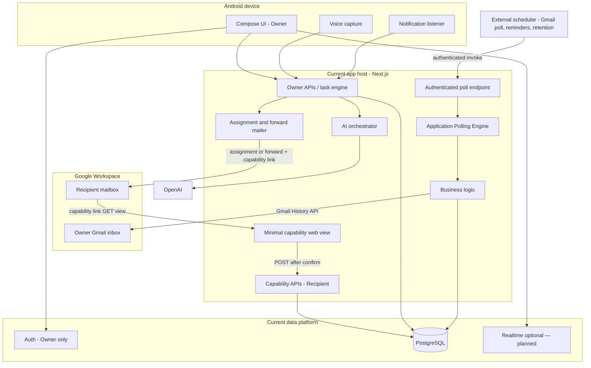

# Architecture

Governed by [PROJECT_CONSTITUTION.md](PROJECT_CONSTITUTION.md). Terms: [GLOSSARY.md](GLOSSARY.md). Decisions: [DECISIONS.md](DECISIONS.md). AuthZ details: [SECURITY_AND_PRIVACY.md](SECURITY_AND_PRIVACY.md). States: [STATE_MACHINE.md](STATE_MACHINE.md).

## Architecture Principles

[PROJECT_CONSTITUTION.md](PROJECT_CONSTITUTION.md) is the authoritative source for the complete Architecture Principles. D079 records them as binding for hosting, schedulers, storage, messaging, cloud services, and other infrastructure decisions.

Operational summary: keep business logic in the application; use vendor-neutral, modular infrastructure adapters; prefer low recurring cost and free tiers only when security, reliability, maintainability, and performance remain acceptable; keep designs simple and validate performance claims rather than adding unnecessary platforms.

**Gmail polling (A5) exemplifies these principles:** the application owns the Application Polling Engine (sync, History ingestion, eligibility, locks, audit). Scheduling is intentionally external. Any External Scheduler that securely invokes the Authenticated Endpoint every five minutes (D065) is acceptable. The recommended initial Infrastructure Adapter while on Vercel Hobby is **cron-job.org**; Vercel Cron, GitHub Actions, Google Cloud Scheduler, AWS EventBridge, and other compatible schedulers remain fully interchangeable. No scheduler is an architectural dependency (D079). External scheduling keeps the app portable across hosting providers.

## System shape

Private Android-first product with Next.js on Vercel, Supabase PostgreSQL, Prisma on authorized servers only, Gmail API for inbox and forwarding, OpenAI for extraction/transcription. Current hosting choices are deployment defaults, not hard-wired business architecture (D079).

**Core chain:** Owner → Task → Assignment → Capability → Capability Link → Recipient action.

Assignment binds a Task to a Recipient. A Capability is the authorization grant for that assignment. A Capability Link delivers the bearer credential. Possession of the link authorizes scoped actions; it does not authenticate a person.

## Implemented through A4 (production-verified)

The following are **implemented** in the repository and included in production verification (`A4_FULL_E2E_PASS`):

- Owner Google Workspace authentication (Supabase Auth; single Owner)
- Owner session API (`GET /api/v1/session`)
- Owner task HTTP (create, list, get, lifecycle mutations, snooze, dismiss, capability issuance)
- Task persistence (`@aicaa/db` / Prisma on Supabase Postgres)
- Recipient capability HTTP and non-mutating `GET /c/[token]` page
- Recipient POST actions with explicit confirmation
- Audit trail for Owner and capability actions (D057)
- Vercel-hosted Next.js runtime with traced `@aicaa/db` / Prisma packaging

Deployment and smoke checks: [DEPLOYMENT.md](DEPLOYMENT.md). HTTP status by route: [API_CONTRACT.md](API_CONTRACT.md).

## Implemented through A5.5 (repository; not production-operational)

The following are implemented in the repository through A5.5 but are not deployed/configured as an operational production Gmail integration. The A5 Prisma migration remains unapplied to production, live Gmail credentials are not configured, and scheduler secrets are not configured:

- Gmail account connection and polling (A5)
- Communication event ingestion tables and Application Polling Engine (A5)
- Owner Gmail OAuth connection routes (A5.3)
- Manual Gmail sync, History ingestion, safe sync-run listing (A5.4)
- Authenticated internal poll endpoint for External Schedulers (A5.5)

## Planned for A6 and later (target architecture)

The following remain **planned future scope**—described here and in [WORKFLOWS.md](WORKFLOWS.md), outside the current repository implementation:

- AI relevance filtering and task suggestion HTTP (A6)
- Gmail assignment email and forward-with-attachments (A7)
- Reminder and retention workers; optional Supabase Realtime
- Future `CommunicationAccount` schema (multiple inboxes later; v1 targets one)
- Android Owner task UI, Messages/call capture, voice, learning (A9–A14)

Do not delete this target architecture; label it accurately when implementing.

## Package layout

| Path                                                    | Responsibility                                                                                                               |
| ------------------------------------------------------- | ---------------------------------------------------------------------------------------------------------------------------- |
| `apps/android`                                          | Kotlin + Jetpack Compose Owner UX (auth/task UI in later milestones; A1 shell + A2 api-contract module exist)                |
| `apps/web`                                              | Next.js App Router: Owner session APIs; Owner task HTTP; capability runtime; Recipient capability APIs and `/c/[token]` page |
| `packages/contracts`                                    | Canonical OpenAPI 3.1; generated TypeScript and Kotlin DTOs (D007)                                                           |
| `packages/domain`                                       | Pure TypeScript state machines, policies, retention helpers—no I/O                                                           |
| `packages/db`                                           | Prisma schema, migrations, repositories, transactions (server-only; D006, D062)                                              |
| `packages/eslint-config` / `packages/typescript-config` | Shared tooling                                                                                                               |
| `packages/ai` / `packages/ui`                           | Deferred                                                                                                                     |

Do not share Zod types with Kotlin. Generate clients from OpenAPI. Neon is not used in v1 (D005).

## Component map

| Component                    | Responsibility                                                                                              |
| ---------------------------- | ----------------------------------------------------------------------------------------------------------- |
| Android app                  | Capture, voice, Owner task UI (later); Owner session credentials only                                       |
| Next.js                      | Owner auth, Owner APIs, capability runtime, Recipient capability routes/pages, mailer, workers              |
| Supabase Auth                | Google Workspace sign-in for the **Owner only** (D048)                                                      |
| Supabase Postgres            | System of record                                                                                            |
| Prisma                       | Server data access only                                                                                     |
| Gmail API                    | Ingest, assignment mail, forward-with-attachments                                                           |
| OpenAI                       | Structured extraction and transcription                                                                     |
| Reminder / retention workers | Deterministic schedules and purge (later milestones); engines in-app, invoked by External Schedulers (D079) |

## Platform directions

**Android:** `minSdk` 31; application id `com.aicommunication.assistant`; private sideload (D019, D040). Device target Galaxy S24+; dialer parsing OPEN #1. Does not write core business rows directly to Supabase—calls Owner session APIs. FCM deferred (D017).

**Web:** Owner-authenticated routes for Owner APIs (D048). Recipient mutations use `/api/v1/capabilities/{token}/…` (D059). Browser view `GET /c/[token]` is non-mutating. Capability secrets: hash at rest; one-time raw reveal to Owner (D063); seven-day default TTL with persisted `expiresAt` (D055); multi-use until invalidation (D056). Persistence: `@aicaa/db`. Dismiss, not physical delete (D064).

**Gmail (A5):** One Owner inbox per organization; poll every five minutes (D065); polling-only in A5 (D066). Inbox-only ingestion (D068); Workspace-domain mailbox gate (D069); `gmail.readonly` only (D070). Persistence models (`CommunicationAccount`, encrypted credential ciphertext, `CommunicationEvent`, temporary excerpts, `GmailSyncRun`, short-lived `GmailOAuthState` with `stateHash` + encrypted PKCE) are implemented in the repository. **A5.3 implements OAuth connection routes** (status, POST start, callback, disconnect) with purpose-bound AES-256-GCM encryption. **A5.4 implements the Application Polling Engine** (manual sync + History ingestion + CommunicationEvent/excerpt persistence (D078 ingest `purgeAt`) + leave-Inbox excerpt purge + sync-run listing). **A5.5 exposes authenticated internal poll** (`GET|POST /api/v1/internal/gmail/poll` with `CRON_SECRET`, system actor D074) that reuses the A5.4 engine (`trigger=cron`). An **External Scheduler** invokes that endpoint every five minutes; the recommended initial adapter is **cron-job.org** (Vercel Hobby), replaceable by Vercel Cron or other compatible schedulers without application logic changes (D079). Production migration, live Gmail credentials, and scheduler secrets remain unconfigured. UI remains pending. A5 creates communication events only — not suggestions (D077). On approved Gmail-origin assignment (A7): forward original with attachments after single confirmation (D037).

**AI:** Tiered jobs (relevance → extract → recommend → transcribe → outcomes → learning suggestions). Recommendations never silently become tasks, assignments, or emails. Learning Owner-only (D054).

**Reminders:** Deterministic policies; timezone `America/Vancouver` (D034); first overdue → Recipient; later may CC Owner; waiting pauses; snooze recalculates; completion stops.

**Retention:** 7-day excerpts; 30-day completed visibility scrub; immediate audio delete on success; does not delete Gmail mailbox copies (D031). Details: [DATA_RETENTION.md](DATA_RETENTION.md).

## Contract strategy

1. Author OpenAPI (D007).
2. Generate TypeScript and Kotlin from OpenAPI.
3. Optionally derive JSON Schema; never treat it as source of truth.
4. Server validation aligned with OpenAPI; CI drift checks.

## Auth boundary (summary)

| Party     | Mechanism                                         |
| --------- | ------------------------------------------------- |
| Owner     | Supabase session (authentication)                 |
| Recipient | Capability token (authorization only; no account) |

Full rules: [SECURITY_AND_PRIVACY.md](SECURITY_AND_PRIVACY.md).

## Diagram

## Known limitations

- Messages notification bodies may be incomplete or unavailable.
- Call capture is best-effort and device-dependent.
- Gmail forward may fail for size/policy (OPEN #9).
- Application retention does not control Gmail copies after forward.
- Capability link possession equals authorization (misuse risk; D051). Re-forward invalidation: OPEN #21.

## Failure principles

1. Degrade to manual/voice rather than silent loss.
2. Retry transient failures with audit.
3. Never assign or forward without recorded Owner approval.
4. Idempotency for forwards, reminders, and ingest.
5. Quarantine invalid AI output; do not guess.
