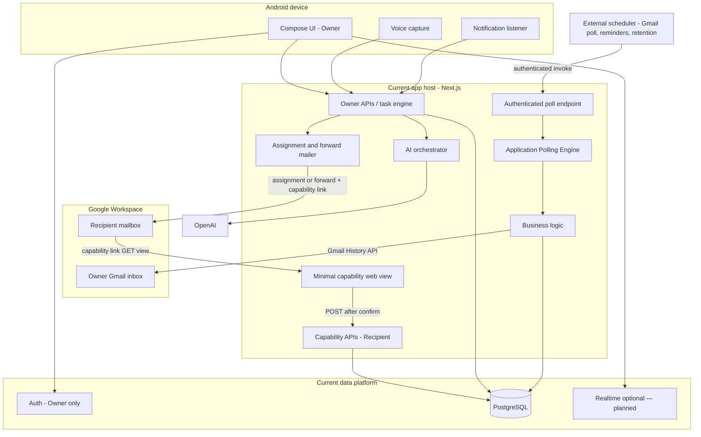

# Architecture

Governed by [PROJECT_CONSTITUTION.md](PROJECT_CONSTITUTION.md). Terms: [GLOSSARY.md](GLOSSARY.md). Decisions: [DECISIONS.md](DECISIONS.md). AuthZ details: [SECURITY_AND_PRIVACY.md](SECURITY_AND_PRIVACY.md). States: [STATE_MACHINE.md](STATE_MACHINE.md).

## Architecture Principles

[PROJECT_CONSTITUTION.md](PROJECT_CONSTITUTION.md) is the authoritative source for the complete Architecture Principles. D079 records them as binding for hosting, schedulers, storage, messaging, cloud services, and other infrastructure decisions.

Operational summary: keep business logic in the application; use vendor-neutral, modular infrastructure adapters; prefer low recurring cost and free tiers only when security, reliability, maintainability, and performance remain acceptable; keep designs simple and validate performance claims rather than adding unnecessary platforms.

**Gmail polling (A5) exemplifies these principles:** the application owns the Application Polling Engine (sync, History ingestion, eligibility, locks, audit). Scheduling is intentionally external. Any External Scheduler that securely invokes the Authenticated Endpoint every five minutes (D065) is acceptable. The recommended initial Infrastructure Adapter while on Vercel Hobby is **cron-job.org**; Vercel Cron, GitHub Actions, Google Cloud Scheduler, AWS EventBridge, and other compatible schedulers remain fully interchangeable. No scheduler is an architectural dependency (D079). External scheduling keeps the app portable across hosting providers.

## System shape

Private Android-first product with Next.js on Vercel, Supabase PostgreSQL, Prisma on authorized servers only, Gmail API for inbox and forwarding, OpenAI for extraction/transcription. Current hosting choices are deployment defaults, not hard-wired business architecture (D079).

**Core chain:** Owner → Task → Assignment → Capability → Capability Link → Recipient action.

Assignment binds a Task to a Recipient. A Capability is the authorization grant for that assignment. A Capability Link delivers the bearer credential. Possession of the link authorizes scoped actions; it does not authenticate a person.

## Implemented through A4 (production-verified)

The following are **implemented** in the repository and included in production verification (`A4_FULL_E2E_PASS`):

- Owner Google Workspace authentication (Supabase Auth; single Owner)
- Owner session API (`GET /api/v1/session`)
- Owner task HTTP (create, list, get, lifecycle mutations, snooze, dismiss, capability issuance)
- Task persistence (`@aicaa/db` / Prisma on Supabase Postgres)
- Recipient capability HTTP and non-mutating `GET /c/[token]` page
- Recipient POST actions with explicit confirmation
- Audit trail for Owner and capability actions (D057)
- Vercel-hosted Next.js runtime with traced `@aicaa/db` / Prisma packaging

Deployment and smoke checks: [DEPLOYMENT.md](DEPLOYMENT.md). HTTP status by route: [API_CONTRACT.md](API_CONTRACT.md).

## Implemented through A6 (production-operational; A5 and A6 closed)

The following are **implemented** and **production-operational**. A5 and A6 are closed except for future bug fixes. Gmail settings UI and History recovery remain deferred and do not block A7:

- Gmail account connection and polling (A5)
- Communication event ingestion tables and Application Polling Engine (A5)
- Owner Gmail OAuth connection routes (A5.3) with encrypted tokens
- Manual Gmail sync, History ingestion (seed + incremental), safe sync-run listing (A5.4)
- Authenticated internal Gmail poll endpoint for External Schedulers (A5.5); cron-job.org every five minutes
- Sync locking, duplicate protection, system audit (D074)
- Heuristic relevance + LLM extraction via `packages/ai` (A6, D085)
- Application Suggestion Engine via `POST /api/v1/internal/suggestions/process` (A6, D084); separate cron-job.org job every five minutes
- Owner task-suggestion HTTP (list/get/approve/edit/dismiss/merge)
- Approve creates **unassigned Task only** (D080); merge dual-resource concurrency (D083)
- Relational event↔suggestion idempotency and processing state (D081)
- Excerpt workflow safety-ceiling retention (D082: dismiss +7d / approve +30d)

## Planned for A7 and later (target architecture)

The following remain **planned future scope**—described here and in [WORKFLOWS.md](WORKFLOWS.md). **A7.0 decisions are locked** (D086–D094); implementation follows A7.1+.

- Gmail assignment email and forward-with-attachments via `POST /api/v1/tasks/{taskId}/handoff` (A7, D037, D090)
- Minimal Owner Recipient management (list/create/update/inactive) — not a CRM (D087)
- Delivery attempt persistence (`pending` / `sent` / `failed`) and single active capability with re-forward revocation (D086, D092)
- Gmail OAuth `gmail.readonly` + `gmail.send` for handoff (D093); Owner re-consent when send missing
- Reminder and retention workers (A8 / A13); optional Supabase Realtime
- Future `CommunicationAccount` schema (multiple inboxes later; v1 targets one)
- Android Owner task UI, Messages/call capture, voice, learning (A9–A14)

Do not delete this target architecture; label it accurately when implementing. Do **not** move A8 reminder implementation into A7 (D089).

### A7.4 Gmail send transport (implemented; transport-only)

A7.4 adds the **outbound Gmail transport layer** — send-scope preparation, outbound-message construction (MIME), and provider transport. It is pure send/compose infrastructure. **A7.4 does not** decide eligibility, create a `HandoffAttempt`, activate a capability, or transition persistence state; those belong to later application orchestration. All transport code lives in `apps/web/lib/gmail/transport` and `apps/web/lib/gmail/outbound` and never imports `@aicaa/db`.

- **Scopes.** OAuth now requests `openid`, `email`, `gmail.readonly`, and `gmail.send` (the minimum send scope). We deliberately do **not** request `gmail.modify`, `gmail.compose`, `https://mail.google.com/`, or contacts (D093). Authoritative source: [users.messages.send](https://developers.google.com/workspace/gmail/api/reference/rest/v1/users.messages/send).
- **Incremental consent.** The auth URL sets `include_granted_scopes=true` so an existing read-only Owner can add `gmail.send` without a destructive reconnect. Existing read-only grants keep polling. A server helper (`buildGmailSendConsentAuthUrl`) can initiate re-consent; the Owner UI route is deferred.
- **Send-capability prerequisite.** `gmail.send` is derived from the persisted `grantedScopes` string, never from the mere existence of a connection. The prerequisite check distinguishes _not connected_ (`GMAIL_NOT_CONNECTED`), _connected but send missing_ (`GMAIL_SEND_SCOPE_REQUIRED`, `requiresSendReconsent=true`), and _send available_ — always as approved typed A7 failures, never raw Google errors. Limitation: Google does not always re-return `scope` on refresh, so the last persisted grant is treated as authoritative (conservative — absence of send means re-consent).
- **MIME.** Standards-compliant RFC 5322: CRLF endings, RFC 2047 encoded-word headers for UTF-8, quoted-printable text parts, base64 attachments, unique boundaries, base64url `raw` encoding. Header injection is impossible (control chars rejected; UTF-8 encoded); addresses strictly validated; the header set is fixed (no caller-supplied headers).
- **Supported forward shapes:** plain text, HTML, multipart/alternative, regular attachments, and inline images with matching `Content-ID`/`cid:` relationships. **Unsupported/ambiguous shapes** (e.g. a `cid:` reference with no fetchable inline part) are **rejected** as `GMAIL_UNSUPPORTED_SOURCE_SHAPE` rather than sent with broken HTML.
- **Incomplete-forward rejection (D088).** Forward construction reads the **exact** source message (never the whole thread, never “latest in thread”) and fetches approved attachments via `attachments.get`. If the original content or any required attachment is unavailable, construction **fails before send** (`GMAIL_SOURCE_MESSAGE_UNAVAILABLE` / `GMAIL_ATTACHMENT_UNAVAILABLE`); it never degrades to a partial forward and never silently switches to `assignment_email`.
- **Attachment ceilings.** Hard Gmail cap 36,700,160 bytes (35 MiB, per the gmail.v1 discovery `send.maxSize`); conservative application ceiling 25 MiB on the assembled message; ≤ 20 attachments; ≤ 20 MiB total / per-attachment. The simple JSON `{raw}` send path is used; the media-upload endpoint for very large messages is deferred.
- **Threading.** Both paths create a **new outbound thread**. No `threadId`, `In-Reply-To`, or `References` are set — a forward never replies into the original sender’s thread. Re-forward threading continuity is deferred to orchestration.
- **Provider error taxonomy.** Gmail failures normalize to privacy-safe outcomes with `code`, `category`, `retryable`, `ambiguous`, and a non-reversible `fingerprint` (code+status only). Raw Google bodies, tokens, message bodies, recipient content, capability links, and attachment data are never surfaced. **Ambiguous outcomes** (timeout after submission, connection loss, unparseable success) are classified as `GMAIL_AMBIGUOUS_SEND` — the transport does not claim the message was not sent. Reconciliation is **not** implemented.
- **Transport vs orchestration boundary.** The transport accepts an already-authorized access token + a fully-composed message (including a complete, already-issued capability URL — never generated/queried/logged here) and returns a normalized acceptance (`providerMessageId`, `acceptedAt`, optional `providerThreadId`) or a typed failure. Later orchestration wires transport between the A7.3 pending-attempt transaction and `markHandoffAttemptSent`/`Failed`.
- **Packaging convention.** A focused guard test (`packages/db/__tests__/a7-domain-import-convention.test.ts`) forbids **runtime value** imports of `@aicaa/domain` under `packages/db/src` (the A7.3 serverless regression); `import type` is allowed. Runtime value imports must use the relative `../../../domain/dist/index.js` convention.

Roadmap boundary (unchanged): **A7.4** = send-scope prep + transport/MIME only. Later **application orchestration** performs pending → Gmail call → accepted/failed persistence. Later **reconciliation/worker** work handles stale/uncertain pending attempts, only when explicitly authorized. Handoff delivery is **not** operational end-to-end yet.

### A7.5 Handoff application orchestration (implemented; internal service only)

A7.5 adds the **one authoritative application service** that coordinates the A7.3 persistence primitives with the A7.4 Gmail transport. It lives in `apps/web/lib/handoff` and is **internal only**: no public HTTP route, no cookie/header auth, no untrusted payloads, no UI. A future authorized HTTP layer constructs a trusted command (after authn + validation) and calls this service.

- **Distributed transaction boundary.** The lifecycle is strictly `DB txn (begin/replay pending) → Gmail send (OUTSIDE any DB txn, exactly once) → DB txn (record accepted or failed)`. A database transaction is **never** held open across the Gmail API call. Each DB phase is a short A7.3 transaction (`beginInitialHandoff` / `prepareFailedHandoffRetry`, then `markHandoffSendAccepted` / `markHandoffDeliveryFailed`). Proven by test: an independent read during the mocked provider call sees the committed `pending` row.
- **Phase sequence & observability.** Phases are `prerequisite → persistence_begin → message_build → provider_send → persistence_accept | persistence_fail`. Each emits a privacy-safe structured log (`event`, `operation`, `phase`, org id, correlation id, attempt id, delivery path, outcome category, `retryable`, `ambiguous`, `reconciliationRequired`, failure code/fingerprint, attachment count/bytes, elapsed ms). Logs **never** contain OAuth tokens, capability URL/token, MIME, source/body/subject text, plaintext recipient email, attachment content, or raw provider errors.
- **Orchestration input & trust boundary.** The internal command carries only already-authorized inputs (org id, Owner id, Task id, Recipient id, server-selected delivery path, idempotency key, request fingerprint, acknowledgement, optional Owner note, correlation id). It **never** accepts OAuth tokens, Gmail account/message ids, MIME headers, capability tokens, or provider message ids from the caller — those are resolved from trusted persisted records or minted internally by the store.
- **Prerequisite ordering.** _Preflight (pre-persistence, deterministic):_ Gmail connected + belongs to org, `gmail.send` available, access token resolvable — deterministic-impossible requests fail before any durable state is created. _Authoritative (inside the A7.3 txn):_ Task eligibility, one-active-assignment uniqueness, active Recipient, idempotency/fingerprint, expected task version — all race-sensitive decisions stay inside `beginInitialHandoff`. _Transport-time:_ MIME validity, attachment ceilings, source availability, provider rejection.
- **Message-preparation timing.** For a **created** attempt the store mints the one-time capability token/hash/URL inside the begin transaction and returns the URL only for `created` (a replay cannot recover the raw token, and a replay never sends). The message is then built **after** pending persistence but **before** send, so it can bind the created capability URL; a deterministic build failure after pending creation is recorded as a typed **failed** attempt (never an unexplained pending row) and never reaches Gmail.
- **Replay rules by attempt status** (from the A7.3 `kind` discriminant, not timing): `created` → send; `replay_sent` → return existing success (`delivered_replay`), no send; `replay_pending` → `in_progress` (reconciliation required), no send; `retry_failed` (same key, attempt failed) → require the explicit retry operation (`previous_attempt_failed`), no send; same key + different fingerprint → `idempotency_conflict`.
- **Accepted outcome.** `markHandoffSendAccepted` persists the provider message id (org-scoped uniqueness), activates the capability, and transitions Assignment delivery to `sent` in one transaction. Capability is **actionable only after** durable acceptance. Re-recording the same provider id is idempotent; a different provider id is a typed `provider_message_conflict` (never a raw DB error).
- **Known rejection.** A non-ambiguous provider failure calls `markHandoffDeliveryFailed`: persists normalized `failureCode` / `failureCategory` / privacy-safe `failureFingerprint` / `retryable`, leaves the capability non-actionable, and leaves the attempt eligible for explicit retry when retryable.
- **Ambiguous outcome.** Timeout after submission, connection loss, unparseable/lost provider response, or a crash between accept and accept-persistence are classified `ambiguous` (`in_progress`, `reconciliationRequired=true`). The attempt is **left pending** — never recorded as `failed`, never auto-retried, capability stays non-actionable. This uses the existing A7.3 `pending` truth (no schema change required); a later, explicitly-authorized reconciliation step resolves it.
- **Four process-crash windows.** (A) begin committed, crash before send → stays pending; replay returns `in_progress`, never resends. (B) Gmail rejects, crash before failed-persist → stays pending; replay returns `in_progress`, never resends. (C) Gmail accepts, crash before accept-persist → stays pending though the email may have been delivered; capability non-actionable; replay returns `in_progress`, never resends. (D) accepted persisted, caller response lost → same-key replay returns `delivered_replay`, Gmail is not called again.
- **Explicit retry with in-place token rotation.** `retryHandoff` reuses the **same** attempt, assignment, capability **row identity**, Recipient, delivery path, idempotency identity, and request fingerprint via `prepareFailedHandoffRetry` (failed→pending). The store mints a **new** random raw token at the application boundary and passes only its hash into the retry transaction, which **atomically replaces the capability row's token hash** (the prior link is immediately invalid) while keeping the capability `status = active`, `actionableAt = null` until Gmail acceptance. The new one-time URL is returned **only** to the winning invocation, in ephemeral memory; the raw token/URL is never persisted, logged, fingerprinted, or placed in errors. Retry is allowed **only** on a retryable failed attempt with a matching fingerprint (the CAS `where` includes `status = failed AND retryable = true AND fingerprint`); a known retry failure leaves the rotated token non-actionable for a later retry (which rotates again). _Crash semantics:_ the raw token is generated before the transaction — if the txn rolls back / the process crashes before commit, nothing is persisted (the prior hash and link survive) and the raw token is discarded; if the txn commits but the process dies before the winner uses the token, the capability holds the new hash (prior link invalid) with a lost raw token and stays non-actionable until another retry rotates again. No raw token is ever persisted in any path.
- **Exclusive retry execution ownership.** `prepareFailedHandoffRetry` returns an explicit `won` discriminant: exactly one concurrent invocation performs the atomic `failed → pending` transition (`won = true`) and receives the rotated raw token + URL and the new send generation; every other invocation observes `won = false` (deterministic replay), rotates nothing, receives **no** usable token/URL, and the orchestrator returns a typed `handoff_in_progress` without calling Gmail. Ownership is the database transition result used as an execution-ownership lease — never an in-process lock and never inferred from status/timestamps. Proven by test: two concurrent retries call the mock transport **exactly once**.
- **Send-generation stale-result rejection.** The reused attempt's `attemptCount` doubles as an internal **send generation** (starts at 1 on create, increments atomically inside retry preparation, reused — **no schema migration**). The winning generation is threaded to `markHandoffSendAccepted` / `markHandoffDeliveryFailed` as a required `expectedSendGeneration`, which is added to the conditional-transition `where`. A delayed provider result from a superseded send (e.g. a prior send before a retry rotated the token) therefore matches no row and returns a typed `INVALID_STATE` conflict **without mutating state** — a stale acceptance can never activate a newly rotated capability, and a stale failure can never mark a newer retry generation failed. This satisfies the invariant "a result from send execution N must not finalize or fail send execution N+1".
- **Initial-send ownership.** Only the invocation whose A7.3 result is `kind = created` receives the freshly minted capability URL and may send; `replay_pending`, `replay_sent`, and `retry_failed` receive **no** raw token/URL and never reconstruct or rotate one. Logs and errors never contain a raw token/URL.
- **Capability base-origin trust.** The capability URL is built by the established builder (`buildCapabilityUrl`) from **server-controlled configuration only** (`NEXT_PUBLIC_APP_URL`), validated by `assertValidCapabilityAppUrl`: absolute http/https, **HTTPS required in production**, no embedded credentials/query/fragment (no open-redirect / token misplacement), normalized path so the token appears only in the `/c/{token}` segment. The base is never derived from a request `Host` header or any caller-supplied value; configuration errors are privacy-safe (config key only). The HTTP layer is **not** responsible for generating retry capability tokens.
- **Re-forward / reassignment scope.** A7.3 exposes `beginExplicitReforward` and `beginReassignment`, but A7.5 does **not** wire orchestration entry points for them (their trusted application inputs — prior-attempt resolution, expected version, new-recipient policy — are not yet complete). Initial handoff and retry can never accidentally perform re-forward/reassignment. Deferred to a later orchestration slice.
- **No exactly-once claim.** The service provides durable idempotency for creating handoff state, **at-most-one** known provider acceptance recording per attempt (enforced by the A7.3 sent transition + provider-id uniqueness), **exclusive retry send ownership** (only the winner of `failed → pending` sends), duplicate-send prevention on normal replays, send-generation rejection of stale provider results, and explicit uncertainty after process/provider boundary failures. It does **not** claim exactly-once email delivery (a single owned send could still be accepted by Gmail while the acceptance record is lost to a crash → ambiguous, resolved by reconciliation).
- **Cancellation.** The provider call is not treated as cancelled because a future HTTP client disconnects; timeouts map to `ambiguous`, and untrusted abort semantics never become persistence truth.
- **Dependency injection.** The orchestrator injects a persistence store (A7.3 primitives via the traced runtime bridge / PGlite in tests), a Gmail access resolver, an outbound message preparer (A7.4 builders + forward-source loader), a Gmail transport (A7.4), a clock, and a logger — no hidden globals. The store adapter reaches A7.3 **only** through `loadDbRuntime()`; the A7 primitives (`beginInitialHandoff`, `markHandoffSendAccepted`, `markHandoffDeliveryFailed`, `prepareFailedHandoffRetry`, `getHandoffAttemptById`, `invalidState`, `handoffInProgress`) are explicit exports across all four bridge surfaces (re-exports, entry map, `REQUIRED_EXPORTS`, NFT packaging guard). Token rotation happens **inside** `prepareFailedHandoffRetry` (the store passes a precomputed hash), so no raw-token helper is exposed on the runtime bridge or any public route surface.
- **Production retry needs no injected prior URL.** Both initial and winning-retry paths receive a server-built `capabilityUrl` from the store (freshly minted or freshly rotated). The production message preparer never reconstructs or injects a prior URL; its `missing_capability_url` guard is defense-in-depth only. Proven by test: the production preparer retries end-to-end using only the store-rotated URL.

Roadmap boundary: **A7.5** = internal application orchestration only. It does **not** add public HTTP routes, Recipient CRUD, Owner UI, reconciliation workers, schedulers, reminders, Android, production OAuth rollout, or migrations. Handoff delivery is **not** operational end-to-end yet.

### A7.6 Recipient management + task-create guard (implemented)

A7.6 adds the **authenticated Owner Recipient-management endpoints** and enforces the `POST /api/v1/tasks` `recipientId` rejection (D091). It uses the existing OpenAPI contract, generated clients, Prisma schema, and migrations **unchanged**.

- **Routes (thin handlers).** `GET /api/v1/recipients` (paginated active list), `POST /api/v1/recipients` (create), `PATCH /api/v1/recipients/{recipientId}` (update mutable fields), `POST /api/v1/recipients/{recipientId}/deactivate` (mark inactive). All require an authenticated Owner session; organization and Owner identity come only from the trusted session (never the body); every lookup/mutation is organization-scoped; responses set `Cache-Control: no-store` and exclude `organizationId`, `emailNormalized`, and DB metadata. Capability-link possession is never an Owner authorization surface (D059). Request bodies require `Content-Type: application/json` (HTTP 415 otherwise).
- **Lifecycle (D087).** Recipients are created active. Listing returns **active only**, ordered by normalized display name (`NFC` → trim → lowercase → collapse internal whitespace) then Recipient id, paginated with an **opaque base64url compound cursor** (`{n,i}`; default limit 25, min 1, max 100; malformed cursor → privacy-safe validation error; `nextCursor: null` when exhausted). Update and deactivate are **organization-scoped conditional writes requiring `active = true`**, so a stale write can neither mutate nor reactivate an inactive Recipient. Conflicts distinguish `404 NOT_FOUND` (missing / cross-organization, no existence leak) from `409 DOMAIN_CONFLICT` (same-organization inactive); duplicate active normalized email → `409` via the existing partial unique index (final authority under races). **No reactivation and no deletion** — a deactivated Recipient stays durable for history, and the same normalized email may back a new active Recipient.
- **Email-change snapshot semantics (may surprise an Owner).** Recipient email is mutable while a `HandoffAttempt` is pending or failed. The **snapshot model is authoritative**: historical `intended_recipient_email` on Assignment/Capability rows is never rewritten, retries continue to the snapshotted address, and only **future new** handoffs use the Recipient's current email. Changing the Recipient record never redirects an in-flight or retryable delivery.
- **Deactivation does not revoke live capabilities.** Deactivating a Recipient only blocks **new** handoffs (`requireActiveRecipientForHandoff` rejects inactive); it leaves existing Assignments, HandoffAttempts, and issued/sent capabilities in their current lifecycle state. Capability revocation remains an explicit handoff/capability lifecycle operation for a later slice.
- **Task-create guard (D091), defense in depth.** The request parser rejects the create request whenever the top-level JSON object **owns** a `recipientId` property (own-property presence — any value: UUID, unknown id, malformed string, empty string, `null`, number, boolean, object, array), before any validation or side effect, with `400 RECIPIENT_HANDOFF_NOT_AVAILABLE`. A differently cased key (`RecipientId`) or a nested `recipientId` is not the legacy field and follows ordinary field rules — it never creates an Assignment. The `createOwnerTask` service's create-with-assignment branch is **removed** and replaced with a defensive invariant, so internal callers cannot create an Assignment via legacy data; `createOwnerTask` now only ever creates an **unassigned** Task. The rejection is application-data side-effect free: no Task/Assignment/Capability/HandoffAttempt, no Gmail call, and **no durable audit row** (only privacy-safe structured logging, never the supplied value).
- **Audit.** Successful Recipient create/update/deactivate write a durable Owner-attributed `AuditEvent` **atomically in the same transaction** as the mutation. Updates record **changed field names only** — never raw previous/new email values or the full request body; the Recipient email is never written to `intended_recipient_email`.

Roadmap boundary: **A7.6** = Recipient management endpoints + task-create guard only. It does **not** add the handoff route, route-level delivery orchestration, Owner UI, Gmail re-consent, reassignment/re-forward, reconciliation, reminders, reactivation/deletion, or any OpenAPI/schema/migration change.

### A7.7 Authenticated Owner handoff HTTP + route-level delivery orchestration (implemented)

A7.7 wires the contracted endpoint `POST /api/v1/tasks/{taskId}/handoff` to the A7.5 orchestrator. Contract, generated clients, Prisma schema, and migrations remain **unchanged**.

- **Thin route.** `apps/web/app/api/v1/tasks/[taskId]/handoff/route.ts` — Owner auth (`runOwnerTaskRoute`), Task-ID validation, `Content-Type: application/json` (415), syntactic `If-Match` parse, `Idempotency-Key` parse, strict body validation (`recipientId` + `acknowledgement` only), service call, public response/error mapping, `Cache-Control: no-store`. No Prisma, Gmail, token, or lifecycle logic in the route.
- **Idempotency-first classification (critical).** After syntactic validation, the route-facing service (`executeHandoff`) computes the production SHA-256 request fingerprint and performs an organization-scoped idempotency lookup **before** any current-state eligibility or Gmail access check. Classification:
  - **`replay_sent`** — reconstruct `HandoffTaskResponse` from persisted state with `idempotentReplay: true`; do **not** compare If-Match version to the post-handoff Task version; do **not** re-check Gmail; do **not** call Gmail; do **not** create an audit row. Remains available after Recipient deactivation, Gmail disconnect, or send-scope loss.
  - **`replay_pending`** — `409 HANDOFF_IN_PROGRESS`; no Gmail; no token rotation.
  - **`retry_failed`** — invoke A7.5 `retryHandoff` (reuse attempt/capability/Assignment; rotate token for winner only; historical delivery snapshot); do **not** reject because the Task is now assigned; do **not** re-run initial Recipient-active eligibility.
  - **`key_conflict`** — `409 IDEMPOTENCY_KEY_CONFLICT`; no disclosure of which field differed; no Gmail.
  - **`new_request`** — only then compare If-Match to current Task version, require unassigned + non-terminal Task, require active Recipient, select delivery path, resolve Gmail access, invoke `deliverInitialHandoff`.
- **Why original If-Match remains valid for replay.** The initial begin transaction bumps the Task version under If-Match CAS. A literal client retry carries the original ETag. Idempotency key + stored request fingerprint identify the original operation; version comparison applies **only** to a brand-new handoff. A changed If-Match version alone does not create a new operation and does not change the fingerprint.
- **Delivery mode.** Server-selected via `selectHandoffDeliveryPath` from the trusted Task `sourceReference` (`gmail` → `gmail_forward`; otherwise `assignment_email`). No client spoof; no silent downgrade of Gmail-origin to assignment email.
- **Gmail forward.** Trusted forward-source resolver derives `providerMessageId` only from persisted Task `externalIds` (`provider=gmail`, `idType=message_id`). Forward includes Owner intro, **persisted Task `summaryPoints`** (escaped as data; order preserved; no fresh LLM), capability link, original Gmail content, and every required attachment. Incomplete forwards are blocked before send (D088).
- **Assignment email.** Non-Gmail path; summary from Task; capability URL; **no attachments**.
- **Provider outcomes.** Retryable known failure → `503 HANDOFF_DELIVERY_FAILED`. Permanent known rejection → `400 HANDOFF_DELIVERY_FAILED`. Ambiguous/unknown → `503 DEPENDENCY_UNAVAILABLE`; attempt stays `pending`; capability stays non-actionable; **no automatic resend**; later reconciliation slice required. No exactly-once claim beyond implemented idempotency/send-generation guarantees.
- **Audits.** Durable Owner audits (`handoff.prepared` / `handoff.sent` / `handoff.failed`) written atomically inside A7.3 transitions when `emitAudits` is set. No duplicate audits on successful/pending replay or retry losers. No raw Recipient email in audit notes; no full idempotency key in logs; no raw capability token/URL in responses.
- **Deferred.** Reassignment, explicit re-forward, `proposedRecipientId` / `proposedRecipientHint` (not in the current request schema — unknown fields → `400 VALIDATION_ERROR`), Owner confirmation UI, re-consent UI, reconciliation workers, reminders, production rollout.

Roadmap boundary: **A7.7** = authenticated handoff HTTP + route-level delivery orchestration only. Parent A7 remains open.

## Package layout

| Path                                                    | Responsibility                                                                                                                                                                                  |
| ------------------------------------------------------- | ----------------------------------------------------------------------------------------------------------------------------------------------------------------------------------------------- |
| `apps/android`                                          | Kotlin + Jetpack Compose Owner UX (auth/task UI in later milestones; A1 shell + A2 api-contract module exist)                                                                                   |
| `apps/web`                                              | Next.js App Router: Owner session APIs; Owner task HTTP; Owner Recipient management HTTP; Owner handoff HTTP (`…/handoff`); capability runtime; Recipient capability APIs and `/c/[token]` page |
| `packages/contracts`                                    | Canonical OpenAPI 3.1; generated TypeScript and Kotlin DTOs (D007)                                                                                                                              |
| `packages/domain`                                       | Pure TypeScript state machines, policies, retention helpers—no I/O                                                                                                                              |
| `packages/db`                                           | Prisma schema, migrations, repositories, transactions (server-only; D006, D062)                                                                                                                 |
| `packages/ai`                                           | LLM extraction adapters for A6+ (D085); **exists as of A6.3** (`@aicaa/ai`)                                                                                                                     |
| `packages/eslint-config` / `packages/typescript-config` | Shared tooling                                                                                                                                                                                  |
| `packages/ui`                                           | Deferred                                                                                                                                                                                        |

Do not share Zod types with Kotlin. Generate clients from OpenAPI. Neon is not used in v1 (D005).

## Component map

| Component                    | Responsibility                                                                                              |
| ---------------------------- | ----------------------------------------------------------------------------------------------------------- |
| Android app                  | Capture, voice, Owner task UI (later); Owner session credentials only                                       |
| Next.js                      | Owner auth, Owner APIs, capability runtime, Recipient capability routes/pages, mailer, workers              |
| Supabase Auth                | Google Workspace sign-in for the **Owner only** (D048)                                                      |
| Supabase Postgres            | System of record                                                                                            |
| Prisma                       | Server data access only                                                                                     |
| Gmail API                    | Ingest, assignment mail, forward-with-attachments                                                           |
| OpenAI                       | Structured extraction and transcription                                                                     |
| Reminder / retention workers | Deterministic schedules and purge (later milestones); engines in-app, invoked by External Schedulers (D079) |

## Platform directions

**Android:** `minSdk` 31; application id `com.aicommunication.assistant`; private sideload (D019, D040). Device target Galaxy S24+; dialer parsing OPEN #1. Does not write core business rows directly to Supabase—calls Owner session APIs. FCM deferred (D017).

**Web:** Owner-authenticated routes for Owner APIs (D048). Recipient mutations use `/api/v1/capabilities/{token}/…` (D059). Browser view `GET /c/[token]` is non-mutating. Capability secrets: hash at rest; one-time raw reveal to Owner (D063); seven-day default TTL with persisted `expiresAt` (D055); multi-use until invalidation (D056). Persistence: `@aicaa/db`. Dismiss, not physical delete (D064).

**Gmail (A5 ingest; A7 outbound planned):** One Owner inbox per organization; poll every five minutes (D065); polling-only in A5 (D066). Inbox-only ingestion (D068); Workspace-domain mailbox gate (D069). A5 OAuth used `gmail.readonly` only (D070). A7 retains `gmail.readonly` and adds `gmail.send` for assignment email and forward; do not request `gmail.modify` without a new Decision (D093). Persistence models and Application Polling Engine are **production-operational**. An **External Scheduler** invokes `GET|POST /api/v1/internal/gmail/poll` every five minutes; recommended initial adapter **cron-job.org** (D079). A5 creates communication events only — not suggestions (D077). Gmail settings UI and History recovery are deferred and do not block A7. On D037 handoff (A7): Owner confirms once; server forwards Gmail-origin originals with attachments (or sends non-Gmail assignment email) using Task `summaryPoints`—no fresh LLM (D094); activate Assignment only after Gmail accepts send (D092).

**AI / suggestions (A6):** Application Suggestion Engine is separate from Gmail sync (D084). Heuristic relevance then LLM extraction via `packages/ai` (D085). Owner suggestion HTTP; approve creates unassigned Task only (D080). Recommendations never silently become assignments or emails. Optional `proposedRecipientHint` may map to `proposedRecipientId` only via deterministic match to an active Recipient (D094)—never auto-handoff.

**Reminders:** Deterministic policies; timezone `America/Vancouver` (D034); first overdue → Recipient; later may CC Owner; waiting pauses; snooze recalculates; completion stops. Scheduling and sends are **A8**. A7 may disclose that follow-up belongs to the assignment workflow but must not claim reminders are scheduled (D089).

**Retention:** Concrete excerpt `purgeAt` always (D082); ingest `syncedAt + 7 days` (D078); bounded 30-day workflow safety ceiling (not refreshed for long-lived active Tasks) / terminal + 7 days (D020, D082); 30-day completed visibility scrub; immediate audio delete on success; does not delete Gmail mailbox copies (D031). Details: [DATA_RETENTION.md](DATA_RETENTION.md).

**Handoff / capability (A7 planned):** One active Recipient capability per Assignment; reassignment or re-forward revokes the prior active capability (D086). Capability URLs use `NEXT_PUBLIC_APP_URL` for A7 (D094). Delivery outcomes `pending` / `sent` / `failed` are a real model (D092), not a permanent placeholder.

## Contract strategy

1. Author OpenAPI (D007).
2. Generate TypeScript and Kotlin from OpenAPI.
3. Optionally derive JSON Schema; never treat it as source of truth.
4. Server validation aligned with OpenAPI; CI drift checks.

## Auth boundary (summary)

| Party     | Mechanism                                         |
| --------- | ------------------------------------------------- |
| Owner     | Supabase session (authentication)                 |
| Recipient | Capability token (authorization only; no account) |

Full rules: [SECURITY_AND_PRIVACY.md](SECURITY_AND_PRIVACY.md).

## Diagram

## Known limitations

- Messages notification bodies may be incomplete or unavailable.
- Call capture is best-effort and device-dependent.
- Gmail forward may fail for size/policy; A7 must not send knowingly incomplete forwards (D088).
- Application retention does not control Gmail copies after forward (D031).
- Capability link possession equals authorization (misuse risk; D051). Re-forward revokes the prior active capability (D086).
- Initial A7 delivery may be synchronous and subject to host runtime limits; architecture should allow a later worker (D094).

## Failure principles

1. Degrade to manual/voice rather than silent loss.
2. Retry transient failures with audit.
3. Never assign or forward without recorded Owner approval.
4. Idempotency for forwards, reminders, and ingest.
5. Quarantine invalid AI output; do not guess.
