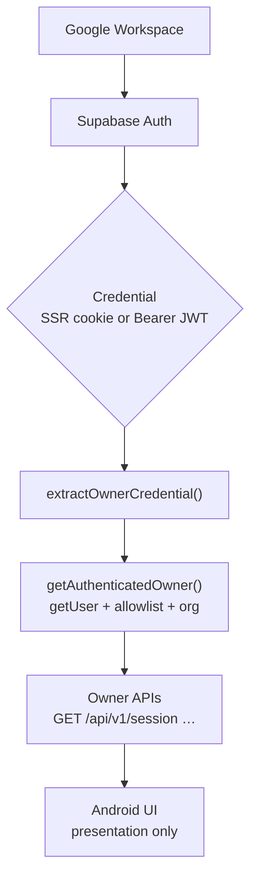
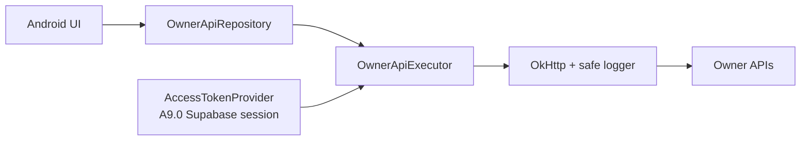
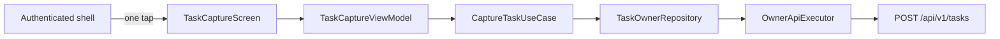
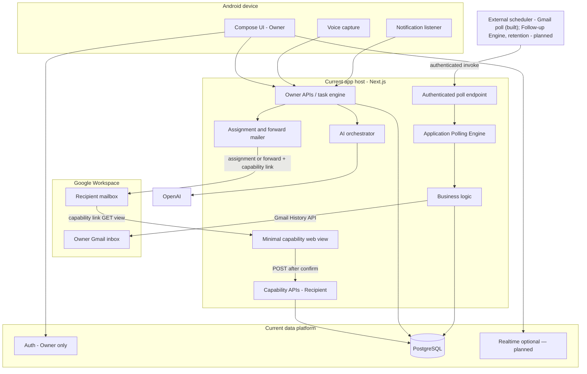

# Architecture

Governed by [PROJECT_CONSTITUTION.md](PROJECT_CONSTITUTION.md). Terms: [GLOSSARY.md](GLOSSARY.md). Decisions: [DECISIONS.md](DECISIONS.md). AuthZ details: [SECURITY_AND_PRIVACY.md](SECURITY_AND_PRIVACY.md). States: [STATE_MACHINE.md](STATE_MACHINE.md).

## Architecture Principles

[PROJECT_CONSTITUTION.md](PROJECT_CONSTITUTION.md) is the authoritative source for the complete Architecture Principles. D079 records them as binding for hosting, schedulers, storage, messaging, cloud services, and other infrastructure decisions.

Operational summary: keep business logic in the application; use vendor-neutral, modular infrastructure adapters; prefer low recurring cost and free tiers only when security, reliability, maintainability, and performance remain acceptable; keep designs simple and validate performance claims rather than adding unnecessary platforms.

**Gmail polling (A5) exemplifies these principles:** the application owns the Application Polling Engine (sync, History ingestion, eligibility, locks, audit). Scheduling is intentionally external. Any External Scheduler that securely invokes the Authenticated Endpoint every five minutes (D065) is acceptable. The recommended initial Infrastructure Adapter while on Vercel Hobby is **cron-job.org**; Vercel Cron, GitHub Actions, Google Cloud Scheduler, AWS EventBridge, and other compatible schedulers remain fully interchangeable. No scheduler is an architectural dependency (D079). External scheduling keeps the app portable across hosting providers.

**Ownership boundaries (D131).** The application is the **sole source of truth** for Tasks, Task state, Reminder Schedules, reminder state, reminder policy, reminder history, delivery outcomes, and Owner-attention state. No external product is authoritative for, independently governs, or overrides any of it. An **External Scheduler only wakes the application**: it decides nothing about which reminders are due, which Tasks are eligible, whether a reminder is sent, whether a schedule is active, waiting, stopped, or otherwise inactive, or about delivery counts, ceilings, generation changes, retry policy, or Owner-attention state. The application re-evaluates current state on **every** invocation, so a missed, late, or duplicated wake-up changes no outcome. **Gmail is a delivery transport only**: it owns no reminder scheduling, reminder state, reminder policy, retry policy, reminder history, stop condition, Task state, or capability state, and it is never the reminder engine. **No third-party task engine is part of A8 or A9** — Google Tasks, Microsoft To Do, Apple Reminders, Google Calendar as a task or reminder engine, and any equivalent are **excluded alternatives**, not planned dependencies, fallback systems, or competing authorities. A future productivity integration would require its own separately approved milestone and could not replace the application as the source of truth.

## System shape

Private Android-first product with Next.js on Vercel, Supabase PostgreSQL, Prisma on authorized servers only, Gmail API for inbox and forwarding, OpenAI for extraction/transcription. Current hosting choices are deployment defaults, not hard-wired business architecture (D079).

**Core chain:** Owner → Task → Assignment → Capability → Capability Link → Recipient action.

Assignment binds a Task to a Recipient. A Capability is the authorization grant for that assignment. A Capability Link delivers the bearer credential. Possession of the link authorizes scoped actions; it does not authenticate a person.

## Implemented through A4 (production-verified)

The following are **implemented** in the repository and included in production verification (`A4_FULL_E2E_PASS`):

- Owner Google Workspace authentication (Supabase Auth; single Owner)
- Owner session API (`GET /api/v1/session`)
- Owner task HTTP (create, list, get, lifecycle mutations, historical snooze surface, dismiss, capability issuance)
- Task persistence (`@aicaa/db` / Prisma on Supabase Postgres)
- Recipient capability HTTP and non-mutating `GET /c/[token]` page
- Recipient POST actions with explicit confirmation
- Audit trail for Owner and capability actions (D057)
- Vercel-hosted Next.js runtime with traced `@aicaa/db` / Prisma packaging

Deployment and smoke checks: [DEPLOYMENT.md](DEPLOYMENT.md). HTTP status by route: [API_CONTRACT.md](API_CONTRACT.md).

## Implemented through A6 (production-operational; A5 and A6 closed)

The following are **implemented** and **production-operational**. A5 and A6 are closed except for future bug fixes. Gmail settings UI and History recovery remain deferred and do not block A7:

- Gmail account connection and polling (A5)
- Communication event ingestion tables and Application Polling Engine (A5)
- Owner Gmail OAuth connection routes (A5.3) with encrypted tokens
- Manual Gmail sync, History ingestion (seed + incremental), safe sync-run listing (A5.4)
- Authenticated internal Gmail poll endpoint for External Schedulers (A5.5); cron-job.org every five minutes
- Sync locking, duplicate protection, system audit (D074)
- Heuristic relevance + LLM extraction via `packages/ai` (A6, D085)
- Application Suggestion Engine via `POST /api/v1/internal/suggestions/process` (A6, D084); separate cron-job.org job every five minutes
- Owner task-suggestion HTTP (list/get/approve/edit/dismiss/merge)
- Approve creates **unassigned Task only** (D080); merge dual-resource concurrency (D083)
- Relational event↔suggestion idempotency and processing state (D081)
- Excerpt workflow safety-ceiling retention (D082: dismiss +7d / approve +30d)

## Implemented through A7 (closed and production-operational)

**A7 is complete and production-operational** (contracts through Owner confirmation UI + Gmail send re-consent UI, closed after a full production E2E on both delivery paths). Binding decisions: D086–D094. Do **not** begin Follow-up Engine or Event Notification Engine implementation without explicit authorization (D089, D102–D110).

Shipped in A7 (production-verified):

- Gmail assignment email and forward-with-attachments via `POST /api/v1/tasks/{taskId}/handoff` (D037, D090)
- Minimal Owner Recipient management (list/create/update/inactive) — not a CRM (D087)
- Delivery attempt persistence (`pending` / `sent` / `failed`) and single active capability with re-forward revocation (D086, D092)
- Gmail OAuth `gmail.readonly` + `gmail.send` for handoff (D093); Owner re-consent when send missing
- Thin Owner confirmation UI (`/tasks`, `/tasks/[taskId]`) and Gmail send re-consent UI (A7.8), with a `/tasks` segment error boundary and Owner-visible Recipient notes / completion outcome

## Planned for P1, A8, and later (target architecture)

- **P1 Owner web experience foundation** (authorized by D111–D120; **complete, deployed, and production-validated** — see [P1 section](#p1-owner-web-experience-foundation) below)
- **Follow-up Engine** (due-date-driven, Task-scoped) and **Event Notification Engine** (A8; product law D102–D110 superseding parts of D095–D101; [WORKFLOWS.md](WORKFLOWS.md) §10)
- Retention workers (A13); optional Supabase Realtime
- Future `CommunicationAccount` schema (multiple inboxes later; v1 targets one)
- Android Owner task UI, push delivery for Event Notifications, Messages/call capture, voice, learning (A9–A14; FCM remains deferred — D017)

Descoped from A7 at close and deferred to a future authorized slice (does not block A8): reassignment / explicit re-forward orchestration, proposed-Recipient hints, reconciliation workers, Owner UI for Recipient management. Full list: [MILESTONES.md](MILESTONES.md) A7 deferred backlog.

### A7.4 Gmail send transport (implemented; transport-only)

A7.4 adds the **outbound Gmail transport layer** — send-scope preparation, outbound-message construction (MIME), and provider transport. It is pure send/compose infrastructure. **A7.4 does not** decide eligibility, create a `HandoffAttempt`, activate a capability, or transition persistence state; those belong to later application orchestration. All transport code lives in `apps/web/lib/gmail/transport` and `apps/web/lib/gmail/outbound` and never imports `@aicaa/db`.

- **Scopes.** OAuth now requests `openid`, `email`, `gmail.readonly`, and `gmail.send` (the minimum send scope). We deliberately do **not** request `gmail.modify`, `gmail.compose`, `https://mail.google.com/`, or contacts (D093). Authoritative source: [users.messages.send](https://developers.google.com/workspace/gmail/api/reference/rest/v1/users.messages/send).
- **Incremental consent.** The auth URL sets `include_granted_scopes=true` so an existing read-only Owner can add `gmail.send` without a destructive reconnect. Existing read-only grants keep polling. A server helper (`buildGmailSendConsentAuthUrl`) can initiate re-consent; Owner re-consent UI shipped in A7.8.
- **Send-capability prerequisite.** `gmail.send` is derived from the persisted `grantedScopes` string, never from the mere existence of a connection. The prerequisite check distinguishes _not connected_ (`GMAIL_NOT_CONNECTED`), _connected but send missing_ (`GMAIL_SEND_SCOPE_REQUIRED`, `requiresSendReconsent=true`), and _send available_ — always as approved typed A7 failures, never raw Google errors. Limitation: Google does not always re-return `scope` on refresh, so the last persisted grant is treated as authoritative (conservative — absence of send means re-consent).
- **MIME.** Standards-compliant RFC 5322: CRLF endings, RFC 2047 encoded-word headers for UTF-8, quoted-printable text parts, base64 attachments, unique boundaries, base64url `raw` encoding. Header injection is impossible (control chars rejected; UTF-8 encoded); addresses strictly validated; the header set is fixed (no caller-supplied headers).
- **Supported forward shapes:** plain text, HTML, multipart/alternative, regular attachments, and inline images with matching `Content-ID`/`cid:` relationships. **Unsupported/ambiguous shapes** (e.g. a `cid:` reference with no fetchable inline part) are **rejected** as `GMAIL_UNSUPPORTED_SOURCE_SHAPE` rather than sent with broken HTML.
- **Incomplete-forward rejection (D088).** Forward construction reads the **exact** source message (never the whole thread, never “latest in thread”) and fetches approved attachments via `attachments.get`. If the original content or any required attachment is unavailable, construction **fails before send** (`GMAIL_SOURCE_MESSAGE_UNAVAILABLE` / `GMAIL_ATTACHMENT_UNAVAILABLE`); it never degrades to a partial forward and never silently switches to `assignment_email`.
- **Attachment ceilings.** Hard Gmail cap 36,700,160 bytes (35 MiB, per the gmail.v1 discovery `send.maxSize`); conservative application ceiling 25 MiB on the assembled message; ≤ 20 attachments; ≤ 20 MiB total / per-attachment. The simple JSON `{raw}` send path is used; the media-upload endpoint for very large messages is deferred.
- **Threading.** Both paths create a **new outbound thread**. No `threadId`, `In-Reply-To`, or `References` are set — a forward never replies into the original sender’s thread. Re-forward threading continuity is deferred to orchestration.
- **Provider error taxonomy.** Gmail failures normalize to privacy-safe outcomes with `code`, `category`, `retryable`, `ambiguous`, and a non-reversible `fingerprint` (code+status only). Raw Google bodies, tokens, message bodies, recipient content, capability links, and attachment data are never surfaced. **Ambiguous outcomes** (timeout after submission, connection loss, unparseable success) are classified as `GMAIL_AMBIGUOUS_SEND` — the transport does not claim the message was not sent. Reconciliation is **not** implemented.
- **Transport vs orchestration boundary.** The transport accepts an already-authorized access token + a fully-composed message (including a complete, already-issued capability URL — never generated/queried/logged here) and returns a normalized acceptance (`providerMessageId`, `acceptedAt`, optional `providerThreadId`) or a typed failure. Later orchestration wires transport between the A7.3 pending-attempt transaction and `markHandoffAttemptSent`/`Failed`.
- **Packaging convention.** A focused guard test (`packages/db/__tests__/a7-domain-import-convention.test.ts`) forbids **runtime value** imports of `@aicaa/domain` under `packages/db/src` (the A7.3 serverless regression); `import type` is allowed. Runtime value imports must use the relative `../../../domain/dist/index.js` convention.

Roadmap boundary: **A7.4** = send-scope prep + transport/MIME only. **A7.5–A7.7** wire orchestration and authenticated handoff HTTP. **A7.8** adds Owner confirmation / re-consent UI. A7 is closed and production-operational. Later **reconciliation/worker** work handles stale/uncertain pending attempts, only when explicitly authorized.

### A7.5 Handoff application orchestration (implemented; internal service only)

A7.5 adds the **one authoritative application service** that coordinates the A7.3 persistence primitives with the A7.4 Gmail transport. It lives in `apps/web/lib/handoff` and is **internal only**: no public HTTP route, no cookie/header auth, no untrusted payloads, no UI. A future authorized HTTP layer constructs a trusted command (after authn + validation) and calls this service.

- **Distributed transaction boundary.** The lifecycle is strictly `DB txn (begin/replay pending) → Gmail send (OUTSIDE any DB txn, exactly once) → DB txn (record accepted or failed)`. A database transaction is **never** held open across the Gmail API call. Each DB phase is a short A7.3 transaction (`beginInitialHandoff` / `prepareFailedHandoffRetry`, then `markHandoffSendAccepted` / `markHandoffDeliveryFailed`). Proven by test: an independent read during the mocked provider call sees the committed `pending` row.
- **Phase sequence & observability.** Phases are `prerequisite → persistence_begin → message_build → provider_send → persistence_accept | persistence_fail`. Each emits a privacy-safe structured log (`event`, `operation`, `phase`, org id, correlation id, attempt id, delivery path, outcome category, `retryable`, `ambiguous`, `reconciliationRequired`, failure code/fingerprint, attachment count/bytes, elapsed ms). Logs **never** contain OAuth tokens, capability URL/token, MIME, source/body/subject text, plaintext recipient email, attachment content, or raw provider errors.
- **Orchestration input & trust boundary.** The internal command carries only already-authorized inputs (org id, Owner id, Task id, Recipient id, server-selected delivery path, idempotency key, request fingerprint, acknowledgement, optional Owner note, correlation id). It **never** accepts OAuth tokens, Gmail account/message ids, MIME headers, capability tokens, or provider message ids from the caller — those are resolved from trusted persisted records or minted internally by the store.
- **Prerequisite ordering.** _Preflight (pre-persistence, deterministic):_ Gmail connected + belongs to org, `gmail.send` available, access token resolvable — deterministic-impossible requests fail before any durable state is created. _Authoritative (inside the A7.3 txn):_ Task eligibility, one-active-assignment uniqueness, active Recipient, idempotency/fingerprint, expected task version — all race-sensitive decisions stay inside `beginInitialHandoff`. _Transport-time:_ MIME validity, attachment ceilings, source availability, provider rejection.
- **Message-preparation timing.** For a **created** attempt the store mints the one-time capability token/hash/URL inside the begin transaction and returns the URL only for `created` (a replay cannot recover the raw token, and a replay never sends). The message is then built **after** pending persistence but **before** send, so it can bind the created capability URL; a deterministic build failure after pending creation is recorded as a typed **failed** attempt (never an unexplained pending row) and never reaches Gmail.
- **Replay rules by attempt status** (from the A7.3 `kind` discriminant, not timing): `created` → send; `replay_sent` → return existing success (`delivered_replay`), no send; `replay_pending` → `in_progress` (reconciliation required), no send; `retry_failed` (same key, attempt failed) → require the explicit retry operation (`previous_attempt_failed`), no send; same key + different fingerprint → `idempotency_conflict`.
- **Accepted outcome.** `markHandoffSendAccepted` persists the provider message id (org-scoped uniqueness), activates the capability, and transitions Assignment delivery to `sent` in one transaction. Capability is **actionable only after** durable acceptance. Re-recording the same provider id is idempotent; a different provider id is a typed `provider_message_conflict` (never a raw DB error).
- **Known rejection.** A non-ambiguous provider failure calls `markHandoffDeliveryFailed`: persists normalized `failureCode` / `failureCategory` / privacy-safe `failureFingerprint` / `retryable`, leaves the capability non-actionable, and leaves the attempt eligible for explicit retry when retryable.
- **Ambiguous outcome.** Timeout after submission, connection loss, unparseable/lost provider response, or a crash between accept and accept-persistence are classified `ambiguous` (`in_progress`, `reconciliationRequired=true`). The attempt is **left pending** — never recorded as `failed`, never auto-retried, capability stays non-actionable. This uses the existing A7.3 `pending` truth (no schema change required); a later, explicitly-authorized reconciliation step resolves it.
- **Four process-crash windows.** (A) begin committed, crash before send → stays pending; replay returns `in_progress`, never resends. (B) Gmail rejects, crash before failed-persist → stays pending; replay returns `in_progress`, never resends. (C) Gmail accepts, crash before accept-persist → stays pending though the email may have been delivered; capability non-actionable; replay returns `in_progress`, never resends. (D) accepted persisted, caller response lost → same-key replay returns `delivered_replay`, Gmail is not called again.
- **Explicit retry with in-place token rotation.** `retryHandoff` reuses the **same** attempt, assignment, capability **row identity**, Recipient, delivery path, idempotency identity, and request fingerprint via `prepareFailedHandoffRetry` (failed→pending). The store mints a **new** random raw token at the application boundary and passes only its hash into the retry transaction, which **atomically replaces the capability row's token hash** (the prior link is immediately invalid) while keeping the capability `status = active`, `actionableAt = null` until Gmail acceptance. The new one-time URL is returned **only** to the winning invocation, in ephemeral memory; the raw token/URL is never persisted, logged, fingerprinted, or placed in errors. Retry is allowed **only** on a retryable failed attempt with a matching fingerprint (the CAS `where` includes `status = failed AND retryable = true AND fingerprint`); a known retry failure leaves the rotated token non-actionable for a later retry (which rotates again). _Crash semantics:_ the raw token is generated before the transaction — if the txn rolls back / the process crashes before commit, nothing is persisted (the prior hash and link survive) and the raw token is discarded; if the txn commits but the process dies before the winner uses the token, the capability holds the new hash (prior link invalid) with a lost raw token and stays non-actionable until another retry rotates again. No raw token is ever persisted in any path.
- **Exclusive retry execution ownership.** `prepareFailedHandoffRetry` returns an explicit `won` discriminant: exactly one concurrent invocation performs the atomic `failed → pending` transition (`won = true`) and receives the rotated raw token + URL and the new send generation; every other invocation observes `won = false` (deterministic replay), rotates nothing, receives **no** usable token/URL, and the orchestrator returns a typed `handoff_in_progress` without calling Gmail. Ownership is the database transition result used as an execution-ownership lease — never an in-process lock and never inferred from status/timestamps. Proven by test: two concurrent retries call the mock transport **exactly once**.
- **Send-generation stale-result rejection.** The reused attempt's `attemptCount` doubles as an internal **send generation** (starts at 1 on create, increments atomically inside retry preparation, reused — **no schema migration**). The winning generation is threaded to `markHandoffSendAccepted` / `markHandoffDeliveryFailed` as a required `expectedSendGeneration`, which is added to the conditional-transition `where`. A delayed provider result from a superseded send (e.g. a prior send before a retry rotated the token) therefore matches no row and returns a typed `INVALID_STATE` conflict **without mutating state** — a stale acceptance can never activate a newly rotated capability, and a stale failure can never mark a newer retry generation failed. This satisfies the invariant "a result from send execution N must not finalize or fail send execution N+1".
- **Initial-send ownership.** Only the invocation whose A7.3 result is `kind = created` receives the freshly minted capability URL and may send; `replay_pending`, `replay_sent`, and `retry_failed` receive **no** raw token/URL and never reconstruct or rotate one. Logs and errors never contain a raw token/URL.
- **Capability base-origin trust.** The capability URL is built by the established builder (`buildCapabilityUrl`) from **server-controlled configuration only** (`NEXT_PUBLIC_APP_URL`), validated by `assertValidCapabilityAppUrl`: absolute http/https, **HTTPS required in production**, no embedded credentials/query/fragment (no open-redirect / token misplacement), normalized path so the token appears only in the `/c/{token}` segment. The base is never derived from a request `Host` header or any caller-supplied value; configuration errors are privacy-safe (config key only). The HTTP layer is **not** responsible for generating retry capability tokens.
- **Re-forward / reassignment scope.** A7.3 exposes `beginExplicitReforward` and `beginReassignment`, but A7.5 does **not** wire orchestration entry points for them (their trusted application inputs — prior-attempt resolution, expected version, new-recipient policy — are not yet complete). Initial handoff and retry can never accidentally perform re-forward/reassignment. Deferred to a later orchestration slice.
- **No exactly-once claim.** The service provides durable idempotency for creating handoff state, **at-most-one** known provider acceptance recording per attempt (enforced by the A7.3 sent transition + provider-id uniqueness), **exclusive retry send ownership** (only the winner of `failed → pending` sends), duplicate-send prevention on normal replays, send-generation rejection of stale provider results, and explicit uncertainty after process/provider boundary failures. It does **not** claim exactly-once email delivery (a single owned send could still be accepted by Gmail while the acceptance record is lost to a crash → ambiguous, resolved by reconciliation).
- **Cancellation.** The provider call is not treated as cancelled because a future HTTP client disconnects; timeouts map to `ambiguous`, and untrusted abort semantics never become persistence truth.
- **Dependency injection.** The orchestrator injects a persistence store (A7.3 primitives via the traced runtime bridge / PGlite in tests), a Gmail access resolver, an outbound message preparer (A7.4 builders + forward-source loader), a Gmail transport (A7.4), a clock, and a logger — no hidden globals. The store adapter reaches A7.3 **only** through `loadDbRuntime()`; the A7 primitives (`beginInitialHandoff`, `markHandoffSendAccepted`, `markHandoffDeliveryFailed`, `prepareFailedHandoffRetry`, `getHandoffAttemptById`, `invalidState`, `handoffInProgress`) are explicit exports across all four bridge surfaces (re-exports, entry map, `REQUIRED_EXPORTS`, NFT packaging guard). Token rotation happens **inside** `prepareFailedHandoffRetry` (the store passes a precomputed hash), so no raw-token helper is exposed on the runtime bridge or any public route surface.
- **Production retry needs no injected prior URL.** Both initial and winning-retry paths receive a server-built `capabilityUrl` from the store (freshly minted or freshly rotated). The production message preparer never reconstructs or injects a prior URL; its `missing_capability_url` guard is defense-in-depth only. Proven by test: the production preparer retries end-to-end using only the store-rotated URL.

Roadmap boundary: **A7.5** = internal application orchestration only (no public HTTP, Recipient CRUD, Owner UI, reconciliation, Follow-up Engine, Android, or production E2E in this slice). Later slices A7.6–A7.8 add Recipient HTTP, handoff HTTP, and Owner UI. A7 is closed and production-operational.

### A7.6 Recipient management + task-create guard (implemented)

A7.6 adds the **authenticated Owner Recipient-management endpoints** and enforces the `POST /api/v1/tasks` `recipientId` rejection (D091). It uses the existing OpenAPI contract, generated clients, Prisma schema, and migrations **unchanged**.

- **Routes (thin handlers).** `GET /api/v1/recipients` (paginated active list), `POST /api/v1/recipients` (create), `PATCH /api/v1/recipients/{recipientId}` (update mutable fields), `POST /api/v1/recipients/{recipientId}/deactivate` (mark inactive). All require an authenticated Owner session; organization and Owner identity come only from the trusted session (never the body); every lookup/mutation is organization-scoped; responses set `Cache-Control: no-store` and exclude `organizationId`, `emailNormalized`, and DB metadata. Capability-link possession is never an Owner authorization surface (D059). Request bodies require `Content-Type: application/json` (HTTP 415 otherwise).
- **Lifecycle (D087).** Recipients are created active. Listing returns **active only**, ordered by normalized display name (`NFC` → trim → lowercase → collapse internal whitespace) then Recipient id, paginated with an **opaque base64url compound cursor** (`{n,i}`; default limit 25, min 1, max 100; malformed cursor → privacy-safe validation error; `nextCursor: null` when exhausted). Update and deactivate are **organization-scoped conditional writes requiring `active = true`**, so a stale write can neither mutate nor reactivate an inactive Recipient. Conflicts distinguish `404 NOT_FOUND` (missing / cross-organization, no existence leak) from `409 DOMAIN_CONFLICT` (same-organization inactive); duplicate active normalized email → `409` via the existing partial unique index (final authority under races). **No reactivation and no deletion** — a deactivated Recipient stays durable for history, and the same normalized email may back a new active Recipient.
- **Email-change snapshot semantics (may surprise an Owner).** Recipient email is mutable while a `HandoffAttempt` is pending or failed. The **snapshot model is authoritative**: historical `intended_recipient_email` on Assignment/Capability rows is never rewritten, retries continue to the snapshotted address, and only **future new** handoffs use the Recipient's current email. Changing the Recipient record never redirects an in-flight or retryable delivery.
- **Deactivation does not revoke live capabilities.** Deactivating a Recipient only blocks **new** handoffs (`requireActiveRecipientForHandoff` rejects inactive); it leaves existing Assignments, HandoffAttempts, and issued/sent capabilities in their current lifecycle state. Capability revocation remains an explicit handoff/capability lifecycle operation for a later slice.
- **Task-create guard (D091), defense in depth.** The request parser rejects the create request whenever the top-level JSON object **owns** a `recipientId` property (own-property presence — any value: UUID, unknown id, malformed string, empty string, `null`, number, boolean, object, array), before any validation or side effect, with `400 RECIPIENT_HANDOFF_NOT_AVAILABLE`. A differently cased key (`RecipientId`) or a nested `recipientId` is not the legacy field and follows ordinary field rules — it never creates an Assignment. The `createOwnerTask` service's create-with-assignment branch is **removed** and replaced with a defensive invariant, so internal callers cannot create an Assignment via legacy data; `createOwnerTask` now only ever creates an **unassigned** Task. The rejection is application-data side-effect free: no Task/Assignment/Capability/HandoffAttempt, no Gmail call, and **no durable audit row** (only privacy-safe structured logging, never the supplied value).
- **Audit.** Successful Recipient create/update/deactivate write a durable Owner-attributed `AuditEvent` **atomically in the same transaction** as the mutation. Updates record **changed field names only** — never raw previous/new email values or the full request body; the Recipient email is never written to `intended_recipient_email`.

Roadmap boundary: **A7.6** = Recipient management endpoints + task-create guard only. It does **not** add the handoff route, route-level delivery orchestration, Owner UI, Gmail re-consent, reassignment/re-forward, reconciliation, Follow-up Engine, reactivation/deletion, or any OpenAPI/schema/migration change.

### A7.7 Authenticated Owner handoff HTTP + route-level delivery orchestration (implemented)

A7.7 wires the contracted endpoint `POST /api/v1/tasks/{taskId}/handoff` to the A7.5 orchestrator. Contract, generated clients, Prisma schema, and migrations remain **unchanged**.

- **Thin route.** `apps/web/app/api/v1/tasks/[taskId]/handoff/route.ts` — Owner auth (`runOwnerTaskRoute`), Task-ID validation, `Content-Type: application/json` (415), syntactic `If-Match` parse, `Idempotency-Key` parse, strict body validation (`recipientId` + `acknowledgement` only), service call, public response/error mapping, `Cache-Control: no-store`. No Prisma, Gmail, token, or lifecycle logic in the route.
- **Idempotency-first classification (critical).** After syntactic validation, the route-facing service (`executeHandoff`) computes the production SHA-256 request fingerprint and performs an organization-scoped idempotency lookup **before** any current-state eligibility or Gmail access check. Classification:
  - **`replay_sent`** — reconstruct `HandoffTaskResponse` from persisted state with `idempotentReplay: true`; do **not** compare If-Match version to the post-handoff Task version; do **not** re-check Gmail; do **not** call Gmail; do **not** create an audit row. Remains available after Recipient deactivation, Gmail disconnect, or send-scope loss.
  - **`replay_pending`** — `409 HANDOFF_IN_PROGRESS`; no Gmail; no token rotation.
  - **`retry_failed`** — invoke A7.5 `retryHandoff` (reuse attempt/capability/Assignment; rotate token for winner only; historical delivery snapshot); do **not** reject because the Task is now assigned; do **not** re-run initial Recipient-active eligibility.
  - **`key_conflict`** — `409 IDEMPOTENCY_KEY_CONFLICT`; no disclosure of which field differed; no Gmail.
  - **`new_request`** — only then compare If-Match to current Task version, require unassigned + non-terminal Task, require active Recipient, select delivery path, resolve Gmail access, invoke `deliverInitialHandoff`.
- **Why original If-Match remains valid for replay.** The initial begin transaction bumps the Task version under If-Match CAS. A literal client retry carries the original ETag. Idempotency key + stored request fingerprint identify the original operation; version comparison applies **only** to a brand-new handoff. A changed If-Match version alone does not create a new operation and does not change the fingerprint.
- **Delivery mode.** Server-selected via `selectHandoffDeliveryPath` from the trusted Task `sourceReference` (`gmail` → `gmail_forward`; otherwise `assignment_email`). No client spoof; no silent downgrade of Gmail-origin to assignment email.
- **Gmail forward.** Trusted forward-source resolver derives `providerMessageId` only from persisted Task `externalIds` (`provider=gmail`, `idType=message_id`). Forward includes Owner intro, **persisted Task `summaryPoints`** (escaped as data; order preserved; no fresh LLM), capability link, original Gmail content, and every required attachment. Incomplete forwards are blocked before send (D088).
- **Assignment email.** Non-Gmail path; summary from Task; capability URL; **no attachments**.
- **Provider outcomes.** Retryable known failure → `503 HANDOFF_DELIVERY_FAILED`. Permanent known rejection → `400 HANDOFF_DELIVERY_FAILED`. Ambiguous/unknown → `503 DEPENDENCY_UNAVAILABLE`; attempt stays `pending`; capability stays non-actionable; **no automatic resend**; later reconciliation slice required. No exactly-once claim beyond implemented idempotency/send-generation guarantees.
- **Audits.** Durable Owner audits (`handoff.prepared` / `handoff.sent` / `handoff.failed`) written atomically inside A7.3 transitions when `emitAudits` is set. No duplicate audits on successful/pending replay or retry losers. No raw Recipient email in audit notes; no full idempotency key in logs; no raw capability token/URL in responses.
- **Deferred.** Reassignment, explicit re-forward, `proposedRecipientId` / `proposedRecipientHint` (not in the current request schema — unknown fields → `400 VALIDATION_ERROR`), reconciliation workers, Follow-up Engine, production E2E. Owner confirmation UI and re-consent UI shipped in A7.8.

Roadmap boundary: **A7.7** = authenticated handoff HTTP + route-level delivery orchestration only. A7 is closed and production-operational.

### A7.8 Owner confirmation UI + Gmail send re-consent UI (implemented)

A7.8 adds the first thin Owner Task surfaces and wires them to A7.7. Contract, generated clients, Prisma schema, and migrations remain **unchanged**. These pages **did not exist before A7.8**.

- **Pages.** `/tasks` (minimal list) and `/tasks/[taskId]` (detail + handoff). Hard Owner gate via `requireOwnerPage` (redirect to `/login?next=…` with a safe relative path). Home links to Tasks when signed in. No Task-list row handoff; no broad app shell.
- **Confirmation.** Modal with disclosure (D037/D031/D089), checkbox, then **Confirm handoff**. Body is exactly `{ recipientId, acknowledgement: "handoff_confirmed_v1" }`.
- **Client operation state.** `sessionStorage` key `aicaa.handoff.pending.v1:<taskId>` holds Task ID, Recipient ID, Idempotency-Key (`crypto.randomUUID()`), original strong If-Match, acknowledgement, timestamps, last public outcome, re-consent flag. No emails, summaries, capability secrets, or Gmail content. 24h display expiry does **not** cancel server operations.
- **Same-key recovery.** Network retry, retryable failure, pending/ambiguous check, and post–re-consent retry reuse the original key + original ETag. No “start over with a new key” after a durable attempt.
- **Re-consent.** `POST /api/v1/gmail/oauth/start?returnPath=/tasks/{taskId}` via top-level HTML form POST (302 to Google). Return shows a banner; Owner must click **Retry handoff** (no auto-send). `GET /api/v1/gmail/connection` emits contracted `canSend` / `requiresSendReconsent` from stored grants; handoff `403` remains authoritative.
- **UX honesty.** Pending → “still unresolved” + Check status. Ambiguous → may-or-may-not-have-sent; no new handoff. Success uses server `deliveryPath`. Delivery explanation before submit is predictive copy only.
- **Deferred.** Reassignment, re-forward, proposed hints, reconciliation, Follow-up Engine, Recipient CRUD UI, production E2E. Default OAuth fallback `/settings/gmail` remains orphan technical debt (A7.8 always supplies Task `returnPath`).

Roadmap boundary: **A7.8** = Owner confirmation + re-consent UI only. A7 is closed and production-operational.

### P1 Owner web experience foundation

Authorized by **D111–D120**; scope, slices, and acceptance criteria: [MILESTONES.md](MILESTONES.md). Baseline evidence: [P1_1_BASELINE.md](P1_1_BASELINE.md).

**P1.1 (observability) — implemented; architecture, security, and regression review passed. Production validation against the baseline was completed in P1.5 (D119) — see [P1_5_EVIDENCE.md](P1_5_EVIDENCE.md) §3.** Application-owned modules under `apps/web/lib/observability/` provide request-scoped `requestId` (AsyncLocalStorage), safe route templates, always-on structured JSON diagnostics, failure classification, and operation timing. Public error envelopes (`lib/auth/http.ts`, `lib/http/errors.ts`) **reuse** the request-scoped `requestId` instead of minting an unrelated UUID. Owner and capability API route runners, Owner Task RSC pages, capability page load, and internal cron routes enter the request context. Capability diagnostics use `/c/[token]` and `/api/v1/capabilities/[token]/…` templates only (D114). The gated `ENABLE_DB_RUNTIME_DIAGNOSTICS` probe remains an incident tool and is not the always-on path. A7.5 handoff logger is unchanged.

**P1.2 (browser harness) and P1.3 (request and render reliability) — implemented, pending architectural review; local evidence only.** Evidence: [P1_2_BROWSER_HARNESS.md](P1_2_BROWSER_HARNESS.md), [P1_3_EVIDENCE.md](P1_3_EVIDENCE.md).

**P1.4 (Owner shell, constrained presentation, organization-timezone display, attention destination) — complete and production-validated.** Evidence: [P1_4_EVIDENCE.md](P1_4_EVIDENCE.md).

**Still not implemented (P1.5):** global error fallback, styled not-found state, connectivity or offline UI, comprehensive accessibility closure, and production validation against the P1.1 baseline.

**Why a foundation and not polish.** A7.8 deliberately shipped thin Owner surfaces. Before P1.3 and P1.4, `apps/web/app/layout.tsx` was an `<html><body>` wrapper with no navigation, no Owner identity context, no sign-out affordance, and no `<main>` landmark; there was one segment error boundary and no other boundary of any kind; and every Owner page was `force-dynamic` with no loading state. The experience layer did not exist rather than existing poorly (D111). **P1.4 closed the shell portion of that gap** — see the Shell paragraph below. **P1.5 closed the remainder**: application boundaries including a global error fallback and styled not-found, lost-connectivity feedback, Recipient dialog keyboard and focus behaviour, and the automated D119 accessibility gate ([P1_5_EVIDENCE.md](P1_5_EVIDENCE.md) §1). **P1 is complete.**

**Shell — implemented in P1.4.** `apps/web/app/(owner)/layout.tsx` wraps authenticated Owner routes with a skip link, `<header>`, product identity, Owner display name, named `<nav aria-label="Owner">`, `<main id="main-content">`, and one consistent container. `(owner)` is a Next.js **route group**, so `/tasks`, `/tasks/{taskId}`, and `/attention` keep their public URLs and `proxy.ts` pathname matching is unaffected. `/`, `/login`, `/auth/**`, `/c/{token}`, and the capability APIs stay deliberately **outside** the group; `/` keeps its dual authenticated/unauthenticated behaviour and is **not** redirected to `/tasks`.

Because the chrome is a layout, it persists across the P1.3 loading boundaries and the Task error boundary, which render inside it. The product name is a **link, not an `<h1>`**, so each page keeps exactly one page-owned `<h1>`. Navigation is exactly three destinations — Tasks, Attention, and a `POST /auth/sign-out` form submission — and carries no Recipients, Gmail settings, suggestions, reminders, administration, or health entry, because those Owner surfaces do not exist.

Shell identity resolution shares the page's single server-verified `getUser()` through a React `cache()` render-pass memo in `lib/auth/require-owner.ts`. **Measured at the real Supabase Auth HTTP layer: one verified `GET /auth/v1/user` per Owner page request**, with sequential and concurrent requests remaining isolated — no cross-request cache was introduced. The shell performs **zero** database queries and emits no second `owner_authentication` timing event.

**Sign-out** is `POST /auth/sign-out`, outside `/api/v1`, following the `/auth/callback` precedent so **no OpenAPI or generated client changed**. POST only, with no `GET` handler exported: a GET sign-out URL would be prefetchable by `next/link`, so merely viewing a linking page could end the session. It revokes server-side at Supabase and redirects `303` to `/login`.

**Attention destination (D118, and A8.6a).** `/attention` exists and is authenticated through the route group. P1.4 placed it deliberately generic so the **D108** Owner schedule-status surface could populate it without a second shell redesign, and until A8.6a it was truthfully empty: it read nothing and said so.

**A8.6a made it read.** It is now the **cross-Task discovery surface** D108 requires — the place an Owner learns that reminder automation has stopped without opening Tasks one at a time. An authenticated server component performs one bounded, organization-scoped repository read of Reminder Schedules where `requires_owner_attention` is true, joined to only the Task fields the list displays, and renders the result. No API endpoint, no server action, no cache, and no mutation.

Three properties of that read are load-bearing. It is **bounded** at fifty, and a filled batch is disclosed to the Owner rather than silently truncated. It is **organization-scoped in application code on both sides of the join** — the schedule and its Task — because deny-by-default RLS with no policies is not tenant isolation for a Prisma read whose connection role owns the tables, and because no composite foreign key binds a schedule's organization to its Task's; a schedule naming a Task in another organization is dropped rather than linked. And it costs a **constant number of round-trips**: one statement for the schedules and one batched relation load for their Tasks, measured at the driver and asserted flat as rows are added.

What survived from P1.4 is the constraint, narrowed rather than relaxed: the page still claims no monitoring, no queue, no alerting, and no automatic updating, because it still does none of those things. It renders what one query returned at navigation time. Its error boundary says so explicitly — a failed attention read means Rocket **cannot say** whether automation has stopped, which is the opposite of an all-clear, and the copy refuses that reading.

`/attention` now depends on the **A8.3a migration chain**, which is **not applied in production**. A deployment reaching this page without those tables fails loudly to the error boundary by design; degrading to the empty state would report "nothing needs your attention" on the strength of a missing table.

**A8.6a does not complete the D108 Owner UI gate.** Discovery is one half. The Task-level schedule status and the controls to act on what is discovered are A8.6b, and D108 is satisfied only once the complete minimum A8.6 reminder experience is reviewed and approved.

**Task-level reminder status and repair (A8.6b).** The other half of D108 is a panel on the Task page. `/attention` links to the Task and adds nothing to the URL: the panel is the Task's own reminder state, so it must be complete whether the Owner arrived from the Attention list, from search, or from a bookmark, and a deep-link parameter would create a second rendering path that only one route exercises.

The **server component loads the reminder state** through the same service the `GET` route calls, so the panel is correct on first paint with no client fetch and no loading flash, and the Task page stays a server component. Only the interactive surface — the date input, the two mutations, and the confirmation dialog — is a client component beneath it. Mutations go through the existing `PUT` and `DELETE` reminder routes; **no endpoint, no server action, no schema change, and no migration** were added.

The panel is a **projection, not a second source of truth**. `lib/reminders/presentation.ts` maps the contracted `TaskReminderState` to Owner-facing copy for all five states, and derives editability by calling the domain's own `decideReminderScheduling` rather than re-listing which Task statuses permit a schedule — a duplicated rule that drifted would disable a working control or offer one the route would refuse with `409`. Stop-reason copy for the three attention reasons is **imported from the module `/attention` uses**, so the two surfaces cannot describe the same stop differently.

Concurrency uses the **reminder ETag, never the Task ETag** — the distinction A8.3b's audit established, since a reminder write deliberately does not bump `Task.version`. A `412` is a resolution path, not a failure: the panel re-reads authoritative state, replaces itself with it, and asks the Owner to look before deciding again. It never retries silently, because a silent retry repeats an action the Owner did not reconfirm. An unknown transport outcome (D132) is reported as **unknown** and resolved by re-reading, never by assuming either result.

**A8.6b uncovered a defect in A8.3b's own ETag, in the running server only.** `lib/reminders/etag.ts` imported `NO_SCHEDULE_REMINDER_VERSION` as a value from `@aicaa/db`, which is a `serverExternalPackages` entry, so Next left it as a runtime external and the binding arrived `undefined`. Every Task without a schedule advertised `"task-reminder-<id>-vundefined"`, the `GET` returned it with a `200`, and any mutation presenting it was refused with a `412` reporting a concurrency conflict that had not occurred — **establishing a first reminder over HTTP was impossible**. Unit tests resolve the package directly and so could not see it; the A8.6b panel is the first caller to round-trip a no-schedule token through a real server. The constant is now declared in the web app with a test asserting it still equals the persistence value and that the token it builds parses.

**Undelivered Owner notification visibility (A8.6c).** `/attention` gained a second section, and it answers a different question from the first: not "what needs a decision", but **"what happened recently that Rocket could not tell you about"**. A8.5 exists to email the Owner once per notable event, so when that email is never sent the Owner may never learn the event occurred at all. This is the backstop for that, and nothing more — **not** a notification inbox, an audit feed, or a delivery console, and **not** a D108 requirement. There is no resend, acknowledgement, dismissal, or mark-as-read, so an item leaves the surface by ageing out of the 30-day window and by no other means.

The read shows the four intent states that mean the Owner was never told — `suppressed`, `failed_permanent`, `ambiguous`, `requires_owner_attention` — bounded at fifty. `sent` is excluded because repeating a delivered email is the inbox this is not; `pending`, `claimed`, and `failed_retryable` are excluded because reporting an unfinished decision invites the Owner to act on one the worker has not made. **The three reminder-stop events are excluded in the statement**, and that is correctness rather than de-duplication: section one clears when the Owner sets a new due date, while a notification intent is terminal and clears never, so an unfiltered read would keep announcing a stop the Owner repaired weeks ago directly beneath the live section that no longer lists it. `reminder.no_active_assignment` is kept, being invisible everywhere else.

**The 30-day cutoff is computed by the caller and the 50-item ceiling is enforced in the repository**, which is the D103 clock boundary applied to a product rule: nothing in `packages/db` reads a clock, and no caller may widen a ratified bound. Subject resolution is **batched by kind** rather than looped, so the statement count is constant — at most five — however many rows return, and every subject lookup independently repeats `organizationId`, because an intent holds no foreign key to its subject and their agreement is a write-path invariant rather than a database-enforced one. A subject that cannot be resolved renders **without a link** instead of vanishing: silently dropping a notification is the one behaviour a surface about undelivered notifications cannot afford.

Actor categories map through one shared module to "You", "The Recipient", and "Rocket". **No Recipient identity is resolved and `attributionLabel` is never displayed** — the category is all the Owner needs, and the label is the field most likely to carry a name. The A8.5 email renderer's "your assistant" is deliberately not reused: inside the product it reads as a different actor from the one every other page calls Rocket. The projection selects nine columns, so claim, lease, fencing, provider, failure, and correlation fields are **absent from memory** rather than merely unrendered.

**A8.6c adds no endpoint, server action, mutation, migration, or index**, and `/attention` now depends on the **A8.5a migration** as well as the A8.3a chain. A candidate index was built and measured on PostgreSQL 16 during the slice and deliberately not added; the evidence is recorded on the repository function.

**Truthful state layer.** The seven states in D112 become shared, documented affordances rather than per-component improvisation. The A7.8 truthful-outcome behaviour above is the reference implementation and is **generalized, not replaced**: pending stays “still unresolved”, ambiguous stays “may or may not have sent”, and same-key recovery keeps reusing the original Idempotency-Key and original If-Match for ambiguous and transport retries. A confirmed `412 PRECONDITION_FAILED` remains the separate case it already is: the idempotency classification above runs before the precondition check, so only a genuinely new request can be rejected as stale, and the Owner must be shown refreshed authoritative state before a new attempt rather than looping on a known-stale ETag. Skeletons and loading affordances are permitted for **reads only**; **no optimistic mutation success**.

**Observability seam (D115).** See P1.1 status above. Hosted or OpenTelemetry backends remain adapters (Architecture Principle 2). **No schema change:** `AuditEvent` already has `requestId` and `correlationId`. RSC `error.digest` remains a Next.js framework reference and is not the application `requestId` (documented gap in the baseline).

**Presentation foundation (D116) — implemented in P1.4.** `packages/ui` exists and holds semantic tokens only: one `tokens.css`, no build step, and no React. Tokens landed as a **verified no-op refactor** — every value equal to the literal it replaced at commit `34d048e7`, pinned individually by `apps/web/__tests__/p1-4-tokens.test.ts`, so any later visual change is traceable. Radius `0` and motion `none` record the current square, static interface rather than acting as placeholders.

Shared presentation lives in `apps/web/lib/presentation/`: `task-title.ts` (title and summary-point derivation), `task-status.ts` (status, urgency, delivery, and assignment labels), `datetime.ts` (organization-timezone formatting), and `task-notes.ts` (note-bound wording). The triplicated `summaryText` helper is now reduced to one remaining copy: `task-detail.tsx` uses the shared helper, and the `handoff-panel.tsx` copy was dead code and was deleted. The `recipient-capability-panel.tsx` copy remains, because `/c/{token}` is touched last, in P1.5.

**Organization-local display (D117) — implemented in P1.4.** `apps/web/lib/presentation/datetime.ts` is the single Owner display formatter, bound to `OWNER_DISPLAY_TIME_ZONE = 'America/Vancouver'` (D034) via an explicit IANA `timeZone` passed to `Intl.DateTimeFormat` — never the browser or device timezone, and never fixed-offset arithmetic. Daylight saving is delegated entirely to `Intl`. Every rendered date-**time** carries a zone indicator; an unsupported zone throws at module load rather than degrading silently to machine-local time. Owner timestamps are formatted on the **server** (`task-detail.tsx` became a server component in P1.4), so no hydration mismatch is possible.

It is a documented constant, not a database field: no `Organization` model or timezone column exists, and P1.4 must not add one. It is also deliberately not an environment variable, because an env-var timezone can differ between the server rendering a date and the operator reading a log.

**Presentation only** — it is not, and must not become, the A8 scheduling resolver, which remains **D103**. **Known gap:** `/c/{token}` still formats timestamps with `toLocaleString`, so Recipient timestamps render in the Recipient's timezone. Recorded for P1.5.

**Verification (D119).** A lightweight browser test layer for critical Owner and Recipient journeys, run as a **separate job** rather than inside `pnpm verify`. Plus structural gates: one Owner authentication call per Owner page request, a documented and asserted maximum database round-trip count per route, and an automated assertion that no capability token or raw `/c/{token}` path can reach any telemetry, log, or error payload (D114). Auth deduplication and query bounds remain **P1.3**.

**Out of P1.** Android application experience (A9 by name), offline storage or caching of authenticated business data, service workers, mutation queues, background sync, conflict resolution, a general component library, Kotlin token generation, commercial analytics, and any A8 runtime behaviour. Dark mode and a health or readiness endpoint are **not** P1 requirements (D115, D119).

## Package layout

| Path                                                    | Responsibility                                                                                                                                                                                                                                                                                                                                                                         |
| ------------------------------------------------------- | -------------------------------------------------------------------------------------------------------------------------------------------------------------------------------------------------------------------------------------------------------------------------------------------------------------------------------------------------------------------------------------- |
| `apps/android`                                          | Kotlin + Jetpack Compose Owner UX. **A9.0:** auth, secure session, Bearer, minimum shell. **A9.1 (D148):** reusable authenticated networking (`OwnerApiExecutor` / `OwnerApiRepository`). **A9.2 (D149):** create-only Task capture. **A9.3 (D150):** Task list/detail, lifecycle, optional handoff assignment.                                                                        |
| `apps/web`                                              | Next.js App Router: Owner session APIs; Owner task HTTP; Owner Recipient management HTTP; Owner handoff HTTP (`…/handoff`); capability runtime; Recipient capability APIs and `/c/[token]` page                                                                                                                                                                                        |
| `packages/contracts`                                    | Canonical OpenAPI 3.1; generated TypeScript and Kotlin DTOs (D007)                                                                                                                                                                                                                                                                                                                     |
| `packages/domain`                                       | Pure TypeScript state machines, policies, retention helpers—no I/O                                                                                                                                                                                                                                                                                                                     |
| `packages/db`                                           | Prisma schema, migrations, repositories, transactions (server-only; D006, D062)                                                                                                                                                                                                                                                                                                        |
| `packages/ai`                                           | LLM extraction adapters for A6+ (D085); **exists as of A6.3** (`@aicaa/ai`)                                                                                                                                                                                                                                                                                                            |
| `packages/eslint-config` / `packages/typescript-config` | Shared tooling                                                                                                                                                                                                                                                                                                                                                                         |
| `packages/ui`                                           | **Semantic-token layer only, authorized by D116; exists as of P1.4** (`@aicaa/ui`). Supersedes its previous **Deferred** status. One `tokens.css` with colour, type scale, spacing, border, radius, motion, touch-target, and measure tokens for `apps/web`. **No build step, no dependency, no `.ts`/`.tsx` file.** **Not** a component library; **no** Kotlin token generation in P1 |

Do not share Zod types with Kotlin. Generate clients from OpenAPI. Neon is not used in v1 (D005).

**Cross-platform sharing reality (D116).** What `apps/android` can realistically inherit from the web foundation is **product and presentation rules**, **semantic token values**, and **generated contract enums**. What it **cannot** inherit directly is React components, TypeScript formatter implementations, and browser-specific interaction code. Android parity is therefore achieved by re-implementing documented rules against shared token values — not by sharing UI code.

## Component map

| Component                                                | Responsibility                                                                                                                                                                                       |
| -------------------------------------------------------- | ---------------------------------------------------------------------------------------------------------------------------------------------------------------------------------------------------- |
| Android app                                              | A9.0 auth; A9.1 networking; A9.2 capture; A9.3 organize/assign/follow-through; later voice/push; Owner session credentials only (Bearer JWT); no direct business-row writes to Supabase (D033, D146) |
| Next.js                                                  | Owner auth (cookie + Bearer via one pipeline, D145), Owner APIs, capability runtime, Recipient capability routes/pages, mailer, workers                                                              |
| Supabase Auth                                            | Google Workspace sign-in for the **Owner only** (D048); web SSR cookies and Android native session share this IdP                                                                                    |
| Supabase Postgres                                        | System of record                                                                                                                                                                                     |
| Prisma                                                   | Server data access only                                                                                                                                                                              |
| Gmail API                                                | Ingest, assignment mail, forward-with-attachments                                                                                                                                                    |
| OpenAI                                                   | Structured extraction and transcription                                                                                                                                                              |
| Follow-up Engine / Event Notification Engine / retention | Deterministic due-date-driven reminder and Event Notification processing (A8, D102–D110) and purge (A13); engines in-app, invoked by External Schedulers where scheduled (D079). Not implemented     |

## Platform directions

**Android:** `minSdk` 31; application id `com.aicommunication.assistant`; private sideload (D019, D040). Device target Galaxy S24+; dialer parsing OPEN #1. Does not write core business rows directly to Supabase—calls Owner session APIs with Bearer JWT after Supabase Auth (D033, D145, D146). OAuth return deep link: `aicaa://auth-callback`. FCM deferred (D017). **A9.0** delivers authentication, secure session handling, and the minimum authenticated shell. **A9.1 (D148)** delivers the reusable authenticated networking foundation. **A9.2 (D149)** delivers create-only Task capture (`POST /api/v1/tasks`). **A9.3 (D150)** delivers Task list/detail, lifecycle follow-through, and optional Recipient handoff via existing `POST …/handoff`.

**Android is online-first (D132).** The Owner experience runs over the online Owner APIs, and the application is the only source of truth (D131). A **temporary** loss of connectivity must degrade gracefully rather than silently: the interface stays stable and truthful, in-progress drafts are preserved where appropriate, duplicate actions are prevented, a write that did not reach the server is never presented as successful, retry is deliberate and runs **through** the existing idempotency and concurrency machinery, and reconnecting never produces duplicate Task mutations. This is a reliability requirement, **not** an offline feature: no offline store of business records, service-worker caching of authenticated business data, mutation queue, background synchronization, or conflict-resolution layer is in scope (D111, D132), a preserved local draft is never a completed server write, and no surface may claim the application works offline.

**Web:** Owner-authenticated routes for Owner APIs (D048). Recipient mutations use `/api/v1/capabilities/{token}/…` (D059). Browser view `GET /c/[token]` is non-mutating. Capability secrets: hash at rest; one-time raw reveal to Owner (D063); seven-day default TTL with persisted `expiresAt` (D055); multi-use until invalidation (D056). Persistence: `@aicaa/db`. Dismiss, not physical delete (D064).

**Web Owner experience (P1; complete).** P1 is complete and production-validated (with one documented evidence limitation). P1 added **no** business behaviour, route permission model, or OpenAPI contract change beyond presentation and foundation. **Android is the product** (P2.0 / D139): the Owner's primary instrument is Android (**A9**); web is administration, review, debugging, and fallback. Until A9 lands, the web Owner surface remains the currently-operational instrument. **Sequencing supersession (D140):** next work is A9 / Owner Acceptance Week / P2.2 before Stage 12 / A8.7d / A8.7e — architecture unchanged; see [P2_0_OWNER_EXPERIENCE_FOUNDATION.md](P2_0_OWNER_EXPERIENCE_FOUNDATION.md).

**Telemetry (P1).** Client telemetry **excludes capability routes entirely** — a `/c/{token}` path carries an authorization secret (D114). No commercial telemetry vendor, session replay, or behavioural analytics is authorized (D115).

**Gmail (A5 ingest; A7 outbound — both closed):** One Owner inbox per organization; poll every five minutes (D065); polling-only in A5 (D066). Inbox-only ingestion (D068); Workspace-domain mailbox gate (D069). A5 OAuth used `gmail.readonly` only (D070). A7 retains `gmail.readonly` and adds `gmail.send` for assignment email and forward; do not request `gmail.modify` without a new Decision (D093). Persistence models and Application Polling Engine are **production-operational**. An **External Scheduler** invokes `GET|POST /api/v1/internal/gmail/poll` every five minutes; recommended initial adapter **cron-job.org** (D079). A5 creates communication events only — not suggestions (D077). Gmail settings UI and History recovery are deferred. On D037 handoff: Owner confirms once; server forwards Gmail-origin originals with attachments (or sends non-Gmail assignment email) using Task `summaryPoints`—no fresh LLM (D094); activate Assignment only after Gmail accepts send (D092). Handoff confirms **no** follow-up interval: preset intervals are retired and reminders derive from the Owner-selected Task due date (D102). **A7 is closed**: the full production E2E passed on both delivery paths (tag `v0.7.0-a7-complete`; see [MILESTONES.md](MILESTONES.md)).

**AI / suggestions (A6):** Application Suggestion Engine is separate from Gmail sync (D084). Heuristic relevance then LLM extraction via `packages/ai` (D085). Owner suggestion HTTP; approve creates unassigned Task only (D080). Recommendations never silently become assignments, emails, or Reminder Schedules. Optional `proposedRecipientHint` may map to `proposedRecipientId` only via deterministic match to an active Recipient (D094)—never auto-handoff. AI may recommend a **due date**; only explicit Owner selection has scheduling effect, and AI may never create, activate, alter, or suppress a Reminder Schedule (D027, D102). AI must not invent reminder times or silently schedule Owner-controlled Task reminders (D152).

**Follow-up Engine / Event Notification Engine (A8; D102–D110 supersede parts of D095–D101, and D129–D130 govern delivery). Not operational —** the domain logic through A8.6 exists and is **deployed in Production at `D3` / `F0`** after Gate 4 and Gate 5; delivery and Owner event capture remain disabled by default, so with both notification flags unset the notification endpoint opens no database connection and constructs no transport, `ENABLE_REMINDER_DELIVERY` is absent so no reminder transport is constructed, no cron job invokes either worker, nothing sweeps capability expiry on a schedule, and no Gmail message has been sent by either A8 path. **[Gate 6](DEPLOYMENT.md#gate-6--first-controlled-production-enablement-a87c-capture--f0--f1) (first capture enablement) was authorized and partially executed but is incomplete and never became live; Stage 12 / A8.7d / A8.7e remain unauthorized and unbegun.** A8 is not closed. Authoritative rules in [WORKFLOWS.md](WORKFLOWS.md) §10.

> **Operational note — Production state.** A8 code through A8.6 **is** deployed in Production (`eb8cabe` / `dpl_Cs2TrnDsy1KSB3wipCCUt82Hpf8D`, Bearer F0 successor of Gate 5's `d369c6d` / `dpl_6cVssNpaZeKPBEVGDynd61AoS9nS`) against all fourteen migrations (**`D3` / `F0`**). All three A8 flags are **absent**. The 2026-08-01 incident is **closed**: [MILESTONES.md](MILESTONES.md) records it; Gate 4 applied migrations 6–9; Gate 5 deployed the queued consumers. Gate 6 built a READY production-target deployment (`dpl_7X5r5ypWbq6ipmWMpver6p99p5Xz`) carrying the capture flag, but the public custom domain never moved to it, so capture never became live. A later authorized Bearer promotion placed the public alias on `dpl_Cs2TrnDsy1KSB3wipCCUt82Hpf8D` while remaining at `F0`. Current detail: [DEPLOYMENT.md § Current production state](DEPLOYMENT.md#current-production-state).
>
> **The architecture below is unchanged by that incident.** The inertness of A8.5 and A8.6 rests on their two flags and holds wherever that code runs. What the incident violated is the **deployment ordering** — migrate before deploying code that depends on the migration — not any decision recorded here. The A8.3b and lifecycle surfaces were never flag-guarded by design, because the architecture assumed their schema would exist before their code did; that assumption is an ordering obligation on the rollout, and the repair restored it rather than amending it.
>
> **One architectural constraint did emerge from the incident, and it is not about A8.** `@aicaa/db` is listed in `serverExternalPackages`, so **a runtime value imported from it does not reliably survive the Next build** while a type-only import always does. This is a property of the packaging boundary, not of the reminder feature, and it applies to every module in `apps/web` that reaches persistence. Crucially, **the unit suite cannot detect a violation** — Vitest resolves the workspace package directly, so the binding exists in every test and is missing only in the shipped artifact. Persistence must be reached through `loadDbRuntime()`, or the value must be owned locally with a guard tying it to the persistence authority. Full statement and the remaining known instance: [DEPLOYMENT.md § the runtime-value import hazard](DEPLOYMENT.md#the-runtime-value-import-hazard).

- **The application owns the engine; the scheduler only wakes it and Gmail only carries the message (D131).** Reminder policy and every durable reminder fact live here: persisted occurrence instants are the scheduling authority, and `POST /api/v1/internal/reminders/process` asks only _which have arrived_, re-evaluating current state on each invocation. An External Scheduler contributes a cadence and no decision — not due-ness, eligibility, whether to send, schedule status, counts, ceilings, generations, retry policy, or Owner attention. Gmail contributes transport and no policy, retry rule, stop condition, or history. **No third-party task engine participates in A8.**
- **Follow-up Engine** is **due-date-driven and Task-scoped** (Recipient audience; Gmail outbound). An explicitly Owner-selected due date is the authoritative scheduling input (D102), superseding `dueAt` independence (D098). Schedules are Task-scoped and survive reassignment (D104), superseding the Assignment-scoped rule (D096).
- **Occurrences** are **09:00 organization-local** on a local calendar date, computed with timezone-aware **local-calendar arithmetic** and resolved individually to absolute instants for execution and audit. Fixed 24-hour millisecond arithmetic (for example `MS_PER_DAY`) is **prohibited**, and resolution must not depend on browser, device, or machine-local timezone (D103). Organization timezone: `America/Vancouver` (D034).
- **Shape:** one advance reminder the morning before the due date (D105); one reminder each morning after it while incomplete, capped at **14 successful overdue deliveries per generation**, then `requiresOwnerAttention` (D106). Waiting suspends and is the only pause mechanism (D097, D107). Sends are attributed to a **`system`** actor; Owner scheduling changes to the **`owner`** actor (D107).
- **Persistence (A8.3a, implemented; D128):** two durable concepts, exactly as D109 directed — `task_reminder_schedules` (at most one per Task; due date, timezone snapshot, generation, status, advance disposition, next overdue occurrence, per-generation delivered count, `requiresOwnerAttention`, claim lease) and the append-only `reminder_delivery_attempts` (one row per processed occurrence, with truthful outcome and skip or failure reason). Occurrence identity is **server-derived and enforced by a unique index** on `(schedule, generation, occurrence kind, local calendar day)` — there is no caller-supplied idempotency key, so an identity cannot be reused with conflicting inputs or replayed into a second row. The occurrence fields are still arguments, and the A8.3b Owner API derives them from the domain rather than accepting them from a client. `tasks.due_local_date` carries the canonical organization-local calendar date as canonical text, deliberately not a `DATE` column, because Prisma would surface that as an instant. A planned-occurrence table remains deferred (D110).
- **Owner API layer (A8.3b, implemented).** `GET`/`PUT`/`DELETE /api/v1/tasks/{taskId}/reminder` are the only way reminder state is reachable. The route layer is thin — authenticate, validate the Task id and `If-Match`, validate the body, call one service — and the service in `apps/web/lib/reminders/` orchestrates without deciding: it asks the A8.2 domain every calendar question and hands the answers to A8.3b transactions in `packages/db/src/transactions/a8b-owner-reminder-transactions.ts`, which compose the A8.3a primitives with an audit event in the **same** transaction. An audit row asserting a schedule was established must not be able to commit without the schedule. The A8.3a transactions are unmodified, so the surface that was independently audited stays intact.
- **The Owner chooses a date; the server derives everything else.** The request carries only `dueLocalDate`, enforced by an **allowlist** — every other property, nested or not, is rejected with 400. The audit found the original denylist silently accepting `reminderTime`, `presetInterval`, and any unenumerated field while the OpenAPI schema declared `additionalProperties: false`, so a client reading the contract was told its typo was invalid while the runtime reported success. The response omits claim leases, worker identifiers, provider message identifiers, raw failure detail, row identifiers, and the raw reminder version, so lease mechanics remain changeable without a contract break.
- **Which Task states may carry reminder scheduling is domain law, not route behaviour.** `packages/domain/src/reminders/eligibility.ts` answers it, so the Task-lifecycle wiring and the A8.4a processing service read the same policy the Owner API does: actionable Tasks schedule actively, a Waiting Task's schedule is born `suspended_waiting` with no claimable occurrence (D107), and a completed or dismissed Task is refused. The switch is exhaustive over `TaskStatus` and a status it has no decision for fails **closed**, because the cost of guessing is a reminder about work nobody expected. Reading and removing are permitted for every status: reading history is not scheduling, and refusing removal would strand an active schedule with no way to switch it off.
- **The reminder resource has its own ETag, because the Task's cannot protect it.** A reminder write deliberately does not bump `Task.version` — `due_local_date` is not part of the Task contract — so a Task ETag stays valid across a reminder change it cannot describe. The audit demonstrated the consequence on real PostgreSQL: two Owners each holding a valid Task token, and a committed `reminder.due_date.removed` event behind a surviving active schedule. `task_reminder_schedules.reminder_version` is now the reminder resource's version, surfaced only as an opaque `task-reminder` ETag that `PUT` and `DELETE` require, and carried into every Owner-initiated write as a compare-and-set. It moves on generation changes, reactivation, suspension, resume, and stopping — and deliberately not on delivery counting or the attention flag, so a worker cannot invalidate an Owner's in-flight edit.
- **The reminder ETag is a mutation precondition, not a representation validator (L1 decision).** `reminder_version` is the version of the _Owner-controlled_ configuration and lifecycle state: due date, schedule existence, generation, and status. `nextOverdueOccurrence` and `overdueDeliveredCount` appear in the `GET` body but are owned by the future delivery worker and deliberately do not move it. The alternative — one version over the whole representation — would make every delivery invalidate every outstanding Owner token, so an Owner editing a due date would lose to a `412` caused by nothing they did and nothing they could have observed, on configuration that had not changed. Nothing is given up, because every reminder response is `no-store` and the token was never a cache validator; a client that wants current delivery progress re-reads `GET`. The contract states this explicitly rather than implying whole-representation semantics.
- **One lock order across every reminder mutation.** Establishment, generation change, removal, and each lifecycle transition begin by locking the Task row, then read the current schedule under that lock, then write the schedule, then the Task's due date or status, then the audit event. The original ordering differed between removal and the other two and deadlocked under contention, with the victim escaping unmapped as a 500. A single row lock removes the cycle by construction rather than asking every future transaction to remember a sequence, and it makes the loser of a race read the winner's committed state and report a truthful 412. The A8.3a establishment primitives that A8.4 will call were brought under the same order, so no path is left holding the old sequence. Contention stays scoped to one Task; there are no table locks. A serialization refusal is still mapped to the typed concurrency error as defence-in-depth. Proven with two connections against PostgreSQL 16; PGlite serializes on one connection and cannot express the failure.
- **No transaction trusts the caller's pre-lock observation.** The re-audit reproduced, on real PostgreSQL, a removal that read "no live schedule", then cleared `tasks.due_local_date` and committed `reminder.due_date.removed` while a concurrent transaction activated the schedule — leaving an active claimable schedule behind a null due date and an audit trail asserting reminders had ended. The cause was a compare-and-set applied only on the branch where the caller had _seen_ a live schedule: the other branches had no transactional precondition at all, so there was nothing for the loser to lose against. Removal now re-reads the schedule under the Task lock and requires a precondition on **every** branch, including absence (version `0`) and the already-stopped case, where the version is bumped so that clearing the due date is itself a serialization point. The **"nothing to remove" branch counts as a branch**: repeated PostgreSQL rounds during this slice caught a removal short-circuiting above the transaction on a torn read — a due date already cleared by a winning removal paired with a schedule version from before it — and answering 200 with a superseded ETag, contradicting the rule that replaying a mutation with its pre-mutation token is 412. That decision now happens under the lock, after the precondition, so the answer is a refusal or a no-op that writes nothing. Establishment and generation change likewise re-check Task status under the lock, so a dismissal cannot race a reactivation into an active schedule on a dismissed Task. The loser writes nothing and reports 409 or 412; nothing escapes as a 500.
- **Task-lifecycle coupling is wired, in the Task's own transaction.** Every authoritative status transition — Owner and Recipient capability alike — flows through `persistCapabilityAction`, which reconciles the reminder schedule before the status commits: entering Waiting suspends, leaving Waiting resumes from the next occurrence strictly after the resume instant with no backlog and no new generation, and completion or dismissal stops with a reason that distinguishes the two. Reconciliation lives in `packages/db/src/transactions/a8-lifecycle-reminder-effects.ts` and is invoked from the transaction rather than a route handler, because the authoritative transition happens below the route: a route-level side effect would be a second transaction and would admit a window where a committed terminal Task still held a claimable occurrence. The derived reminder event is attributed to the actor who caused the transition (D107) — never to an Owner for a Recipient's action, and never to an autonomous worker, which does not exist in this slice. **An advance occurrence a Waiting period spanned is permanently skipped rather than replayed**: resume marks it `skipped_waiting_elapsed`, which is deliberately distinct from the establishment-time `skipped_window_elapsed`, keeps the occurrence's own date as history, and arms only the next future overdue occurrence — so a due-scan never has to decide whether a past advance instant on an active schedule is still owed. Reopen and restore are decided (no automatic reactivation) and unreachable today; see [STATE_MACHINE.md](STATE_MACHINE.md).
- **The occurrence row is the duplicate-prevention authority (A8.4a).** Occurrence identity — `(schedule, generation, occurrence kind, local calendar day)`, unique in the database — is the only thing standing between a Recipient and two emails about the same morning. Every other exclusion mechanism is an efficiency concern: the schedule claim is a **scan hint** that bounds wasted queries, the batch bound limits one invocation's work, and losing either costs duplicated effort, never a duplicated send. This is stated as a rule rather than an observation because the alternative — a lease that is _also_ correctness-bearing — creates two authorities that can disagree, and the one that is easier to reason about is the one that would be trusted. Delivery finalization therefore does not consult the schedule lease at all. The lease is fenced on exact claim identity so a stale holder cannot release a successor's, which is hygiene, not correctness.
- **A successful delivery is never undone by a schedule that moved (A8.4a, closing audit finding F1).** The pre-fix transaction recorded the success, incremented the count, and armed the next occurrence together, with the last two conditional on the generation — so an Owner changing the due date mid-call rolled back the row saying the Recipient had been emailed. `finalizeReminderOccurrence` runs two phases in **two** transactions: the occurrence terminalizes **unconditionally**, fenced only on claim ownership; then a separate, idempotent transaction applies the schedule effect as `updateMany` statements whose zero-row result is an expected no-op. Suspension, stopping, completion, or a superseded generation costs the count, never the history.
  - **This originally shared one transaction, and that was wrong (A8.4a audit H1).** The reasoning was that phase two could not abort phase one because every phase-two write tolerated zero rows. Zero-row tolerance is not the same property as "cannot raise": fault injection forced a CHECK violation inside phase two and the whole transaction aborted, taking the record of a sent message with it. Splitting them creates the opposite hazard — a crash between the commits leaves the occurrence terminal and the schedule un-advanced — and the answer is that this divergence is **representable and self-healing** where the other was neither. A terminal row with a null `schedule_settled_at` is settlement debt; `listUnsettledTerminalOccurrences` finds it; settlement is idempotent, so collecting it late produces the same schedule as collecting it on time; and the worker's first act on every invocation is to collect. A rolled-back delivery record left nothing behind to find.
- **`provider_call_started_at` is written before the transport call, and that ordering is the whole recovery rule (A8.4a, closing F2).** An expired claim without the marker means nothing left the building — reclaim it. An expired claim with it means a provider may hold the message and nobody can prove otherwise, so the occurrence is finalized `ambiguous`, consumes its local day, and is never retried. Marking after the call would make those two cases indistinguishable and the sweep would resend. A `claim_sequence` fencing token makes every takeover a single conditional update, so two workers reclaiming one abandoned lease produce a winner and a refusal rather than two claimants. A retry reuses the same occurrence row: D109's identity is the occurrence, so a second row for a retry would be a second occurrence, and the one-success-per-day index would be guarding the wrong thing.
  - **The marker describes the current attempt, not "some attempt once called a provider" (A8.4a audit H2).** A retry takeover used to inherit it from the attempt that failed, so a retry crashing before its _own_ call was recovered as ambiguous — a reminder provably never sent, recorded as probably delivered, its local day consumed. Takeover now clears the marker, the acceptance fields, the message reference, and the settlement marker.
  - **Recovery arms the next occurrence (A8.4a audit B1).** Finalizing an abandoned in-flight occurrence consumes one morning; it does not end the series. The recovery path computes the next occurrence with the same domain call the live path uses, and settlement arms it while the schedule is still active at the matching generation. Passing nothing wrote a null onto an `active` schedule with no stop reason and no attention flag, which ended the reminder series silently.
  - **An occurrence nobody can claim and nobody has finished is closed, not re-scanned (A8.4a audit B2).** A worker that died on its last permitted attempt before marking a provider call left exactly that state, and every later invocation scanned it, was refused with `retry_budget_exhausted`, and repeated forever. A sweep now terminalizes it as a `permanent_failure` carrying that same code, which stops the schedule and removes it from the scan.
- **Only a terminal outcome settles an advance disposition (A8.4a, closing audit finding A-A).** `hasProcessedAdvanceOccurrence` counted a bare `claimed` lease as processed, so a worker that claimed an advance occurrence and died would have frozen that advance permanently — unreclaimable, because the unique identity refuses a second row. `hasTerminalAdvanceOccurrence` replaces it, and the occurrence outcome and the schedule's disposition are written in the **same transaction**, so an attempt row and the schedule it belongs to cannot describe different histories.
- **One public success path (A8.4a, closing F7 and F8).** `finalizeReminderOccurrence` loads the occurrence and verifies its kind, schedule, generation, and pre-terminal state rather than trusting its arguments, so an advance occurrence cannot reach the overdue counter. The low-level writer is `recordTerminalOccurrenceOutcomeUnsafe`, module-private and absent from both `@aicaa/db` and `@aicaa/db/runtime`; a source guard fails the build if it reappears in either barrel, because an export is an invitation and the safe path is only safe if it is the only path.
- **The worker scan is global; the writes are not (A8.4a, closing F11).** `listDueReminderSchedulesGlobally` returns a bounded batch across all organizations, ordered by occurrence instant then id so the reminder owed longest goes first, backed by a partial index on active schedules. A cron-driven worker that enumerated organizations in application memory would be making a fairness decision in the least observable place available. Every row carries its own `organizationId`, read from the database rather than supplied by the caller, and every subsequent claim and finalization scopes by it — so global scanning is not global writing. Owner-facing reads remain organization-scoped. Multi-organization fairness later is a change to that `ORDER BY` and `WHERE`, and needs no change to occurrence identity, which never mentions the scan that found it.
- **The Owner `GET` projects one database snapshot (A8.4a, closing audit finding H-A).** It read the schedule and the canonical Task due date as two independent unlocked statements, and racing a `DELETE` returned an active schedule behind a null due date — each half true, of different moments. `readCoherentReminderProjection` reads both inside one `RepeatableRead` transaction. An ordinary read takes no write lock, and `Cache-Control: no-store` is unchanged.
- **The Owner-mutation regression guard is structural (A8.4a, closing audit finding H-B).** The PostgreSQL race suite that was supposed to defend the H-1 fix was measured against the restored pre-fix code and did not fail in 240 rounds: the window is microseconds wide and the tests cannot reliably land in it. `apps/web/__tests__/a8-4a-worker-safety-guards.test.ts` reads the source instead and fails if materiality or an immaterial success is decided outside the locked transaction, if the raw success writer is exported, or if any processing source imports Gmail. It rejects the pre-fix design on every run with no database. The race suites still run and still assert; they are evidence of behaviour under contention, not the regression mechanism.
- **Processing is a service with an injected transport, and there is no default (A8.4a).** `apps/web/lib/reminders/process-service.ts` discharges settlement debt, then recovery debt — expired pre-provider claims, abandoned in-flight occurrences, exhausted retry budgets — each class bounded on its own budget so one unprocessable row cannot starve the rest, and only then scans a bounded batch of due schedules. It claims one occurrence, re-validates Task status, assignment, due date, and schedule state in **one `RepeatableRead` snapshot** immediately before invoking the transport, then finalizes. The pre-send re-read is not redundant with the claim: a claim proves exclusivity, not eligibility, and the Owner may have completed the Task in between. Reading the four facts in one snapshot rather than three independent statements is the same lesson as the Owner `GET` below — halves of different moments describe a state that never existed.
  - **A missing transport fails closed (A8.4a audit H3).** The service has no import of any transport implementation and constructs none; without an injected one it returns a zero-work response reporting `transportConfigured: false` and touches no row. The fake used by tests defaults to a permanent `transport_not_configured` failure rather than to acceptance, because an unconfigured transport claiming success is the one failure a delivery system cannot detect downstream.
  - **Two scans, one pipeline (A8.4b.3).** Each invocation runs a bounded scan per occurrence kind and feeds both into the same claim, guard, send, and settle path. They are separate queries with separate partial indexes because they ask structurally different questions: overdue follows `next_overdue_occurrence_at`, a pointer re-armed after every occurrence, while advance reads `advance_occurrence_at` gated on `advance_disposition = 'scheduled'`, one immutable instant per generation whose disposition settles exactly once and never returns. A single query could not report which occurrence it had found. Advance is processed first, being the older instant whenever both are due — a state that needs an outage long enough for the due date itself to pass. Each scan carries its own batch bound, so a backlog of one kind cannot starve the other. `POST /api/v1/internal/reminders/process` follows the existing internal-worker conventions — cron bearer secret, Node runtime, 60-second cap, soft deadline, aggregate-only response, `no-store`, no `GET` handler — and suits an approximately five-minute external wake-up, exactly as the Gmail poll does. Nothing repeats every five minutes: persisted occurrence instants are the scheduling authority and the endpoint asks which have arrived, so a missed invocation is recovered by a later one and overlapping invocations are safe because occurrence identity is unique, not because they do not overlap. **`ENABLE_REMINDER_DELIVERY` defaults disabled and is set nowhere**; when off, the endpoint claims nothing, writes nothing, calls no transport, and returns `deliveryEnabled: false`. The flag matches the exact string `"true"` — `"1"`, `"TRUE"`, `"yes"`, `"false"`, `"0"`, and `"true "` with a trailing space all leave delivery off, because the cost of guessing wrong is mail nobody approved. **The endpoint is deployed (Gate 5); no cron job exists; with the flag absent no Gmail transport is constructed at the route, and no Gmail client is reachable from any processing module.**
- **Gmail authorization is resolved once per invocation, before the first claim (A8.4b.1).** This is an ordering rule, not a caching optimization. Resolving per occurrence would let an invocation claim ten occurrences, deliver three, and only then discover the connection was never usable — having spent three of a Recipient's fourteen local calendar days (D106) on messages that had no chance of being sent. So `runInternalReminderProcess` resolves an injected `ReminderTransportProvider` **before any database work**, and an unavailable result returns immediately with `transportAuthorized: false` and **zero claims, zero occurrence rows, zero attempts, zero schedule mutations, and zero provider calls**. A Gmail authorization failure is deliberately **not** recorded as an occurrence-level reminder failure: a missing connection is a fact about the deployment, and charging it to whichever schedule the scan reached first would stop a series that did nothing wrong. The resolver is A7's `createGmailAccessResolver`, reused rather than reimplemented, because a second authorization path is a second place for refresh-token decryption and scope evaluation to disagree.
- **The reminder transport is a dedicated adapter over shared Gmail primitives, and A7 is untouched (A8.4b.1).** `apps/web/lib/gmail/outbound/reminder-transport.ts` composes the MIME builder, the raw send call, the HTTP-status classification, and the access resolver directly rather than going through A7's `GmailTransport`. The reason is truthfulness rather than taste: A7's transport takes an `OutboundMessage` whose `deliveryPath` is a `HandoffDeliveryPath` and echoes that value back on every acceptance, so reuse would mean either widening an A7 domain type or recording a reminder as an `assignment_email`. The one shared change is that `buildMimeMessage` now accepts `OutboundMimeMessage` — `OutboundMessage` minus the `deliveryPath` it never read — a removed requirement rather than a new value, so every A7 call site compiles and behaves identically. No threading, no CC, no BCC, no new OAuth flow, no second token refresh, and no handoff send function is reachable from a reminder. `lib/reminders` still imports no provider: the route is the single composition point, and a guard asserts it imports exactly two Gmail seams.
- **A reminder carries no link, and capability state is a pre-send gate (D130, A8.4b.1).** A capability is a bearer secret delivered once, of which only an HMAC is stored (D109), so a reminder could carry a link only by minting a new capability per reminder — multiplying live credentials by up to fourteen per Task — or by adding an unauthenticated redirect surface. Neither is justified by a nudge, so the reminder tells the Recipient to use the original assignment email. That makes the health of _that_ email's capability a precondition for sending at all: `readReminderPreSendSnapshot` now reads the canonical capability row inside the **same `RepeatableRead` transaction** as the Task, assignment, due date, and schedule, and a missing, expired, revoked, never-activated, or already-consumed capability skips the occurrence as `no_actionable_capability` with **no provider call** and no transport failure. A second query after the fact would have reintroduced exactly the incoherent-read defect the audit raised against the three-statement version of that function. The skip is deliberately distinguishable from `no_active_assignment`: one means re-send the assignment, the other means assign somebody. Because summary points are authorized content derived from a real communication and can legitimately contain a URL, every rendered line is URL-redacted and both MIME bodies are asserted link-free before the message is emitted; a body that cannot be rendered safely is a truthful non-retryable failure rather than a message that breaks the decision.
- **Provider outcomes stay four-valued, and ambiguity is never reported as a send (A8.4b.1).** Confirmed acceptance carries the Gmail message id and nothing else — not the raw response, not `threadId`, not headers, not the MIME body, not the address. **Only Gmail answering with an HTTP status may produce a retry**, because only that answer proves the message was rejected rather than kept. A timeout, an unparseable response, a `2xx` with no message id, and **any connection failure** are **ambiguous**: the occurrence consumes its local day and is never retried, because a provider may hold the message and nobody can prove otherwise. The connection case is the re-audit's blocker — the raw sender reports every non-abort `fetch` rejection as `network`, and Node raises the same rejection for a connection refused before the request was written and for one reset after Gmail received the whole body, so a retry there could send a second real reminder for the same local day. Rate limits and provider unavailability are retryable; invalid or oversized messages are permanent. Authorization refusals **at send time** are classified retryable rather than permanent — a deliberate departure from A7, where an Owner is present and "reconnect Gmail" is the useful answer; a worker with fourteen schedules in flight must not stop them all because a token aged out mid-run, and Gmail rejecting the request proves the message was not sent. A8.4b.1 makes every ambiguous outcome durable, dated, and attributable to a generation, which is what D129 derives from.
- **Three consecutive terminal ambiguous overdue outcomes in one generation stop the schedule (D129, A8.4b.2).** The stop uses the existing `stopped` status with reason `repeated_ambiguous_outcomes` and `requiresOwnerAttention`; there is no new suspended state, no automatic resume, and no manual resume endpoint. It is enforced at the **occurrence-to-schedule settlement boundary** — the same transaction that holds the Task lock, applies the schedule effect exactly once, and evaluates the D106 ceiling — because that is the only place where the occurrence is already terminal, the read cannot be stale, and a crash is already repaired by the unsettled-occurrence sweep. No provider adapter and no worker decides it. The counted unit is the **final occurrence outcome**, never a provider attempt: one occurrence retried three times is one outcome, and counting attempts would stop a schedule that had seen a single uncertain morning. A success or a permanent failure **breaks** the run — including retry-budget exhaustion, which is recorded as a permanent failure and counted as one, never re-read as ambiguity because earlier attempts were uncertain. A **skip neither counts nor breaks it**, because no provider was contacted and it therefore says nothing about whether sends arrive. A retryable or still-claimed occurrence is invisible until it finishes. The read is a **bounded three-row window**, filtered in SQL from the domain's own list of participating outcomes, scoped to the current generation, and ordered by scheduled `occurrence_at` with the row id as tie-breaker rather than by `completed_at`: settlement can be late, and ordering by when work finished would make the repair of an old occurrence look like the newest event in the run. **No counter is stored anywhere** — a stored count needs resetting on success, on permanent failure, and on a new generation, and any path that forgets one stops early or never stops; a generation-scoped derivation resets by definition. The stop is conditional on the schedule still being `active`, so an earlier authoritative stop keeps its reason and the occurrence stays truthfully ambiguous, and it nulls the armed occurrence, which is what makes a fourth reminder unreachable by this worker, a concurrent one, and the next invocation.
- **The advance reminder is the one occurrence that can expire (D105, A8.4b.3).** An overdue occurrence stays owed however late the worker is, because the Task is still late and the nudge is still true. The advance reminder says the Task is due tomorrow, so a worker reaching it the next morning would state something false about a Task due today. The delivery gate is therefore a **calendar-day comparison in the organization's zone**, not a lateness budget in hours: the occurrence may be sent at any point during the local day before the due date and never afterwards. Hours would be wrong twice a year, because the advance day is 23 or 25 hours long in the weeks the clocks shift, and a fixed 24 would either cut an hour off that day or spill an hour into the due date. A morning that has passed is claimed anyway and settled as a truthful `advance_window_elapsed` skip with no provider call — the same fact establishment records for a schedule created too late to have an advance morning at all — because filtering it out of the scan instead would leave the row saying `scheduled` forever with nothing left in the system that would ever correct it. That skip is deliberately distinct from `skipped_not_eligible`: an outage and a completed Task are different things, and their remedies differ. The message itself does not change with the kind. D105 makes the advance reminder a difference in **timing**, and the body states the due date rather than asserting lateness, so the same builder is truthful the morning before and every morning after; a structural guard keeps `occurrenceKind` out of the email module entirely. Advance occurrences do not count toward D106's fourteen, and **D129 cannot reach them**: a generation holds one advance occurrence, so it can never be the second or third of a consecutive run, and both the SQL filter and the domain predicate say `overdue` independently.
- **Persistence/domain boundary.** `packages/db` stores occurrences; it never derives one. Repositories take the instant and the occurrence as arguments, and a source guard (`packages/db/__tests__/a8-reminder-persistence-boundary.test.ts`) fails the build on a clock read, a timezone resolution, day arithmetic, or a restated ceiling inside the reminder persistence modules. Scheduling has one home (D103, D127).
- **Organization coherence.** `organization_id` and `task_id` are independent columns with independent foreign keys, so the database alone will accept a schedule that points at another organization's Task. Reminder writes therefore resolve the owning organization from the referenced Task or schedule and refuse a caller claiming a different one (`reminder-scope-guard.ts`); an attempt's Task is derived from its schedule rather than supplied. This is application enforcement, as it is for every other organization-scoped table — a composite foreign key to `tasks(id, organization_id)` remains the stronger fix and would need its own migration.
- **Local dates are validated in both directions.** The column CHECK proves canonical `YYYY-MM-DD` shape but cannot prove the day exists, because Postgres requires CHECK expressions to be IMMUTABLE. Every reminder write and every read therefore passes the value through the A8.2 `parseLocalDate`, so an impossible date is refused where it is supplied rather than discovered by whoever reads it next.
- **Event Notification Engine** remains event-driven, separate, and its own A8 deliverable (Owner audience; **delivery by email via Owner's connected Gmail**, D099). No escalation stages or Owner-CC ladders. FCM/push remains deferred (D017; A9). **Its product law is locked at A8.5.0 (D133–D136):** ten canonical event types; notification intent written in the triggering mutation's own transaction rather than derived from the audit log; the destination resolved at delivery time from the connected `CommunicationAccount` and never persisted on an intent row; one-shot delivery policy that deliberately declines D129 and D106; two independent disabled flags with capture evaluated before any mutation transaction opens; and a narrow `X-Rocket-Generated` marker so notifications sent to the connected mailbox are not ingested back through D068. Authoritative rules: [WORKFLOWS.md](WORKFLOWS.md) §10b.
- **Notification-intent persistence and the first producer (A8.5a, implemented; D133–D134).** `owner_notification_intents` holds one row per notifiable event and the append-only `owner_notification_attempts` will hold one row per delivery attempt. Event identity is **server-derived and enforced by a unique index** on `(organization, event type, subject kind, subject id, occurrence key)`, exactly as reminder occurrence identity is — there is no caller-supplied idempotency key. For `task.completed_by_recipient` the occurrence key is the post-mutation `Task.version`, so a re-completion after a reopen is a legitimate second notification while a retried mutation at the same version is refused by the database. **There is deliberately no foreign key to `tasks`:** the reason the Owner is being told something must outlive the subject it is about, and a purge that silently deleted the notification would be the one case where the Owner most needs it. State coherence is enforced by twelve CHECK constraints rather than by the writer, so a settled row without a settled instant, a suppressed row without a reason, or a half-written claim lease cannot exist even if a future worker is wrong. RLS is enabled deny-by-default with no policies, matching every other domain table.
- **One producer, inside the transaction that already exists.** A Recipient completing a Task through a capability writes the Task, the audit event, the reminder reconciliation, and the notification intent in `persistCapabilityAction`'s single transaction, so an audit row asserting the completion cannot commit without the Owner's reason to be told about it, and a rolled-back completion leaves nothing behind. The intent copies the triggering event's **truthful attribution** — a capability action stays capability-attributed, and the notification system is never the actor merely because the Owner is the audience. An Owner-attributed completion produces no intent, and `persistOwnerTaskMutation`'s type `Omit`s the parameter so it cannot be made to produce one by a later edit rather than by a convention someone must remember.
- **`ENABLE_OWNER_EVENT_CAPTURE` is read before the transaction opens**, which is what made an unapplied migration safe during the incident and what keeps capture inert today. Production now has the A8.5 tables (Gate 4) and the A8.5 code (Gate 5); the flag is absent at **`F0`**, so the mutation path constructs no intent argument and issues no statement against either table. The decision cannot be moved inside the transaction without a source guard failing. Exact-string `"true"` only — `1`, `TRUE`, `yes`, and whitespace variants stay disabled. [Gate 6](DEPLOYMENT.md#gate-6--first-controlled-production-enablement-a87c-capture--f0--f1) is incomplete and never made capture live.
- **PGlite proves shape; PostgreSQL 16 proves the rest.** `packages/db/__tests__/a8-5a-owner-notification.pg.test.ts` applies the whole migration history to an empty schema through Prisma's own runner, races twenty rounds of duplicate identity inserts to one winner, and reads `EXPLAIN` to confirm the partial pending index is the one the A8.5b scan will get. It is skipped without a loopback URL, and a skipped run is not evidence.
- **The delivery state machine and its worker (A8.5b, implemented; D133, D135). No migration:** the A8.5a schema and its twelve CHECK constraints were the specification. `POST /api/v1/internal/notifications/process` is a separate internal endpoint from the reminder worker — POST only, cron bearer, Node.js, `maxDuration = 60` — reusing the reminder worker's proven constants rather than inventing new ones: twenty-five intents per invocation, a two-minute lease, a fifteen-second deadline reserve, three total attempts. Since A8.5c the route composes a real Gmail adapter behind the delivery flag; the processing service still cannot name a provider, and a source guard fails the build if it learns to.
- **A retryable failure returns the intent to `pending` rather than resting in `failed_retryable`.** The worker scan is served by a partial index on `state = 'pending'`, so a second resting state for retry-eligible work would put half the eligible rows outside the index the scan depends on. The retryable outcome is recorded on the append-only attempt row, which is where per-attempt history belongs. `requires_owner_attention` is reserved for the three terminal outcomes that need a human: retry exhaustion, permanent failure, and ambiguity.
- **Claim, mark, call, settle — and the marker before the call is the crash-safety argument.** Claiming is compare-and-set on a fencing sequence (the A8.4a pattern, not `FOR UPDATE SKIP LOCKED`), and the token is carried into every later write so a superseded worker's predicate no longer matches. The in-flight attempt row is committed **before** the transport is invoked, and the transport is invoked with **no transaction open** — a network call inside a transaction would hold row locks for as long as a third party takes to answer. A lapsed lease with no attempt row is a worker that died before contacting anyone and is reclaimed; a lapsed lease with one is unknowable, terminalizes as `ambiguous`, and is never retried. `recoverExpiredOwnerNotificationClaim` decides which atomically rather than reading and then acting on what it read.
- **Beginning an attempt is a second compare-and-set, on the attempt count.** Fencing on the claim sequence alone lets two calls under one valid claim each increment the count and each insert a row; the PostgreSQL suite found exactly that with three concurrent workers. The increment and the insert now assert the count they advance from, so attempt numbering is a consequence of a compare-and-set rather than of a read followed by a write.
- **One-shot delivery, and the reminder engine's policy is deliberately not inherited (D135).** Ambiguity is terminal on the first occurrence and never counted as sent; D129's three-consecutive rule describes a repeating series and an event notification is not one. A transport that throws is ambiguous rather than retryable, because the in-flight marker is already durable and the throw may have happened after the request left. Staleness is checked before claiming: past twenty-four hours an intent is suppressed with a durable reason, makes zero transport calls, creates no attempt row, and is never eligible again — which is what stops a backlog accumulated while delivery was disabled from flushing when somebody enables the flag.
- **Terminal outcomes append system-attributed audit events, in the settlement transaction (D133).** `sent`, `failed_permanent`, `ambiguous`, `retry_exhausted`, and `suppressed_stale` are statements about Rocket's own workflow and need no Gmail assumption, so they belong in A8.5b rather than A8.5c. Attribution is `system` and only `system` — the intent keeps the triggering actor, and copying it would say a Recipient sent the Owner an email. `suppressed_stale` is `denied` rather than `failed`, the only outcome of the three that does not assert an error the system never encountered. Attempt rows remain the operational source of truth; the two records are not merged.
- **`ENABLE_OWNER_EVENT_DELIVERY` is read before the runtime is loaded, so a disabled invocation opens no connection.** Exact-string `"true"`; `1`, `TRUE`, `yes`, and whitespace variants stay disabled. An absent transport is treated identically, so a fake cannot become reachable in production by being a default — there is no default. The aggregate response is contracted alongside the reminder worker's: counts and flags only, and `batchFilled` rather than a remaining count, because an exact remainder needs an unbounded `COUNT` over every pending row.
- **Owner email rendering, the real Gmail adapter, and self-ingestion protection (A8.5c, implemented; D134, D136). No migration.** The adapter composes at the route, where the reminder worker composes its own, because two guards point in opposite directions and both are right: `lib/notifications` may import no provider, and `lib/gmail/outbound` may import no database layer. **Nothing is reachable** — `ENABLE_OWNER_EVENT_DELIVERY` is unset everywhere and is read before any construction or configuration, and constructing the real sender under a test runner without an injected fake throws rather than returning a stub.
- **The destination is resolved, never chosen (D134).** It comes from `CommunicationAccount.emailAddress` for the organization named on the intent, through A7's existing access resolver, and the message is addressed to that same mailbox. The adapter takes **no `to` parameter at all**, so "the destination is the connected account" is a property of the type signature rather than a rule to keep following: no Task field, Recipient row, event metadata, environment variable, or caller string has anywhere to travel. `OWNER_ORGANIZATION_ID` is a fail-closed assertion, not a source — a disagreeing intent is refused rather than redirected. Authorization resolves per notification with nothing cached, which costs a token exchange per message and buys cross-tenant safety plus a destination that reflects a mailbox reconnected a moment ago.
- **Rendering is a closed record keyed by the ratified event enum,** so the type checker proves all ten events have copy and an eleventh cannot be added without one. Content is fixed Rocket copy, the canonical event meaning, the URL-redacted persisted Task summary, the historical actor read from the intent rather than from current Task state, the occurrence instant, and one authenticated Owner link. Recipient note bodies, clarification text, and excerpts have **no parameter to arrive through** — escaping does not satisfy D134, because a Recipient's words reaching the Owner under Rocket's own `From` address is laundering regardless of encoding. A link is permitted where a reminder's is not because an Owner is not a bearer: `/tasks/{id}` is not a credential and reaches sign-in without a session.
- **The D136 marker is one header the caller cannot forge or repeat.** `OutboundMimeMessage` gained a single optional field from a closed union; the MIME builder owns the name, validates the value, and emits it once. "Callers cannot supply arbitrary headers" therefore survives the addition, which is what keeps header injection unreachable rather than merely unlikely. Assignment emails, forwards, and reminders are unchanged and structurally unable to set it.
- **Ingestion excludes exactly one exact marker, before anything downstream exists.** A send-to-self notification is labelled both `SENT` and `INBOX`, so D068 would admit it and A6 would derive a suggestion from Rocket's own mail. The sync engine skips a marked message before the fixture is built, so no excerpt is created and no `CommunicationEvent` exists to claim. **No Gmail API change was needed** — the poll already requests `format=full` with `payload(headers(name,value))`. Only top-level headers count, since honouring a nested `message/rfc822` part would let anyone claim the exclusion by attaching a forwarded copy. Two markers, an empty value, or a near-miss all fail closed and stay ingestible; ordinary self-sent mail, `SENT`+`INBOX` mail, and mail from the connected address remain governed by the unchanged D068 rules.
- **Provider classification is A8.5c's own rather than the reminder worker's inherited policy.** A confirmed message id is accepted and only the short reference is kept; a 2xx without one is ambiguous, never sent; timeouts and every thrown error are ambiguous, so a caught error and a crash at the same instant produce the same answer. 401 and 403 are retryable, because Gmail proved non-acceptance and the next invocation resolves a fresh token. A **disconnected or unscoped account is permanent**, decided before Gmail contact and before the Task is read: the reminder worker can call this retryable because it resolves authorization before its first claim and ends the invocation, while this worker has already claimed the intent and must answer for it. The A8.5b outcome vocabulary was sufficient — `permanent` already means terminal, unsent, and requiring attention, so no `channel_unavailable` was added.
- **All ten producers, each inside the transaction that establishes its event (A8.5d, implemented; D133). No migration** — the A8.5a schema was the specification for the whole taxonomy, not just for the first event. A clarification request and a return to Owner join the A4 unit of work; a terminal handoff failure joins the A7 transaction that records it; the three reminder stops and the unassigned skip join A8.4b settlement. Nothing derives an intent from the audit log, nothing enqueues after a commit, and a rolled-back mutation leaves neither an audit row nor an intent.
- **Capability expiry has a durable transition for the first time, and it is shared (A8.5d).** `expiresAt` passing is not a write, so a capability nobody touched stayed `active` while every reader treated it as expired. `observeCapabilityExpiry` is the single transition: compare-and-set on `status = 'active' AND expiresAt <= at`, then the audit row and the intent, written only by the caller that won. The lazy validator path calls it too, so a Recipient presenting a lapsed token while a sweep observes it produces one transition, one audit event, and one intent. A loser writes nothing — a duplicate audit row is its own falsehood. The observation instant is an argument, as everywhere in `packages/db` (D103).
- **The expiry sweep is the worker's capture phase, gated on capture alone (A8.5e, implemented). No migration.** A8.5d left it unwired because invoking it would have contradicted A8.5b's "delivery disabled means zero database access". A8.5e took that contradiction as the thing to fix: the endpoint now has a **capture** phase under `ENABLE_OWNER_EVENT_CAPTURE` and a **delivery** phase under `ENABLE_OWNER_EVENT_DELIVERY`, running in that order, sharing the deadline and no transaction. Whether a capability's lapse becomes durable must not depend on whether mail can be sent, or a capability goes on claiming to be `active` because delivery is off — an authorization lie caused by a mail flag.
- **The replacement invariant is stronger where it counts: both flags off means zero database access and no transport.** A8.5b's version covered only the delivery service and left the route constructing a Prisma client on every invocation, including disabled ones. The route now passes `getDb` as a thunk, so "opened no connection" is something a test observes rather than infers, and the same is true of transport composition — capture never calls it, so no Gmail configuration is read and no credential touched during a capture-only run.
- **Phase isolation follows from the phases sharing no transaction.** A lost expiry race is counted rather than raised. A systemic scan failure aborts the invocation with a truthful `500` and leaves committed transitions committed. An invalid Gmail configuration after a successful capture yields `transportConfigured: false` and rolls nothing back. Running out of budget during capture stops before any transport is composed; the observed expiries are durable and the next invocation finds their intents.
- **The expiry scan is bounded and deliberately unindexed.** Fifty per invocation, earliest `expiresAt` first with an identifier tie-breaker, the batch size validated inside `packages/db` so a caller cannot widen it. It is global across organizations — expiry is a property of the clock, not of a tenant — so the `(organization_id, status, expires_at)` index cannot serve it and PostgreSQL 16 plans a sequential scan with a top-N heapsort. Measured, not assumed: **0.74 ms over 9,109 rows**. A capability row is written once per handoff, so the table grows with delivery history rather than traffic. **No index was added on speculation**; the remedy if that changes is a partial `(expires_at, id) WHERE status = 'active'`, and the planner test is where the cost would first become visible.
- **Nothing schedules any of it.** The sweep is invoked by this endpoint and by nothing else, no cron job invokes the endpoint, and both flags are unset in every environment. **Expiry is not swept on any schedule.**
- **Six of the ten events are system-attributed, and that is the actor of the event rather than of the request.** The A7 audit for a handoff _request_ is Owner-attributed and truthfully so; a provider refusing the message is not something the Owner did. An Owner pressing "sync now" is how a lapsed grant gets noticed, not how it lapsed. Copying the request's actor would render as "Who acted: you" on an email reporting that the Owner's mail connection died.
- **`gmail.disconnected` made the status write compare-and-set.** An unconditional write cannot tell a transition from a re-observation, and this event is about a transition. Requiring `status = 'connected'` makes one notification per outage a property of the row; a second observer changes no status, writes no audit row, creates no intent, and is told it changed nothing.
- **`reminder.no_active_assignment` is decided from durable state under the Task lock settlement already holds:** the skip reason is exactly `no_active_assignment`, the schedule is still active at this generation, and nobody is assigned now. A gap closed before settlement produces nothing. Distinguishing a brief Recipient swap from an abandoned schedule is deliberately not attempted — no durable "unassigned since" state exists, and inventing one to soften a notification would be persisting mutable state for prose. The generation-scoped identity bounds the cost to one message per generation.
- **No reminder decision changed.** D106's ceiling, D129's ambiguity evaluation, settlement ordering, delivery counts, attempt outcomes, stop semantics, and A8.4b claim behaviour are byte-identical. Capture is a row written beside the settlement, never an input to it, and a guard fails if a reminder branch reads it.
- **Rendering resolves the subject to its Task (A8.5d).** Six events are about a schedule, a capability, or a handoff attempt rather than a Task, and a notification that cannot name the work is not worth sending. One indexed lookup returns the identifier and nothing else. `gmail.disconnected` is the one event legitimately about no Task, and its copy says so.
- **Production-enablement gate (D108):** scheduler and delivery may merge behind a **disabled** production feature flag, but production reminder delivery must not be enabled until both the Event Notification Engine and the minimum Owner schedule-status UI are operational.
- **A8.4b real delivery is gated on two decisions that are product law, not implementation detail.** First, the **capability-link envelope**: what a reminder is actually addressed to, and whether it mints or reuses a Recipient capability — a question about what a Recipient can do with a link, answered nowhere yet. Second, the **non-success limit**: the threshold of consecutive ambiguous or budget-exhausted occurrences at which a schedule suspends and the Owner is told, which cannot be inferred from the mechanics. A8.4a records the durable data both will need — terminal `ambiguous` outcomes, `permanent_failure` with `retry_budget_exhausted`, and `requiresOwnerAttention` — and deliberately decides neither, because a threshold invented by the slice that happens to need one is a product decision made by accident.
- A7 must not claim an active Reminder Schedule while A8 is not operational (D089).

**Retention:** Concrete excerpt `purgeAt` always (D082); ingest `syncedAt + 7 days` (D078); bounded 30-day workflow safety ceiling (not refreshed for long-lived active Tasks) / terminal + 7 days (D020, D082); 30-day completed visibility scrub; immediate audio delete on success; does not delete Gmail mailbox copies (D031). Details: [DATA_RETENTION.md](DATA_RETENTION.md).

**Handoff / capability (A7 closed; production-operational):** One active Recipient capability per Assignment; reassignment or re-forward revokes the prior active capability (D086). Capability URLs use `NEXT_PUBLIC_APP_URL` for A7 (D094). Delivery outcomes `pending` / `sent` / `failed` are a real model (D092), not a permanent placeholder.

## Contract strategy

1. Author OpenAPI (D007).
2. Generate TypeScript and Kotlin from OpenAPI.
3. Optionally derive JSON Schema; never treat it as source of truth.
4. Server validation aligned with OpenAPI; CI drift checks.

## Auth boundary (summary)

| Party     | Mechanism                                         |
| --------- | ------------------------------------------------- |
| Owner     | Supabase session (authentication)                 |
| Recipient | Capability token (authorization only; no account) |

Full rules: [SECURITY_AND_PRIVACY.md](SECURITY_AND_PRIVACY.md).

### Owner authentication pipeline (A9.0 — built)

Single shared Owner identity path (D145–D147). Android presents Bearer JWT; web presents SSR cookies. Both enter the same extraction and validation pipeline. Android sign-out is **session-local** (D147) and does not terminate web sessions.

```mermaid
flowchart TB
  GW["Google Workspace"]
  SA["Supabase Auth"]
  Cred{"Credential<br/>SSR cookie or Bearer JWT"}
  Ext["extractOwnerCredential()"]
  Own["getAuthenticatedOwner()<br/>getUser + allowlist + org"]
  APIs["Owner APIs<br/>GET /api/v1/session …"]
  UI["Android UI<br/>presentation only"]

  GW --> SA
  SA --> Cred
  Cred --> Ext
  Ext --> Own
  Own --> APIs
  APIs --> UI
```

Device verification procedure: [A9_0_DEVICE_VERIFICATION.md](A9_0_DEVICE_VERIFICATION.md).

### Android Owner networking foundation (A9.1 — built)

Hand-written OkHttp stack (D047, D148). Future Owner API repositories extend `OwnerApiRepository` and call through `OwnerApiExecutor` — no second HTTP client.

```mermaid
flowchart LR
  UI["Android UI"]
  Repo["OwnerApiRepository"]
  Exec["OwnerApiExecutor"]
  Tok["AccessTokenProvider<br/>A9.0 Supabase session"]
  Net["OkHttp + safe logger"]
  API["Owner APIs"]

  UI --> Repo --> Exec
  Tok --> Exec
  Exec --> Net --> API
```

### Android Task Capture (A9.2 — built)

Create-only Owner capture (D149). Presentation on device; identity and business rules on the server. Path: Capture → Save → `POST /api/v1/tasks` → confirm only on `201`. IME speech-to-text fills the same field (not A12). A9.3 adds progressive **Open Task** / optional **Assign** on success without changing the create path.

### Android organize, assign, and follow-through (A9.3 — built)

Task list is the organizational workspace; Task detail is the natural continuation after capture (D150). Lifecycle mutations use Task `If-Match`. Assignment is progressive and optional: only `POST /api/v1/tasks/{taskId}/handoff` with `handoff_confirmed_v1`, retained idempotency key, and truthful pending/ambiguous outcomes. Unassigned Tasks remain Owner work (D094). Reminder UI/delivery, reassignment, offline sync, and push remain out of scope.

```mermaid
flowchart LR
  Shell["Authenticated shell"]
  CapUI["TaskCaptureScreen"]
  VM["TaskCaptureViewModel"]
  UC["CaptureTaskUseCase"]
  Repo["TaskOwnerRepository"]
  Exec["OwnerApiExecutor"]
  API["POST /api/v1/tasks"]

  Shell -->|"one tap"| CapUI --> VM --> UC --> Repo --> Exec --> API
```

## Diagram

**Target architecture, not a statement of what is built.** Built today: the Next.js host, PostgreSQL, Owner auth, the Gmail poll endpoint and Polling Engine, the suggestion/AI path, the assignment-and-forward mailer, and the capability web view plus capability APIs. **Planned, not built:** the Android notification listener, voice capture, and Compose Owner UI; optional Realtime; and the scheduler's Follow-up Engine (A8) and retention (A13) invocations. Current implementation status is owned by [MILESTONES.md](MILESTONES.md).

```mermaid
flowchart TB
  subgraph Device["Android device"]
    NL["Notification listener"]
    Voice["Voice capture"]
    AppUI["Compose UI - Owner"]
  end

  subgraph Google["Google Workspace"]
    Gmail["Owner Gmail inbox"]
    RecipientMail["Recipient mailbox"]
  end

  subgraph Host["Current app host - Next.js"]
    API["Owner APIs / task engine"]
    PollEndpoint["Authenticated poll endpoint"]
    PollEngine["Application Polling Engine"]
    BusinessLogic["Business logic"]
    CapAPI["Capability APIs - Recipient"]
    CapView["Minimal capability web view"]
    AI["AI orchestrator"]
    Mailer["Assignment and forward mailer"]
  end

  subgraph Data["Current data platform"]
    Auth["Auth - Owner only"]
    DB[("PostgreSQL")]
    RT["Realtime optional — planned"]
  end

  Scheduler["External scheduler - Gmail poll (built); Follow-up Engine, retention - planned"]
  OpenAI["OpenAI"]

  NL --> API
  Voice --> API
  AppUI --> Auth
  AppUI --> API
  AppUI --> RT

  Scheduler -->|authenticated invoke| PollEndpoint
  PollEndpoint --> PollEngine
  PollEngine --> BusinessLogic
  BusinessLogic -->|Gmail History API| Gmail
  BusinessLogic --> DB
  API --> DB
  API --> AI
  AI --> OpenAI
  API --> Mailer
  Mailer -->|assignment or forward + capability link| RecipientMail
  RecipientMail -->|capability link GET view| CapView
  CapView -->|POST after confirm| CapAPI
  CapAPI --> DB
```

## Known limitations

- Messages notification bodies may be incomplete or unavailable.
- Call capture is best-effort and device-dependent.
- Gmail forward may fail for size/policy; A7 must not send knowingly incomplete forwards (D088).
- Application retention does not control Gmail copies after forward (D031).
- Capability link possession equals authorization (misuse risk; D051). Re-forward revokes the prior active capability (D086).
- Initial A7 delivery may be synchronous and subject to host runtime limits; architecture should allow a later worker (D094).
- **API error correlation is unified (P1.1):** public `ErrorResponse.requestId` reuses the request-scoped identifier shared with structured diagnostics and audit writes. **Remaining gap:** RSC `error.digest` on the Owner Task segment boundary is still a Next.js framework digest, not the application `requestId` ([P1_1_BASELINE.md](P1_1_BASELINE.md)).
- **Operational diagnostics and timing exist (P1.1)** via `apps/web/lib/observability/` (always-on JSON). The gated DB incident probe and A7.5 handoff logger remain. Capability routes use safe templates only (D114).
- **Owner authentication and Task-list note bounds were closed in P1.3** (request-scoped memoization and bounded list queries); P1.4 additionally shares one verified `getUser()` across Owner layout plus page via React render-pass `cache()` ([P1_3_EVIDENCE.md](P1_3_EVIDENCE.md), [P1_4_EVIDENCE.md](P1_4_EVIDENCE.md)). Proxy cookie maintenance remains separate from identity verification.
- **Confirmation dialog accessibility is inconsistent.** The Owner handoff dialog implements a focus trap and Escape handling; the Recipient capability dialog has `role="dialog"` and `aria-modal` but no focus trap, no Escape handler, and no initial focus. P1.5 addresses this (D119).
- **Owner shell, route loading states, global error fallback, styled not-found, and connectivity UI all exist (P1.3–P1.5).** Segment error boundary: `app/(owner)/tasks/error.tsx`. Boundary work completed in P1.5 (D111, D119); the `/c/{token}` loading boundary landed there too ([P1_5_EVIDENCE.md](P1_5_EVIDENCE.md) §1).

## Failure principles

1. Degrade to manual/voice rather than silent loss.
2. Retry transient failures with audit.
3. Never assign or forward without recorded Owner approval.
4. Idempotency for forwards, reminder delivery attempts, and ingest.
5. Quarantine invalid AI output; do not guess.
