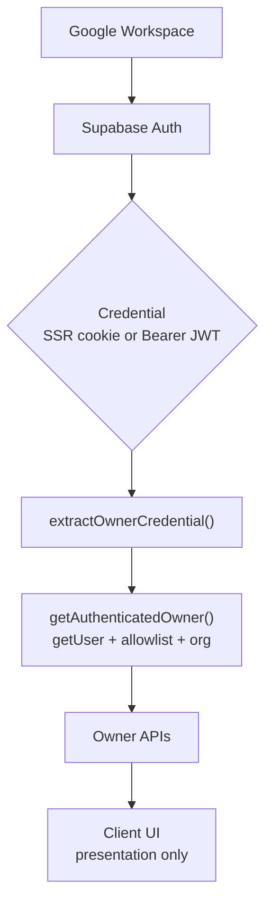
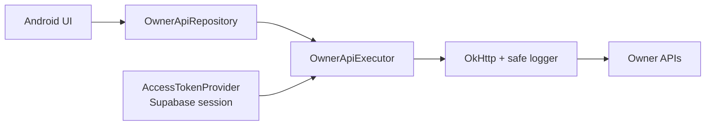
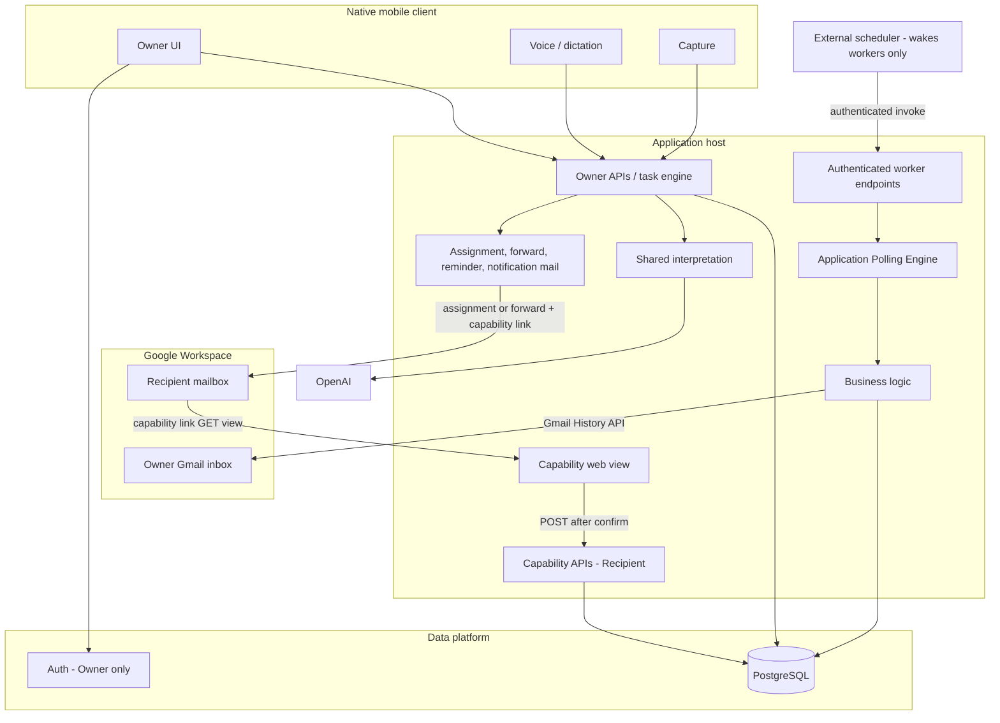

# Architecture

Governed by [PROJECT_CONSTITUTION.md](PROJECT_CONSTITUTION.md). Terms: [GLOSSARY.md](GLOSSARY.md). Decisions: [DECISIONS.md](DECISIONS.md). AuthZ details: [SECURITY_AND_PRIVACY.md](SECURITY_AND_PRIVACY.md). Workflow rules: [WORKFLOWS.md](WORKFLOWS.md). Contract: [API_CONTRACT.md](API_CONTRACT.md). Operations: [DEPLOYMENT.md](DEPLOYMENT.md).

This document describes the **current architecture and the rules that govern changing it**. It is not a build log. Delivery sequence and status live in [MILESTONES.md](MILESTONES.md).

## Architecture principles

[PROJECT_CONSTITUTION.md](PROJECT_CONSTITUTION.md) is the authoritative source. D079 records them as binding for hosting, schedulers, storage, messaging, and other infrastructure decisions.

Operational summary: keep business logic in the application; use vendor-neutral, modular infrastructure adapters; prefer low recurring cost where security, reliability, maintainability, and performance remain acceptable; keep designs simple and validate performance claims rather than adding platforms.

**Ownership boundaries (D131).** The application is the **sole source of truth** for Tasks, Task state, Reminder Schedules, reminder state, reminder policy, reminder history, delivery outcomes, and Owner-attention state. An **External Scheduler only wakes the application**: it decides nothing about due-ness, eligibility, whether a reminder is sent, schedule status, delivery counts, ceilings, generations, retry policy, or Owner attention. The application re-evaluates current state on **every** invocation, so a missed, late, or duplicated wake-up changes no outcome. **Gmail is a delivery transport only** and is never the reminder engine. **No third-party task engine is part of the architecture** — Google Tasks, Microsoft To Do, Apple Reminders, and Google Calendar as a task or reminder engine are **excluded alternatives**, not planned dependencies or fallbacks. A future productivity integration would need its own approved milestone and could not replace the application as the source of truth.

Scheduling is deliberately external and interchangeable: any scheduler that securely invokes the authenticated endpoint on cadence is acceptable (D065, D079). The current adapter is cron-job.org; Vercel Cron, GitHub Actions, Cloud Scheduler, and EventBridge are equivalent. No scheduler is an architectural dependency.

## Ownership and reuse map

**Read this before designing any new capability.** There is **one canonical Task domain**, **one shared proposal/candidate path**, and **one shared interpretation capability** (D157). Every native and web client uses the **same backend Task and intelligence system**. Existing infrastructure is **evolved rather than duplicated**: a parallel Task model, a second proposal pipeline, a second interpretation stack, a second reminder engine, a client-local Recipient truth, or a client-specific identity model each requires its own approved architecture decision.

Clients differ in presentation and device integration, never in what a Task _is_.

The **names in the right-hand column are current implementation, not product law** (D158). They may change without a product decision. What is binding is that a new capability must **inspect and evolve the listed carrier before creating a second one**.

| Domain                                                                 | Who owns the truth | Current implementation carrier to inspect first                                                                                                                                                                                                                                                                                                                                                                                                                                                                               | What must not happen                                                                                                                                |
| ---------------------------------------------------------------------- | ------------------ | ----------------------------------------------------------------------------------------------------------------------------------------------------------------------------------------------------------------------------------------------------------------------------------------------------------------------------------------------------------------------------------------------------------------------------------------------------------------------------------------------------------------------------- | --------------------------------------------------------------------------------------------------------------------------------------------------- |
| **Task**                                                               | Shared backend     | `packages/domain` state machines and policies, `packages/db` persistence, Owner Task HTTP in `apps/web`                                                                                                                                                                                                                                                                                                                                                                                                                       | Android, web, future iPhone, Gmail, SMS, and post-call capture must not create separate Task systems                                                |
| **Proposal / candidate**                                               | Shared backend     | `TaskSuggestion` and the shared Owner-review / responsibility-selection path (**D164**, **D161**, D155). A6 Application Suggestion Engine is a **preserved legacy automatic producer** (**D163**), not the carrier to extend for new capabilities                                                                                                                                                                                                                                                                             | No `CandidateTask`, inbox-task persistence, or second proposal store. One interpretation occurrence → 0..N TaskSuggestions                          |
| **Interpretation occurrence**                                          | Shared backend     | `interpretation_runs` / `InterpretationRun` in `@aicaa/db` — completed-occurrence persistence foundation (idempotency + successful outcomes only) (**D161**). Shared application producer wiring is authorized by **D169** and implemented in S3.1. **D170** authorizes S3.2 Owner `POST /api/v1/manual-captures` as the first HTTP adapter, now implemented. **D171** authorizes S3.3 Android capture-to-proposal client reachability (**authorized, not yet implemented**); full proposal-lifecycle UI remains unauthorized | No “one interpretation forever per source.” Occurrence is not canonical Task truth                                                                  |
| **Interpretation**                                                     | Shared backend     | `packages/ai` — Owner/shared `InterpretationResult` is the product interpretation job; A6 `SuggestionExtractionResult` remains a distinct legacy job sharing transport where appropriate (D085, **D161**, **D163**). Controlled S3 application-service wiring authorized by **D169**                                                                                                                                                                                                                                          | No per-source implementation of "what constitutes a task." Source-specific **adapters** may differ; the semantics may not                           |
| **Gmail / source ingest (A5)**                                         | Shared backend     | Gmail OAuth/sync, `CommunicationEvent`, `TemporaryCommunicationExcerpt` (**D077**, **D163**)                                                                                                                                                                                                                                                                                                                                                                                                                                  | A5 must not create TaskSuggestions or own AI interpretation. Future Review-with-Rocket / automatic modes consume A5, then shared interpretation     |
| **Reminders / follow-through**                                         | Shared backend     | Reminder Schedule and occurrence domain in `packages/domain` + `packages/db`, processing service in `apps/web/lib/reminders`                                                                                                                                                                                                                                                                                                                                                                                                  | No second reminder engine. Owner-controlled reminders extend or expose this domain                                                                  |
| **Recipients / assignment**                                            | Shared backend     | `Recipient`, `TaskAssignment`, `TaskCapability`, `HandoffAttempt`, Gmail handoff — authoritative for **external** Recipient assignment, capability, and delivery                                                                                                                                                                                                                                                                                                                                                              | No client-specific People list, assignment truth, or contact store. No Owner `TaskAssignment` or second assignment/custody state machine (**D164**) |
| **Owner identity / auth**                                              | Shared backend     | Supabase Auth, one credential pipeline for cookie and Bearer (D145–D147)                                                                                                                                                                                                                                                                                                                                                                                                                                                      | No client-specific identity truth or second auth path                                                                                               |
| **Attention, capture, notification, device integration, presentation** | **Native client**  | `apps/android` — inspect and evolve the existing A9.2 networking/capture substrate (`OwnerApiExecutor` / capture flow) where it can support the authorized Owner UX; do not casually discard it                                                                                                                                                                                                                                                                                                                               | Shared business intelligence must not migrate into Android merely because Android is the first native client                                        |

**Interpretation semantics (D154, D161, D164).** The target shape for every source is:

```
source → interpretation occurrence → zero or more proposals → Owner review
       → accept and choose who is responsible (Owner or Recipient) → canonical Task → follow-through
```

- One occurrence may produce 0..N TaskSuggestions. Zero proposals is **successful** Owner-initiated interpretation (no actionable Task) — not an error, not `skipped_irrelevant`, and not a fake suggestion.
- Multiple legitimate occurrences may reference the same source; there is no one-interpretation-forever-per-source invariant.
- Owner-initiated idempotency uses unique `(organizationId, idempotencyKey)` plus request-fingerprint conflict detection. Source identity and trigger are provenance, not uniqueness constraints. Everything the fingerprint covers is supplied by the caller, including the capture timestamp: a service clock reading would differ per attempt and turn an exact retry into a false conflict, so each source adapter states when its own source was captured.
- Automated A6 processing continues to use CommunicationEvent claim/lease/process-state infrastructure; its `AI_EMPTY_OUTPUT` semantics after heuristic prefilter are not redefined by Owner-interpretation zero-result success.
- Representing `trigger = owner_review` does **not** authorize Owner-review APIs, Review-with-Rocket UI, exclusions, automatic-processing changes, notifications, cron, or Production flags.
- **D169** authorizes controlled S3 implementation with Owner manual capture (`sourceKind = owner_manual_capture`) as the first source-neutral producer; Gmail and SMS adapters remain unauthorized until separately approved. S3.1 is implemented as backend infrastructure with no Production activation: the interpretation application service resolves organization-scoped idempotency before interpreting, calls the shared provider outside any database transaction, and commits the occurrence with its 0..N proposals atomically. Its provider composition is default closed, `peopleHints` and unresolved `deadlineExpression` are not persisted, and the service returns canonical proposals plus occurrence metadata rather than persistence identity. **D170** authorizes S3.2, now implemented: Owner-authenticated `POST /api/v1/manual-captures` plus generated public contracts call that service with server-fixed `owner_manual_capture`. The route is a thin adapter — authentication and organization scope, content type, `Idempotency-Key`, body validation, one service call, canonical DTO mapping — while fingerprinting, idempotency resolution, the provider call, and the occurrence transaction stay in S3.1. Raw capture text is transient on the server and never persisted, echoed, or logged, and the public response carries no interpretation provenance. **D171** authorizes S3.3 — Android switches manual capture onto that route and displays returned proposals read-only, with encrypted device-side pending-capture retry state (max 24 hours) — as the next controlled slice (**authorized, not yet implemented**). Generic arbitrary-source interpretation APIs, Gmail/SMS adapters, full Android proposal-lifecycle UI, and Production enablement remain separately unauthorized.
- Manual capture, Gmail, SMS, and future post-call capture converge on these semantics when their Owner-initiated interpretation paths are authorized.

**Responsibility selection (D164).** Acceptance asks the Owner **one** question — who is responsible for this Task — answered by the **Owner (Me)** or an external **Recipient**. There is no separate Owner-facing Keep action, and the architectural consequence is deliberately narrow:

- **A unified question does not require unified persistence.** A Recipient-responsible Task uses the existing Recipient / `TaskAssignment` / `TaskCapability` / `HandoffAttempt` / Gmail handoff chain, which stays **external**-Recipient machinery; an Owner-responsible Task is the canonical Task with **no active external assignment** and needs no `TaskAssignment` to the Owner.
- **Responsibility-selection evidence is the settled representation (D168).** The Owner's affirmative selection is a dedicated **append-only responsibility-selection evidence record** in the D155 structured-learning/evidence family, standing beside `TaskSuggestionRevision` as an independent axis, and written **atomically inside the existing proposal-approval mutation** — never as a later best-effort write — for every successful acceptance, which cannot occur without it. It must establish organization scope, accepted `TaskSuggestion` identity, resulting canonical Task identity, selected party kind (Owner or Recipient), the Recipient identity when the kind is Recipient, and the selection timestamp, with at most one such record for a successfully accepted proposal. It is **not** canonical Task state, current custody, delivery or handoff state, a replacement for `TaskAssignment`, a current-responsibility projection, or a responsibility-history state machine: no responsibility, assignee, or custody column on `Task`, no Owner `TaskAssignment`, and `AuditEvent` must **not** become the responsibility evidence store. Owner selection is affirmative — absence of the record, of a `TaskAssignment`, of a Recipient, or of a handoff never means **Me** was chosen — and responsibility selection stays distinct from accepted-content revision.
- **Recipient selection is not delivery (D168).** Selecting a Recipient persists the affirmative selection only: it creates no `TaskAssignment`, no `TaskCapability`, and no `HandoffAttempt`, sends no email or Gmail message, and activates no Recipient access. The existing later handoff mutation still owns every one of those effects, and a failed, pending, cancelled, cleared, or absent handoff never erases or falsifies the selection. One canonical Task, one reminder schedule/occurrence architecture, one follow-through engine, and the existing `TaskAssignment`/handoff infrastructure for external Recipients are preserved; D168 authorizes only its bounded evidence-carrier implementation slice.
- **Operational representation is not affirmative evidence.** A Task with no active assignment may operationally be Owner work (D080, D094), but that absence is **never** evidence that the Owner affirmatively selected Me (D155).
- **One canonical Task and one follow-through model.** Responsibility decides who is expected to do the work — never whether a Task may participate in lifecycle, deadline, reminder, completion, or follow-through. Owner attention mechanics may differ from Recipient email/capability delivery without becoming a second engine (see § Reminder and notification architecture).

**A5 / A6 boundary (D163).** A5 is the reusable Gmail/source infrastructure. A6 is **preserved compatibility/legacy** automatic Gmail processing — useful while it remains, **not** a dependency target for future Rocket capabilities. Shared infrastructure may be used by A6; new shared/product infrastructure must **not** depend on A6-specific semantics (heuristic gating, A6 extraction-empty behaviour, claim/lease batch semantics, or 0..1 proposal assumptions as product law). Future automatic Gmail intelligence remains a legitimate possible product direction and, when separately approved, should preferentially use the shared interpretation/proposal architecture rather than extend A6. This boundary does **not** require immediate A6 deletion.

**Client responsibility.** Mobile is the product surface; Android is the first native client; iPhone is planned, not being implemented. Native clients own Owner attention, capture, notifications, device integration, and presentation. The shared backend owns canonical Task truth, interpretation, synchronization, Gmail and backend communication handling, Recipient records, assignment, shared follow-through logic, and reusable business intelligence. Web is a synchronized companion over the same backend truth.

**What Android can inherit from the web foundation (D116):** product and presentation **rules**, semantic **token values**, and generated contract **enums**. Not React components, TypeScript formatter implementations, or browser interaction code. Parity is achieved by re-implementing documented rules against shared token values.

## System shape

Private mobile-first product: Next.js on Vercel, Supabase PostgreSQL, Prisma on authorized servers only, Gmail API for inbox and forwarding, OpenAI for extraction and transcription. Hosting choices are deployment defaults, not business architecture (D079).

**Core chain:** Owner → Task → Assignment → Capability → Capability Link → Recipient action.

Assignment binds a Task to a Recipient. A Capability is the authorization grant for that assignment. A Capability Link delivers the bearer credential. Possession authorizes scoped actions; it does not authenticate a person.

### Package layout

| Path                                                    | Responsibility                                                                                                                                                                         |
| ------------------------------------------------------- | -------------------------------------------------------------------------------------------------------------------------------------------------------------------------------------- |
| `apps/android`                                          | Kotlin + Jetpack Compose Owner client: authentication and secure session, reusable authenticated networking, Task capture, Task list/detail and lifecycle, optional handoff assignment |
| `apps/web`                                              | Next.js App Router: Owner session/task/Recipient/handoff/reminder HTTP; internal worker endpoints; capability runtime; Recipient capability APIs and `/c/[token]` page                 |
| `packages/contracts`                                    | Canonical OpenAPI 3.1; generated TypeScript and Kotlin DTOs (D007)                                                                                                                     |
| `packages/domain`                                       | Pure TypeScript state machines, policies, calendar arithmetic, retention helpers — no I/O                                                                                              |
| `packages/db`                                           | Prisma schema, migrations, repositories, transactions (server-only; D006, D062)                                                                                                        |
| `packages/ai`                                           | The one shared interpretation capability (D085, D157)                                                                                                                                  |
| `packages/ui`                                           | Semantic-token layer only (D116): one `tokens.css`, no build step, no React. Not a component library                                                                                   |
| `packages/eslint-config` / `packages/typescript-config` | Shared tooling                                                                                                                                                                         |

Do not share Zod types with Kotlin — generate clients from OpenAPI.

### Component map

| Component                                                | Responsibility                                                                                                                        |
| -------------------------------------------------------- | ------------------------------------------------------------------------------------------------------------------------------------- |
| Android app                                              | Owner presentation and capture; Owner session credentials only (Bearer JWT); no direct business-row writes to Supabase (D033, D146)   |
| Next.js                                                  | Owner auth (cookie + Bearer through one pipeline, D145), Owner APIs, capability runtime, Recipient routes and pages, mailers, workers |
| Supabase Auth                                            | Google Workspace sign-in for the **Owner only** (D048); web SSR cookies and Android native session share this IdP                     |
| Supabase Postgres                                        | System of record                                                                                                                      |
| Prisma                                                   | Server data access only                                                                                                               |
| Gmail API                                                | Ingest, assignment mail, forward-with-attachments, reminder and notification transport                                                |
| OpenAI                                                   | Structured extraction and transcription                                                                                               |
| Follow-up Engine / Event Notification Engine / retention | Deterministic reminder and Owner-event processing and purge; engines in-app, woken by External Schedulers (D079)                      |

## Domain state model

Persisted states and transitions, implemented in `packages/domain`. **Task status is independent of Assignment.** Reminder behaviour is owned by [WORKFLOWS.md](WORKFLOWS.md) §10a. Concurrency preconditions and error codes are owned by [API_CONTRACT.md](API_CONTRACT.md).

### Task Suggestion

Rocket’s **single shared proposal domain** (D157, D161). Persisted states: `pending` · `approved` · `dismissed` · `merged`. Terminal states do not transition again. Only the **Owner** may approve, edit, dismiss, or merge; AI and voice create suggestions, never Tasks (D038).

TaskSuggestion is the **mutable operational proposal head**. Append-only proposal revisions preserve revision 0 (AI as presented to the Owner) and later Owner edits; the finally accepted **content** revision must be identifiable (D155). Approval creates an **unassigned** Task (D080).

Acceptance also carries **one responsibility selection** — the Owner or a Recipient (D164) — recorded as affirmative D155 evidence independent of the accepted content revision. Selecting a Recipient records that affirmative selection only; the existing Recipient / `TaskAssignment` / Gmail handoff path remains the later delivery/delegation mechanism after Recipient selection (D168).

**Implementation status.** The responsibility-selection carrier is implemented in `@aicaa/db` as `task_suggestion_responsibility_selections`, written atomically inside the existing approve transaction. The selection is **required** on approve through the distinct `responsibility` concept, so no acceptance can succeed without its affirmative evidence and an omitted field is rejected rather than defaulted to Owner; the legacy `recipientId` keeps its D080 rejection. `party_kind` is the whole affirmative answer. Owner TaskSuggestion list/detail expose the existing nullable `approvedTaskId` linkage for lost-response recovery (approval linkage, not responsibility state). Accepted-content-revision identification, Owner-edit revision capture, a public read API for the selection, and Android/web responsibility UX remain unimplemented ([DATA_RETENTION.md](DATA_RETENTION.md) § Learning evidence, [packages/db/README.md](../packages/db/README.md)).

| From                          | To        | Actor | Notes                                                                                                                                                     |
| ----------------------------- | --------- | ----- | --------------------------------------------------------------------------------------------------------------------------------------------------------- |
| pending                       | approved  | Owner | Creates an **unassigned** Task (D080); excerpt safety ceiling (D082, multi-proposal sibling entitlement); Recipient handoff is a separate mutation (D090) |
| pending                       | dismissed | Owner | Excerpt `purgeAt = dismissedAt + 7 days` (D020, D082)                                                                                                     |
| pending                       | merged    | Owner | Requires suggestion `If-Match` + `targetTaskIfMatch` (D083); excerpt +7d                                                                                  |
| approved / dismissed / merged | —         | —     | Terminal                                                                                                                                                  |

### Task

Persisted states: `open` · `in_progress` · `waiting` · `completed` · `dismissed`.

| From                         | To                 | Owner (session) | Recipient (capability, POST after confirm) |
| ---------------------------- | ------------------ | --------------- | ------------------------------------------ |
| open                         | in_progress        | yes             | no                                         |
| open / in_progress           | waiting            | yes             | yes                                        |
| waiting                      | open / in_progress | yes             | yes (resume)                               |
| open / in_progress / waiting | completed          | yes             | yes                                        |
| open / in_progress / waiting | dismissed          | yes             | no                                         |
| completed / dismissed        | —                  | terminal        | terminal                                   |

**Assignment is an attribute**, not a Task status (`TaskAssignment`). It records **external** Recipient assignment; an Owner-responsible Task simply has no active one (D164). At most one Assignment is active; historical rows persist. Capability grants attach to a specific Assignment, not to "whoever is assigned"; at most one **active** Recipient capability per Assignment, and reassignment or re-forward revokes the prior one (D086). Delivery outcomes are `pending` / `sent` / `failed` (D092), and a capability becomes actionable only after a successful send. Handoff is the Owner mutation `POST /api/v1/tasks/{taskId}/handoff` (D090) — not part of suggestion approval.

**Waiting and resume.** Entering `waiting` stores `priorActionableStatus`; `resume` restores it. Waiting is the **only** pause mechanism (D097, D101, D107) and does not alter retention clocks.

**Return to Owner** clears the Assignment and leaves Task status unchanged. **Request clarification** does not change Task status; it is an Event Notification Engine input (D099). Capabilities are multi-use until invalidation (D056); a Recipient work request becomes a pending Suggestion (D061).

**Completion** requires only `outcomeType`; note, structured outcome summary points, and a next-action proposal payload are optional. Recipient completion uses the same shape under capability auth with explicit POST confirmation. Any next action remains a Suggestion requiring Owner approval (D038).

**Lifecycle deletion (D064).** Physical Task deletion is out of scope; abandoned work is **dismissed**.

### Derived display labels (never persisted)

`due_soon` and `overdue` are derived for display only, and are not computed while `waiting`, `completed`, or `dismissed`. They **must not** be a scheduling mechanism: reminder occurrences are computed from the due **date** by [WORKFLOWS.md](WORKFLOWS.md) §10a (D103), never from a label, and label-triggered sends remain prohibited (D102, D117). Rendered through `apps/web/lib/presentation/task-status.ts` and formatted in the organization timezone by `apps/web/lib/presentation/datetime.ts` (D034, D117, D122) — never the browser, device, or machine-local timezone.

**Contract debt.** Both labels are still computed from the instant-typed `dueAt`, an artefact of the pre-A8.1 representation. When the derivation is restated in local-calendar terms (D109) that window goes; until then it is not reminder law.

## Auth boundary

| Party     | Mechanism                                         |
| --------- | ------------------------------------------------- |
| Owner     | Supabase session (authentication)                 |
| Recipient | Capability token (authorization only; no account) |

Full rules: [SECURITY_AND_PRIVACY.md](SECURITY_AND_PRIVACY.md).

**One shared Owner identity path (D145–D147).** Android presents a Bearer JWT; web presents SSR cookies. Both enter the **same** extraction and validation pipeline. Android sign-out is session-local (D147) and does not terminate web sessions. A future client reuses this pipeline rather than establishing its own identity truth.


```mermaid
flowchart TB
  GW["Google Workspace"]
  SA["Supabase Auth"]
  Cred{"Credential<br/>SSR cookie or Bearer JWT"}
  Ext["extractOwnerCredential()"]
  Own["getAuthenticatedOwner()<br/>getUser + allowlist + org"]
  APIs["Owner APIs"]
  UI["Client UI<br/>presentation only"]

  GW --> SA
  SA --> Cred
  Cred --> Ext
  Ext --> Own
  Own --> APIs
  APIs --> UI
```

Device verification procedure: [A9_0_DEVICE_VERIFICATION.md](A9_0_DEVICE_VERIFICATION.md).

## Platform directions

**Android.** `minSdk` 31; application id `com.aicommunication.assistant`; private sideload (D019, D040). Device target Galaxy S24+; dialer parsing OPEN #1. Does not write core business rows directly to Supabase — calls Owner session APIs with Bearer JWT after Supabase Auth (D033, D145, D146). OAuth return deep link `aicaa://auth-callback`. FCM deferred (D017).

Android networking is a single hand-written OkHttp stack (D047, D148): Owner API repositories extend `OwnerApiRepository` and call through `OwnerApiExecutor`. **There is no second HTTP client.**


```mermaid
flowchart LR
  UI["Android UI"]
  Repo["OwnerApiRepository"]
  Exec["OwnerApiExecutor"]
  Tok["AccessTokenProvider<br/>Supabase session"]
  Net["OkHttp + safe logger"]
  API["Owner APIs"]

  UI --> Repo --> Exec
  Tok --> Exec
  Exec --> Net --> API
```

**Android is online-first (D132).** The application is the only source of truth (D131). A **temporary** loss of connectivity must degrade gracefully rather than silently: the interface stays stable and truthful, in-progress drafts are preserved where appropriate, duplicate actions are prevented, a write that did not reach the server is never presented as successful, retry runs **through** the existing idempotency and concurrency machinery, and reconnecting never produces duplicate mutations. This is a reliability requirement, **not** an offline feature: no offline store of business records, service-worker caching of authenticated business data, mutation queue, background synchronization, or conflict-resolution layer is in scope (D111, D132), and no surface may claim the application works offline.

**Current Android screens are scaffolding, not final UX.** The existing capture and Task screens are a working client over the shared backend; they are not the intended Owner experience. Branding direction lives in [BRAND.md](../BRAND.md).

**Android capture is currently direct-create, and that is not the target (D154).** Today: Capture → Save → `POST /api/v1/tasks` → confirm only on `201`, with IME speech-to-text filling the same field. The product target for manual typed or dictated capture is AI-first: Owner input → interpretation occurrence → zero or more proposed Tasks → Owner review → accept and choose the responsible person, **Me** or a **Recipient** → canonical Task → follow-through (D161, **D164**). **D169** authorizes controlled S3 backend machinery for that path (S3.1: shared interpretation application service + canonical persistence). **D170** authorizes S3.2 Owner manual-capture HTTP/API (`POST /api/v1/manual-captures` + generated contracts) calling that service, now implemented on the backend. **D171** authorizes S3.3 Android capture-to-proposal integration — switch capture onto that route, freeze the durable retry tuple, display returned proposals read-only, and keep encrypted device-side pending-capture retry state for at most 24 hours — **authorized, not yet implemented**. S3.3 does **not** authorize full proposal-lifecycle actions (approve, responsibility selection, edit/merge, inbox, Task creation from proposal). Evolving the one shared proposal path and the one shared interpretation capability (D157) remains required; do not add a second one. The shipped Android direct-create path is a legacy/direct-capture shortcut; S3.3 may leave that Android implementation temporarily unused for rollback, and must **not** remove or modify the backend `POST /api/v1/tasks` endpoint.

**Web.** Owner-authenticated routes for Owner APIs (D048). Recipient mutations use `/api/v1/capabilities/{token}/…` (D059); browser view `GET /c/[token]` is non-mutating. Capability secrets: hash at rest, one-time raw reveal to Owner (D063), seven-day default TTL with persisted `expiresAt` (D055), multi-use until invalidation (D056). Dismiss, not physical delete (D064).

**Mobile is the primary product experience; Android is the first native client** (D153, extending D139). Web is a synchronized, optional companion for administration, review, debugging, and fallback.

The Owner web surface has an application shell at `apps/web/app/(owner)/layout.tsx` — a Next.js **route group**, so `/tasks`, `/tasks/{taskId}`, and `/attention` keep their public URLs. `/`, `/login`, `/auth/**`, `/c/{token}`, and capability APIs stay deliberately **outside** the group. Sign-out is `POST /auth/sign-out` with **no `GET` handler**, because a GET sign-out URL would be prefetchable by `next/link` and merely viewing a linking page could end the session.

**Telemetry.** Client telemetry **excludes capability routes entirely** — a `/c/{token}` path carries an authorization secret (D114). No commercial telemetry vendor, session replay, or behavioural analytics is authorized (D115). Hosted or OpenTelemetry backends remain adapters. `AuditEvent` already carries `requestId` and `correlationId`; public error envelopes reuse the request-scoped `requestId` rather than minting an unrelated one.

**Organization timezone is a documented constant, not a database field.** `OWNER_DISPLAY_TIME_ZONE = 'America/Vancouver'` (D034) is passed as an explicit IANA `timeZone` to `Intl.DateTimeFormat`; daylight saving is delegated entirely to `Intl`. It is deliberately **not** an environment variable, because an env-var timezone can differ between the server rendering a date and the operator reading a log. Owner timestamps are formatted on the **server**, so no hydration mismatch is possible. This is presentation only and must never become the scheduling resolver, which remains **D103**.

**Gmail.** One Owner inbox per organization; poll every five minutes (D065); polling-only (D066). Inbox-only ingestion (D068); Workspace-domain mailbox gate (D069). OAuth holds `gmail.readonly` and `gmail.send`; do not request `gmail.modify` without a new Decision (D093). An External Scheduler invokes `GET|POST /api/v1/internal/gmail/poll`. Ingestion creates communication events only — not suggestions (D077). On handoff the server forwards Gmail-origin originals with attachments (or sends a non-Gmail assignment email) using persisted Task `summaryPoints` — no fresh LLM (D094) — and activates the Assignment only after Gmail accepts the send (D092).

**AI and suggestions.** The preserved A6 Application Suggestion Engine is separate from Gmail sync (D084): heuristic relevance, then LLM extraction via `packages/ai` (D085). It is compatibility/legacy automatic processing (**D163**), not the architecture new product work should extend. Approve creates an unassigned Task only (D080). Recommendations never silently become assignments, emails, or Reminder Schedules. `proposedRecipientHint` may map to `proposedRecipientId` only via deterministic match to an active Recipient (D094) — never auto-handoff. AI may recommend a **due date**; only explicit Owner selection has scheduling effect, and AI may never create, activate, alter, or suppress a Reminder Schedule (D027, D102, D152).

**Automatic email interpretation via A6 is current implementation infrastructure, not the product commissioning target.** Email interpretation is targeted to become Owner-initiated ("Review with Rocket") with sender exclusion; automatic interpretation of non-excluded mail remains a **future** mode (D156) and, when approved, should preferentially use the shared interpretation/proposal architecture rather than extend A6 (**D163**). The three categories are kept distinct in [WORKFLOWS.md](WORKFLOWS.md) §1a. Nothing here authorizes a change to the operational path or requires A6 deletion.

## Reminder and notification architecture

Authoritative rules: [WORKFLOWS.md](WORKFLOWS.md) §10. Product law: D102–D110, D128–D136, D152, D164. Persistence reference: [packages/db/README.md](../packages/db/README.md).

**Shape.** A Reminder Schedule is **due-date-driven and Task-scoped**, surviving reassignment (D102, D104). Occurrences are **09:00 organization-local** on a local calendar date, computed with timezone-aware local-calendar arithmetic and resolved individually to absolute instants. Fixed 24-hour millisecond arithmetic is **prohibited** (D103). One advance reminder the morning before the due date (D105); one each morning after while incomplete, capped at **14 successful overdue deliveries per generation**, then `requiresOwnerAttention` (D106). Waiting suspends and is the only pause mechanism (D107). Automated sends are attributed to a **`system`** actor; Owner scheduling changes to the **`owner`** actor (D107).

**D152 is product law:** Task → 0..1 deadline → 0..N Owner-controlled reminders. Owner-controlled reminders independent of deadlines are **authorized**; escalation ladders, Owner CC ladders, silent AI scheduling, and general calendar management as the product's purpose remain prohibited. The current engine rules stay due-date-driven until a separately authorized implementation slice evolves this domain — **which is the domain to evolve, not to replace.**

**Audience is not responsibility, and there is an unresolved seam here (D164).** A8 reminder delivery is Recipient-oriented throughout: eligibility requires an active external assignment, and an occurrence without one is skipped as `no_active_assignment` ([WORKFLOWS.md](WORKFLOWS.md) §10a). Owner-responsible reminder delivery is therefore **not implemented and not claimed anywhere**; closing that seam needs its own authorized slice and must **evolve this Task-scoped domain** rather than add a second reminder engine, schedule, or occurrence model.

**The Event Notification Engine** is event-driven, separate, and Owner-audience, delivered by email through the Owner's connected Gmail (D099). Ten canonical event types; no escalation stages or Owner-CC ladders; FCM/push deferred (D017). Its law is locked at D133–D136.

### Structural rules that survive their originating slice

These were expensive to learn. They apply to new work, not only to the code that produced them.

- **Occurrence identity is the duplicate-prevention authority.** `(schedule, generation, occurrence kind, local calendar day)`, unique in the database, is the only thing standing between a Recipient and two emails about the same morning. Every other exclusion mechanism — the schedule claim lease, the batch bound — is an **efficiency** concern, and losing one costs duplicated effort, never a duplicated send. Delivery finalization therefore does not consult the lease at all. Two authorities that can disagree is the failure mode this rule exists to prevent.
- **Identity is server-derived; there is no caller-supplied idempotency key** (D109, D133). The index prevents duplication, not fabrication: a future API must derive the identity fields rather than let a client choose them.
- **Mark the provider call as started _before_ the transport, never after.** That ordering is the entire recovery rule. An expired claim without the marker means nothing left the building — reclaim it. With it, a provider may hold the message and nobody can prove otherwise, so the occurrence finalizes as `ambiguous`, consumes its local day, and is never retried. Marking afterwards makes those two cases indistinguishable and the sweep resends.
- **A successful delivery is never undone by a schedule that moved.** Terminalizing the occurrence and applying the schedule effect are **two transactions**. Zero-row tolerance in the second phase is not the same property as "cannot raise" — an unexpected error in a shared transaction takes the record of a sent message with it. Splitting them trades an unrecoverable loss for **representable, self-healing debt**: a terminal row with no settlement marker, found by a sweep and discharged idempotently.
- **Ambiguity is never reported as a send, and only a provider's HTTP answer may produce a retry.** A timeout, an unparseable response, a `2xx` with no message id, and any connection failure are ambiguous, because the runtime reports a connection refused before the request was written identically to one reset after the provider received the whole body.
- **One lock order across every mutation of a shared aggregate.** Reminder mutations begin by locking the Task row, then read, then write. A mixed order deadlocks under contention with the victim escaping as a 500. One order removes the cycle by construction rather than asking every future transaction to remember a sequence.
- **No transaction trusts the caller's pre-lock observation.** Every branch needs a transactional precondition, **including the "nothing to do" branch** — otherwise the loser of a race has nothing to lose against and commits a contradiction.
- **A sub-resource that does not bump the parent's version needs its own ETag.** A reminder write deliberately does not bump `Task.version`, so a Task ETag stays valid across a reminder change it cannot describe. `reminder_version` moves on Owner-controlled configuration and lifecycle changes and deliberately **not** on delivery counting or the attention flag, so a worker doing its job cannot invalidate an Owner's in-flight edit. A precondition token is not a representation validator.
- **Read related facts in one snapshot.** Independent unlocked statements return halves of different moments and describe a state that never existed. Pre-send validation and coherent Owner reads take one `RepeatableRead` transaction.
- **Scan globally, write scoped.** Worker scans span organizations, bounded and ordered, because enumerating tenants in application memory makes a fairness decision in the least observable place available. Every row carries its own `organizationId` read from the database, and every subsequent write scopes by it.
- **Flags fail closed and are evaluated before work begins.** A flag matches the exact string `"true"`; `1`, `TRUE`, `yes`, and whitespace variants leave the feature off. It is read **before** any transaction opens or runtime loads, so a disabled path opens no connection and constructs no transport. There is **no default transport** — an unconfigured transport claiming success is the one failure a delivery system cannot detect downstream.
- **Request-scoped authorization is resolved once, before the first claim.** Resolving per item lets a worker deliver three of ten and only then discover the connection was never usable, spending three of a Recipient's fourteen local calendar days on messages that had no chance. An authorization failure is a fact about the deployment and must not be charged to whichever schedule the scan reached first.
- **Persistence stores facts; the domain computes them.** Repositories take the instant and the occurrence as arguments. A source guard fails the build on a clock read, timezone resolution, day arithmetic, or a restated ceiling inside persistence. Scheduling has one home (D103, D127).
- **Do not store a derived counter that needs resetting on several paths.** A stored ambiguity count must reset on success, permanent failure, and new generation; any missed path stops a schedule early or never. A generation-scoped derivation resets by definition.
- **The unsafe writer is exported from no barrel**, enforced by a source guard. An export is an invitation, and the safe path is only safe if it is the only path.
- **A reminder carries no capability link** (D130). A capability is a bearer secret delivered once, so a link would mean minting a new capability per reminder — multiplying live credentials — or adding an unauthenticated redirect surface. The reminder directs the Recipient to the original assignment email, which makes that capability's health a pre-send gate. Rendered summary lines are URL-redacted and both MIME bodies asserted link-free.
- **An Owner link is permitted where a Recipient link is not**, because an Owner is not a bearer: `/tasks/{id}` is not a credential and reaches sign-in without a session.
- **Recipient free text has no parameter to arrive through** in Owner notifications. Escaping does not satisfy D134 — a Recipient's words reaching the Owner under Rocket's own `From` address is laundering regardless of encoding.
- **Self-ingestion is excluded by one exact marker on a top-level header**, checked before any downstream fixture is built. Honouring a nested `message/rfc822` part would let anyone claim the exclusion by attaching a forwarded copy. Two markers, an empty value, or a near-miss fail closed and stay ingestible.
- **A structural source guard beats a race test for regression defence.** A microsecond-wide window cannot be reliably landed by a test; reading the source and failing when a decision moves outside the locked transaction rejects the defective design on every run with no database. Race suites remain evidence of behaviour under contention, not the regression mechanism.

### The `serverExternalPackages` runtime-value import hazard

`@aicaa/db` is listed in `serverExternalPackages`, so **a runtime value imported from it does not reliably survive the Next build** while a type-only import always does. This is a property of the packaging boundary, not of any feature, and it applies to every module in `apps/web` that reaches persistence.

**Unit tests structurally cannot detect a violation** — Vitest resolves the workspace package directly, so the binding exists in every test and is missing only in the shipped artefact. A green suite is not evidence. Persistence must be reached through `loadDbRuntime()`, or the value must be owned locally with a guard tying it to the persistence authority. Production bundle verification is the only real guard. Full statement and known instances: [DEPLOYMENT.md § the runtime-value import hazard](DEPLOYMENT.md#the-runtime-value-import-hazard).

## Contract strategy

1. Author OpenAPI (D007).
2. Generate TypeScript and Kotlin from OpenAPI.
3. Optionally derive JSON Schema; never treat it as source of truth.
4. Server validation aligned with OpenAPI; CI drift checks.

## Retention

Concrete excerpt `purgeAt` always (D082); ingest `syncedAt + 7 days` (D078); bounded 30-day workflow safety ceiling (not refreshed for long-lived active Tasks) / terminal + 7 days (D020, D082); multi-proposal sibling entitlement so one sibling does not shorten another’s still-valid hold (D082, D161); Owner-authored manual capture raw input is a separate short-lived review-support class (max 7 days from successful interpretation — D162), not TemporaryCommunicationExcerpt; 30-day completed visibility scrub; immediate audio delete on success. Application retention does not delete Gmail mailbox copies (D031). Details: [DATA_RETENTION.md](DATA_RETENTION.md).

## Target diagram

**Target architecture, not a statement of what is built.** Current implementation status is owned by [MILESTONES.md](MILESTONES.md).


```mermaid
flowchart TB
  subgraph Device["Native mobile client"]
    Capture["Capture"]
    Voice["Voice / dictation"]
    AppUI["Owner UI"]
  end

  subgraph Google["Google Workspace"]
    Gmail["Owner Gmail inbox"]
    RecipientMail["Recipient mailbox"]
  end

  subgraph Host["Application host"]
    API["Owner APIs / task engine"]
    PollEndpoint["Authenticated worker endpoints"]
    PollEngine["Application Polling Engine"]
    BusinessLogic["Business logic"]
    CapAPI["Capability APIs - Recipient"]
    CapView["Capability web view"]
    AI["Shared interpretation"]
    Mailer["Assignment, forward, reminder, notification mail"]
  end

  subgraph Data["Data platform"]
    Auth["Auth - Owner only"]
    DB[("PostgreSQL")]
  end

  Scheduler["External scheduler - wakes workers only"]
  OpenAI["OpenAI"]

  Capture --> API
  Voice --> API
  AppUI --> Auth
  AppUI --> API

  Scheduler -->|authenticated invoke| PollEndpoint
  PollEndpoint --> PollEngine
  PollEngine --> BusinessLogic
  BusinessLogic -->|Gmail History API| Gmail
  BusinessLogic --> DB
  API --> DB
  API --> AI
  AI --> OpenAI
  API --> Mailer
  Mailer -->|assignment or forward + capability link| RecipientMail
  RecipientMail -->|capability link GET view| CapView
  CapView -->|POST after confirm| CapAPI
  CapAPI --> DB
```

## Known limitations

- Messages notification bodies may be incomplete or unavailable; call capture is best-effort and device-dependent.
- Gmail forward may fail for size or policy; the system must not send knowingly incomplete forwards (D088).
- Application retention does not control Gmail copies after forward (D031).
- Capability link possession equals authorization (misuse risk; D051). Re-forward revokes the prior active capability (D086).
- Handoff delivery may be synchronous and subject to host runtime limits; the architecture must allow a later worker (D094).
- Stale or uncertain `pending` handoff attempts have no reconciliation worker. They remain queryable; resolution is deferred, explicitly-authorized work.
- RSC `error.digest` on the Owner Task segment boundary is a Next.js framework digest, not the application `requestId`.
- A schedule's organization and its Task's organization are not bound by a composite foreign key; coherence is enforced in application code. The stronger fix needs its own migration.

## Failure principles

1. Degrade to manual or voice rather than silent loss.
2. Retry transient failures with audit.
3. Never assign or forward without recorded Owner approval.
4. Idempotency for forwards, reminder delivery attempts, notifications, and ingest.
5. Quarantine invalid AI output; do not guess.
