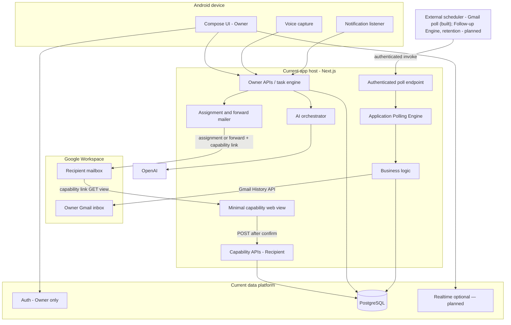

# Architecture

Governed by [PROJECT_CONSTITUTION.md](PROJECT_CONSTITUTION.md). Terms: [GLOSSARY.md](GLOSSARY.md). Decisions: [DECISIONS.md](DECISIONS.md). AuthZ details: [SECURITY_AND_PRIVACY.md](SECURITY_AND_PRIVACY.md). States: [STATE_MACHINE.md](STATE_MACHINE.md).

## Architecture Principles

[PROJECT_CONSTITUTION.md](PROJECT_CONSTITUTION.md) is the authoritative source for the complete Architecture Principles. D079 records them as binding for hosting, schedulers, storage, messaging, cloud services, and other infrastructure decisions.

Operational summary: keep business logic in the application; use vendor-neutral, modular infrastructure adapters; prefer low recurring cost and free tiers only when security, reliability, maintainability, and performance remain acceptable; keep designs simple and validate performance claims rather than adding unnecessary platforms.

**Gmail polling (A5) exemplifies these principles:** the application owns the Application Polling Engine (sync, History ingestion, eligibility, locks, audit). Scheduling is intentionally external. Any External Scheduler that securely invokes the Authenticated Endpoint every five minutes (D065) is acceptable. The recommended initial Infrastructure Adapter while on Vercel Hobby is **cron-job.org**; Vercel Cron, GitHub Actions, Google Cloud Scheduler, AWS EventBridge, and other compatible schedulers remain fully interchangeable. No scheduler is an architectural dependency (D079). External scheduling keeps the app portable across hosting providers.

## System shape

Private Android-first product with Next.js on Vercel, Supabase PostgreSQL, Prisma on authorized servers only, Gmail API for inbox and forwarding, OpenAI for extraction/transcription. Current hosting choices are deployment defaults, not hard-wired business architecture (D079).

**Core chain:** Owner → Task → Assignment → Capability → Capability Link → Recipient action.

Assignment binds a Task to a Recipient. A Capability is the authorization grant for that assignment. A Capability Link delivers the bearer credential. Possession of the link authorizes scoped actions; it does not authenticate a person.

## Implemented through A4 (production-verified)

The following are **implemented** in the repository and included in production verification (`A4_FULL_E2E_PASS`):

- Owner Google Workspace authentication (Supabase Auth; single Owner)
- Owner session API (`GET /api/v1/session`)
- Owner task HTTP (create, list, get, lifecycle mutations, historical snooze surface, dismiss, capability issuance)
- Task persistence (`@aicaa/db` / Prisma on Supabase Postgres)
- Recipient capability HTTP and non-mutating `GET /c/[token]` page
- Recipient POST actions with explicit confirmation
- Audit trail for Owner and capability actions (D057)
- Vercel-hosted Next.js runtime with traced `@aicaa/db` / Prisma packaging

Deployment and smoke checks: [DEPLOYMENT.md](DEPLOYMENT.md). HTTP status by route: [API_CONTRACT.md](API_CONTRACT.md).

## Implemented through A6 (production-operational; A5 and A6 closed)

The following are **implemented** and **production-operational**. A5 and A6 are closed except for future bug fixes. Gmail settings UI and History recovery remain deferred and do not block A7:

- Gmail account connection and polling (A5)
- Communication event ingestion tables and Application Polling Engine (A5)
- Owner Gmail OAuth connection routes (A5.3) with encrypted tokens
- Manual Gmail sync, History ingestion (seed + incremental), safe sync-run listing (A5.4)
- Authenticated internal Gmail poll endpoint for External Schedulers (A5.5); cron-job.org every five minutes
- Sync locking, duplicate protection, system audit (D074)
- Heuristic relevance + LLM extraction via `packages/ai` (A6, D085)
- Application Suggestion Engine via `POST /api/v1/internal/suggestions/process` (A6, D084); separate cron-job.org job every five minutes
- Owner task-suggestion HTTP (list/get/approve/edit/dismiss/merge)
- Approve creates **unassigned Task only** (D080); merge dual-resource concurrency (D083)
- Relational event↔suggestion idempotency and processing state (D081)
- Excerpt workflow safety-ceiling retention (D082: dismiss +7d / approve +30d)

## Implemented through A7 (closed and production-operational)

**A7 is complete and production-operational** (contracts through Owner confirmation UI + Gmail send re-consent UI, closed after a full production E2E on both delivery paths). Binding decisions: D086–D094. Do **not** begin Follow-up Engine or Event Notification Engine implementation without explicit authorization (D089, D102–D110).

Shipped in A7 (production-verified):

- Gmail assignment email and forward-with-attachments via `POST /api/v1/tasks/{taskId}/handoff` (D037, D090)
- Minimal Owner Recipient management (list/create/update/inactive) — not a CRM (D087)
- Delivery attempt persistence (`pending` / `sent` / `failed`) and single active capability with re-forward revocation (D086, D092)
- Gmail OAuth `gmail.readonly` + `gmail.send` for handoff (D093); Owner re-consent when send missing
- Thin Owner confirmation UI (`/tasks`, `/tasks/[taskId]`) and Gmail send re-consent UI (A7.8), with a `/tasks` segment error boundary and Owner-visible Recipient notes / completion outcome

## Planned for P1, A8, and later (target architecture)

- **P1 Owner web experience foundation** (authorized by D111–D120; **P1.1 observability implemented**; shell/UI slices not started — see [P1 section](#p1-owner-web-experience-foundation) below)
- **Follow-up Engine** (due-date-driven, Task-scoped) and **Event Notification Engine** (A8; product law D102–D110 superseding parts of D095–D101; [WORKFLOWS.md](WORKFLOWS.md) §10)
- Retention workers (A13); optional Supabase Realtime
- Future `CommunicationAccount` schema (multiple inboxes later; v1 targets one)
- Android Owner task UI, push delivery for Event Notifications, Messages/call capture, voice, learning (A9–A14; FCM remains deferred — D017)

Descoped from A7 at close and deferred to a future authorized slice (does not block A8): reassignment / explicit re-forward orchestration, proposed-Recipient hints, reconciliation workers, Owner UI for Recipient management. Full list: [MILESTONES.md](MILESTONES.md) A7 deferred backlog.

### A7.4 Gmail send transport (implemented; transport-only)

A7.4 adds the **outbound Gmail transport layer** — send-scope preparation, outbound-message construction (MIME), and provider transport. It is pure send/compose infrastructure. **A7.4 does not** decide eligibility, create a `HandoffAttempt`, activate a capability, or transition persistence state; those belong to later application orchestration. All transport code lives in `apps/web/lib/gmail/transport` and `apps/web/lib/gmail/outbound` and never imports `@aicaa/db`.

- **Scopes.** OAuth now requests `openid`, `email`, `gmail.readonly`, and `gmail.send` (the minimum send scope). We deliberately do **not** request `gmail.modify`, `gmail.compose`, `https://mail.google.com/`, or contacts (D093). Authoritative source: [users.messages.send](https://developers.google.com/workspace/gmail/api/reference/rest/v1/users.messages/send).
- **Incremental consent.** The auth URL sets `include_granted_scopes=true` so an existing read-only Owner can add `gmail.send` without a destructive reconnect. Existing read-only grants keep polling. A server helper (`buildGmailSendConsentAuthUrl`) can initiate re-consent; Owner re-consent UI shipped in A7.8.
- **Send-capability prerequisite.** `gmail.send` is derived from the persisted `grantedScopes` string, never from the mere existence of a connection. The prerequisite check distinguishes _not connected_ (`GMAIL_NOT_CONNECTED`), _connected but send missing_ (`GMAIL_SEND_SCOPE_REQUIRED`, `requiresSendReconsent=true`), and _send available_ — always as approved typed A7 failures, never raw Google errors. Limitation: Google does not always re-return `scope` on refresh, so the last persisted grant is treated as authoritative (conservative — absence of send means re-consent).
- **MIME.** Standards-compliant RFC 5322: CRLF endings, RFC 2047 encoded-word headers for UTF-8, quoted-printable text parts, base64 attachments, unique boundaries, base64url `raw` encoding. Header injection is impossible (control chars rejected; UTF-8 encoded); addresses strictly validated; the header set is fixed (no caller-supplied headers).
- **Supported forward shapes:** plain text, HTML, multipart/alternative, regular attachments, and inline images with matching `Content-ID`/`cid:` relationships. **Unsupported/ambiguous shapes** (e.g. a `cid:` reference with no fetchable inline part) are **rejected** as `GMAIL_UNSUPPORTED_SOURCE_SHAPE` rather than sent with broken HTML.
- **Incomplete-forward rejection (D088).** Forward construction reads the **exact** source message (never the whole thread, never “latest in thread”) and fetches approved attachments via `attachments.get`. If the original content or any required attachment is unavailable, construction **fails before send** (`GMAIL_SOURCE_MESSAGE_UNAVAILABLE` / `GMAIL_ATTACHMENT_UNAVAILABLE`); it never degrades to a partial forward and never silently switches to `assignment_email`.
- **Attachment ceilings.** Hard Gmail cap 36,700,160 bytes (35 MiB, per the gmail.v1 discovery `send.maxSize`); conservative application ceiling 25 MiB on the assembled message; ≤ 20 attachments; ≤ 20 MiB total / per-attachment. The simple JSON `{raw}` send path is used; the media-upload endpoint for very large messages is deferred.
- **Threading.** Both paths create a **new outbound thread**. No `threadId`, `In-Reply-To`, or `References` are set — a forward never replies into the original sender’s thread. Re-forward threading continuity is deferred to orchestration.
- **Provider error taxonomy.** Gmail failures normalize to privacy-safe outcomes with `code`, `category`, `retryable`, `ambiguous`, and a non-reversible `fingerprint` (code+status only). Raw Google bodies, tokens, message bodies, recipient content, capability links, and attachment data are never surfaced. **Ambiguous outcomes** (timeout after submission, connection loss, unparseable success) are classified as `GMAIL_AMBIGUOUS_SEND` — the transport does not claim the message was not sent. Reconciliation is **not** implemented.
- **Transport vs orchestration boundary.** The transport accepts an already-authorized access token + a fully-composed message (including a complete, already-issued capability URL — never generated/queried/logged here) and returns a normalized acceptance (`providerMessageId`, `acceptedAt`, optional `providerThreadId`) or a typed failure. Later orchestration wires transport between the A7.3 pending-attempt transaction and `markHandoffAttemptSent`/`Failed`.
- **Packaging convention.** A focused guard test (`packages/db/__tests__/a7-domain-import-convention.test.ts`) forbids **runtime value** imports of `@aicaa/domain` under `packages/db/src` (the A7.3 serverless regression); `import type` is allowed. Runtime value imports must use the relative `../../../domain/dist/index.js` convention.

Roadmap boundary: **A7.4** = send-scope prep + transport/MIME only. **A7.5–A7.7** wire orchestration and authenticated handoff HTTP. **A7.8** adds Owner confirmation / re-consent UI. A7 is closed and production-operational. Later **reconciliation/worker** work handles stale/uncertain pending attempts, only when explicitly authorized.

### A7.5 Handoff application orchestration (implemented; internal service only)

A7.5 adds the **one authoritative application service** that coordinates the A7.3 persistence primitives with the A7.4 Gmail transport. It lives in `apps/web/lib/handoff` and is **internal only**: no public HTTP route, no cookie/header auth, no untrusted payloads, no UI. A future authorized HTTP layer constructs a trusted command (after authn + validation) and calls this service.

- **Distributed transaction boundary.** The lifecycle is strictly `DB txn (begin/replay pending) → Gmail send (OUTSIDE any DB txn, exactly once) → DB txn (record accepted or failed)`. A database transaction is **never** held open across the Gmail API call. Each DB phase is a short A7.3 transaction (`beginInitialHandoff` / `prepareFailedHandoffRetry`, then `markHandoffSendAccepted` / `markHandoffDeliveryFailed`). Proven by test: an independent read during the mocked provider call sees the committed `pending` row.
- **Phase sequence & observability.** Phases are `prerequisite → persistence_begin → message_build → provider_send → persistence_accept | persistence_fail`. Each emits a privacy-safe structured log (`event`, `operation`, `phase`, org id, correlation id, attempt id, delivery path, outcome category, `retryable`, `ambiguous`, `reconciliationRequired`, failure code/fingerprint, attachment count/bytes, elapsed ms). Logs **never** contain OAuth tokens, capability URL/token, MIME, source/body/subject text, plaintext recipient email, attachment content, or raw provider errors.
- **Orchestration input & trust boundary.** The internal command carries only already-authorized inputs (org id, Owner id, Task id, Recipient id, server-selected delivery path, idempotency key, request fingerprint, acknowledgement, optional Owner note, correlation id). It **never** accepts OAuth tokens, Gmail account/message ids, MIME headers, capability tokens, or provider message ids from the caller — those are resolved from trusted persisted records or minted internally by the store.
- **Prerequisite ordering.** _Preflight (pre-persistence, deterministic):_ Gmail connected + belongs to org, `gmail.send` available, access token resolvable — deterministic-impossible requests fail before any durable state is created. _Authoritative (inside the A7.3 txn):_ Task eligibility, one-active-assignment uniqueness, active Recipient, idempotency/fingerprint, expected task version — all race-sensitive decisions stay inside `beginInitialHandoff`. _Transport-time:_ MIME validity, attachment ceilings, source availability, provider rejection.
- **Message-preparation timing.** For a **created** attempt the store mints the one-time capability token/hash/URL inside the begin transaction and returns the URL only for `created` (a replay cannot recover the raw token, and a replay never sends). The message is then built **after** pending persistence but **before** send, so it can bind the created capability URL; a deterministic build failure after pending creation is recorded as a typed **failed** attempt (never an unexplained pending row) and never reaches Gmail.
- **Replay rules by attempt status** (from the A7.3 `kind` discriminant, not timing): `created` → send; `replay_sent` → return existing success (`delivered_replay`), no send; `replay_pending` → `in_progress` (reconciliation required), no send; `retry_failed` (same key, attempt failed) → require the explicit retry operation (`previous_attempt_failed`), no send; same key + different fingerprint → `idempotency_conflict`.
- **Accepted outcome.** `markHandoffSendAccepted` persists the provider message id (org-scoped uniqueness), activates the capability, and transitions Assignment delivery to `sent` in one transaction. Capability is **actionable only after** durable acceptance. Re-recording the same provider id is idempotent; a different provider id is a typed `provider_message_conflict` (never a raw DB error).
- **Known rejection.** A non-ambiguous provider failure calls `markHandoffDeliveryFailed`: persists normalized `failureCode` / `failureCategory` / privacy-safe `failureFingerprint` / `retryable`, leaves the capability non-actionable, and leaves the attempt eligible for explicit retry when retryable.
- **Ambiguous outcome.** Timeout after submission, connection loss, unparseable/lost provider response, or a crash between accept and accept-persistence are classified `ambiguous` (`in_progress`, `reconciliationRequired=true`). The attempt is **left pending** — never recorded as `failed`, never auto-retried, capability stays non-actionable. This uses the existing A7.3 `pending` truth (no schema change required); a later, explicitly-authorized reconciliation step resolves it.
- **Four process-crash windows.** (A) begin committed, crash before send → stays pending; replay returns `in_progress`, never resends. (B) Gmail rejects, crash before failed-persist → stays pending; replay returns `in_progress`, never resends. (C) Gmail accepts, crash before accept-persist → stays pending though the email may have been delivered; capability non-actionable; replay returns `in_progress`, never resends. (D) accepted persisted, caller response lost → same-key replay returns `delivered_replay`, Gmail is not called again.
- **Explicit retry with in-place token rotation.** `retryHandoff` reuses the **same** attempt, assignment, capability **row identity**, Recipient, delivery path, idempotency identity, and request fingerprint via `prepareFailedHandoffRetry` (failed→pending). The store mints a **new** random raw token at the application boundary and passes only its hash into the retry transaction, which **atomically replaces the capability row's token hash** (the prior link is immediately invalid) while keeping the capability `status = active`, `actionableAt = null` until Gmail acceptance. The new one-time URL is returned **only** to the winning invocation, in ephemeral memory; the raw token/URL is never persisted, logged, fingerprinted, or placed in errors. Retry is allowed **only** on a retryable failed attempt with a matching fingerprint (the CAS `where` includes `status = failed AND retryable = true AND fingerprint`); a known retry failure leaves the rotated token non-actionable for a later retry (which rotates again). _Crash semantics:_ the raw token is generated before the transaction — if the txn rolls back / the process crashes before commit, nothing is persisted (the prior hash and link survive) and the raw token is discarded; if the txn commits but the process dies before the winner uses the token, the capability holds the new hash (prior link invalid) with a lost raw token and stays non-actionable until another retry rotates again. No raw token is ever persisted in any path.
- **Exclusive retry execution ownership.** `prepareFailedHandoffRetry` returns an explicit `won` discriminant: exactly one concurrent invocation performs the atomic `failed → pending` transition (`won = true`) and receives the rotated raw token + URL and the new send generation; every other invocation observes `won = false` (deterministic replay), rotates nothing, receives **no** usable token/URL, and the orchestrator returns a typed `handoff_in_progress` without calling Gmail. Ownership is the database transition result used as an execution-ownership lease — never an in-process lock and never inferred from status/timestamps. Proven by test: two concurrent retries call the mock transport **exactly once**.
- **Send-generation stale-result rejection.** The reused attempt's `attemptCount` doubles as an internal **send generation** (starts at 1 on create, increments atomically inside retry preparation, reused — **no schema migration**). The winning generation is threaded to `markHandoffSendAccepted` / `markHandoffDeliveryFailed` as a required `expectedSendGeneration`, which is added to the conditional-transition `where`. A delayed provider result from a superseded send (e.g. a prior send before a retry rotated the token) therefore matches no row and returns a typed `INVALID_STATE` conflict **without mutating state** — a stale acceptance can never activate a newly rotated capability, and a stale failure can never mark a newer retry generation failed. This satisfies the invariant "a result from send execution N must not finalize or fail send execution N+1".
- **Initial-send ownership.** Only the invocation whose A7.3 result is `kind = created` receives the freshly minted capability URL and may send; `replay_pending`, `replay_sent`, and `retry_failed` receive **no** raw token/URL and never reconstruct or rotate one. Logs and errors never contain a raw token/URL.
- **Capability base-origin trust.** The capability URL is built by the established builder (`buildCapabilityUrl`) from **server-controlled configuration only** (`NEXT_PUBLIC_APP_URL`), validated by `assertValidCapabilityAppUrl`: absolute http/https, **HTTPS required in production**, no embedded credentials/query/fragment (no open-redirect / token misplacement), normalized path so the token appears only in the `/c/{token}` segment. The base is never derived from a request `Host` header or any caller-supplied value; configuration errors are privacy-safe (config key only). The HTTP layer is **not** responsible for generating retry capability tokens.
- **Re-forward / reassignment scope.** A7.3 exposes `beginExplicitReforward` and `beginReassignment`, but A7.5 does **not** wire orchestration entry points for them (their trusted application inputs — prior-attempt resolution, expected version, new-recipient policy — are not yet complete). Initial handoff and retry can never accidentally perform re-forward/reassignment. Deferred to a later orchestration slice.
- **No exactly-once claim.** The service provides durable idempotency for creating handoff state, **at-most-one** known provider acceptance recording per attempt (enforced by the A7.3 sent transition + provider-id uniqueness), **exclusive retry send ownership** (only the winner of `failed → pending` sends), duplicate-send prevention on normal replays, send-generation rejection of stale provider results, and explicit uncertainty after process/provider boundary failures. It does **not** claim exactly-once email delivery (a single owned send could still be accepted by Gmail while the acceptance record is lost to a crash → ambiguous, resolved by reconciliation).
- **Cancellation.** The provider call is not treated as cancelled because a future HTTP client disconnects; timeouts map to `ambiguous`, and untrusted abort semantics never become persistence truth.
- **Dependency injection.** The orchestrator injects a persistence store (A7.3 primitives via the traced runtime bridge / PGlite in tests), a Gmail access resolver, an outbound message preparer (A7.4 builders + forward-source loader), a Gmail transport (A7.4), a clock, and a logger — no hidden globals. The store adapter reaches A7.3 **only** through `loadDbRuntime()`; the A7 primitives (`beginInitialHandoff`, `markHandoffSendAccepted`, `markHandoffDeliveryFailed`, `prepareFailedHandoffRetry`, `getHandoffAttemptById`, `invalidState`, `handoffInProgress`) are explicit exports across all four bridge surfaces (re-exports, entry map, `REQUIRED_EXPORTS`, NFT packaging guard). Token rotation happens **inside** `prepareFailedHandoffRetry` (the store passes a precomputed hash), so no raw-token helper is exposed on the runtime bridge or any public route surface.
- **Production retry needs no injected prior URL.** Both initial and winning-retry paths receive a server-built `capabilityUrl` from the store (freshly minted or freshly rotated). The production message preparer never reconstructs or injects a prior URL; its `missing_capability_url` guard is defense-in-depth only. Proven by test: the production preparer retries end-to-end using only the store-rotated URL.

Roadmap boundary: **A7.5** = internal application orchestration only (no public HTTP, Recipient CRUD, Owner UI, reconciliation, Follow-up Engine, Android, or production E2E in this slice). Later slices A7.6–A7.8 add Recipient HTTP, handoff HTTP, and Owner UI. A7 is closed and production-operational.

### A7.6 Recipient management + task-create guard (implemented)

A7.6 adds the **authenticated Owner Recipient-management endpoints** and enforces the `POST /api/v1/tasks` `recipientId` rejection (D091). It uses the existing OpenAPI contract, generated clients, Prisma schema, and migrations **unchanged**.

- **Routes (thin handlers).** `GET /api/v1/recipients` (paginated active list), `POST /api/v1/recipients` (create), `PATCH /api/v1/recipients/{recipientId}` (update mutable fields), `POST /api/v1/recipients/{recipientId}/deactivate` (mark inactive). All require an authenticated Owner session; organization and Owner identity come only from the trusted session (never the body); every lookup/mutation is organization-scoped; responses set `Cache-Control: no-store` and exclude `organizationId`, `emailNormalized`, and DB metadata. Capability-link possession is never an Owner authorization surface (D059). Request bodies require `Content-Type: application/json` (HTTP 415 otherwise).
- **Lifecycle (D087).** Recipients are created active. Listing returns **active only**, ordered by normalized display name (`NFC` → trim → lowercase → collapse internal whitespace) then Recipient id, paginated with an **opaque base64url compound cursor** (`{n,i}`; default limit 25, min 1, max 100; malformed cursor → privacy-safe validation error; `nextCursor: null` when exhausted). Update and deactivate are **organization-scoped conditional writes requiring `active = true`**, so a stale write can neither mutate nor reactivate an inactive Recipient. Conflicts distinguish `404 NOT_FOUND` (missing / cross-organization, no existence leak) from `409 DOMAIN_CONFLICT` (same-organization inactive); duplicate active normalized email → `409` via the existing partial unique index (final authority under races). **No reactivation and no deletion** — a deactivated Recipient stays durable for history, and the same normalized email may back a new active Recipient.
- **Email-change snapshot semantics (may surprise an Owner).** Recipient email is mutable while a `HandoffAttempt` is pending or failed. The **snapshot model is authoritative**: historical `intended_recipient_email` on Assignment/Capability rows is never rewritten, retries continue to the snapshotted address, and only **future new** handoffs use the Recipient's current email. Changing the Recipient record never redirects an in-flight or retryable delivery.
- **Deactivation does not revoke live capabilities.** Deactivating a Recipient only blocks **new** handoffs (`requireActiveRecipientForHandoff` rejects inactive); it leaves existing Assignments, HandoffAttempts, and issued/sent capabilities in their current lifecycle state. Capability revocation remains an explicit handoff/capability lifecycle operation for a later slice.
- **Task-create guard (D091), defense in depth.** The request parser rejects the create request whenever the top-level JSON object **owns** a `recipientId` property (own-property presence — any value: UUID, unknown id, malformed string, empty string, `null`, number, boolean, object, array), before any validation or side effect, with `400 RECIPIENT_HANDOFF_NOT_AVAILABLE`. A differently cased key (`RecipientId`) or a nested `recipientId` is not the legacy field and follows ordinary field rules — it never creates an Assignment. The `createOwnerTask` service's create-with-assignment branch is **removed** and replaced with a defensive invariant, so internal callers cannot create an Assignment via legacy data; `createOwnerTask` now only ever creates an **unassigned** Task. The rejection is application-data side-effect free: no Task/Assignment/Capability/HandoffAttempt, no Gmail call, and **no durable audit row** (only privacy-safe structured logging, never the supplied value).
- **Audit.** Successful Recipient create/update/deactivate write a durable Owner-attributed `AuditEvent` **atomically in the same transaction** as the mutation. Updates record **changed field names only** — never raw previous/new email values or the full request body; the Recipient email is never written to `intended_recipient_email`.

Roadmap boundary: **A7.6** = Recipient management endpoints + task-create guard only. It does **not** add the handoff route, route-level delivery orchestration, Owner UI, Gmail re-consent, reassignment/re-forward, reconciliation, Follow-up Engine, reactivation/deletion, or any OpenAPI/schema/migration change.

### A7.7 Authenticated Owner handoff HTTP + route-level delivery orchestration (implemented)

A7.7 wires the contracted endpoint `POST /api/v1/tasks/{taskId}/handoff` to the A7.5 orchestrator. Contract, generated clients, Prisma schema, and migrations remain **unchanged**.

- **Thin route.** `apps/web/app/api/v1/tasks/[taskId]/handoff/route.ts` — Owner auth (`runOwnerTaskRoute`), Task-ID validation, `Content-Type: application/json` (415), syntactic `If-Match` parse, `Idempotency-Key` parse, strict body validation (`recipientId` + `acknowledgement` only), service call, public response/error mapping, `Cache-Control: no-store`. No Prisma, Gmail, token, or lifecycle logic in the route.
- **Idempotency-first classification (critical).** After syntactic validation, the route-facing service (`executeHandoff`) computes the production SHA-256 request fingerprint and performs an organization-scoped idempotency lookup **before** any current-state eligibility or Gmail access check. Classification:
  - **`replay_sent`** — reconstruct `HandoffTaskResponse` from persisted state with `idempotentReplay: true`; do **not** compare If-Match version to the post-handoff Task version; do **not** re-check Gmail; do **not** call Gmail; do **not** create an audit row. Remains available after Recipient deactivation, Gmail disconnect, or send-scope loss.
  - **`replay_pending`** — `409 HANDOFF_IN_PROGRESS`; no Gmail; no token rotation.
  - **`retry_failed`** — invoke A7.5 `retryHandoff` (reuse attempt/capability/Assignment; rotate token for winner only; historical delivery snapshot); do **not** reject because the Task is now assigned; do **not** re-run initial Recipient-active eligibility.
  - **`key_conflict`** — `409 IDEMPOTENCY_KEY_CONFLICT`; no disclosure of which field differed; no Gmail.
  - **`new_request`** — only then compare If-Match to current Task version, require unassigned + non-terminal Task, require active Recipient, select delivery path, resolve Gmail access, invoke `deliverInitialHandoff`.
- **Why original If-Match remains valid for replay.** The initial begin transaction bumps the Task version under If-Match CAS. A literal client retry carries the original ETag. Idempotency key + stored request fingerprint identify the original operation; version comparison applies **only** to a brand-new handoff. A changed If-Match version alone does not create a new operation and does not change the fingerprint.
- **Delivery mode.** Server-selected via `selectHandoffDeliveryPath` from the trusted Task `sourceReference` (`gmail` → `gmail_forward`; otherwise `assignment_email`). No client spoof; no silent downgrade of Gmail-origin to assignment email.
- **Gmail forward.** Trusted forward-source resolver derives `providerMessageId` only from persisted Task `externalIds` (`provider=gmail`, `idType=message_id`). Forward includes Owner intro, **persisted Task `summaryPoints`** (escaped as data; order preserved; no fresh LLM), capability link, original Gmail content, and every required attachment. Incomplete forwards are blocked before send (D088).
- **Assignment email.** Non-Gmail path; summary from Task; capability URL; **no attachments**.
- **Provider outcomes.** Retryable known failure → `503 HANDOFF_DELIVERY_FAILED`. Permanent known rejection → `400 HANDOFF_DELIVERY_FAILED`. Ambiguous/unknown → `503 DEPENDENCY_UNAVAILABLE`; attempt stays `pending`; capability stays non-actionable; **no automatic resend**; later reconciliation slice required. No exactly-once claim beyond implemented idempotency/send-generation guarantees.
- **Audits.** Durable Owner audits (`handoff.prepared` / `handoff.sent` / `handoff.failed`) written atomically inside A7.3 transitions when `emitAudits` is set. No duplicate audits on successful/pending replay or retry losers. No raw Recipient email in audit notes; no full idempotency key in logs; no raw capability token/URL in responses.
- **Deferred.** Reassignment, explicit re-forward, `proposedRecipientId` / `proposedRecipientHint` (not in the current request schema — unknown fields → `400 VALIDATION_ERROR`), reconciliation workers, Follow-up Engine, production E2E. Owner confirmation UI and re-consent UI shipped in A7.8.

Roadmap boundary: **A7.7** = authenticated handoff HTTP + route-level delivery orchestration only. A7 is closed and production-operational.

### A7.8 Owner confirmation UI + Gmail send re-consent UI (implemented)

A7.8 adds the first thin Owner Task surfaces and wires them to A7.7. Contract, generated clients, Prisma schema, and migrations remain **unchanged**. These pages **did not exist before A7.8**.

- **Pages.** `/tasks` (minimal list) and `/tasks/[taskId]` (detail + handoff). Hard Owner gate via `requireOwnerPage` (redirect to `/login?next=…` with a safe relative path). Home links to Tasks when signed in. No Task-list row handoff; no broad app shell.
- **Confirmation.** Modal with disclosure (D037/D031/D089), checkbox, then **Confirm handoff**. Body is exactly `{ recipientId, acknowledgement: "handoff_confirmed_v1" }`.
- **Client operation state.** `sessionStorage` key `aicaa.handoff.pending.v1:<taskId>` holds Task ID, Recipient ID, Idempotency-Key (`crypto.randomUUID()`), original strong If-Match, acknowledgement, timestamps, last public outcome, re-consent flag. No emails, summaries, capability secrets, or Gmail content. 24h display expiry does **not** cancel server operations.
- **Same-key recovery.** Network retry, retryable failure, pending/ambiguous check, and post–re-consent retry reuse the original key + original ETag. No “start over with a new key” after a durable attempt.
- **Re-consent.** `POST /api/v1/gmail/oauth/start?returnPath=/tasks/{taskId}` via top-level HTML form POST (302 to Google). Return shows a banner; Owner must click **Retry handoff** (no auto-send). `GET /api/v1/gmail/connection` emits contracted `canSend` / `requiresSendReconsent` from stored grants; handoff `403` remains authoritative.
- **UX honesty.** Pending → “still unresolved” + Check status. Ambiguous → may-or-may-not-have-sent; no new handoff. Success uses server `deliveryPath`. Delivery explanation before submit is predictive copy only.
- **Deferred.** Reassignment, re-forward, proposed hints, reconciliation, Follow-up Engine, Recipient CRUD UI, production E2E. Default OAuth fallback `/settings/gmail` remains orphan technical debt (A7.8 always supplies Task `returnPath`).

Roadmap boundary: **A7.8** = Owner confirmation + re-consent UI only. A7 is closed and production-operational.

### P1 Owner web experience foundation

Authorized by **D111–D120**; scope, slices, and acceptance criteria: [MILESTONES.md](MILESTONES.md). Baseline evidence: [P1_1_BASELINE.md](P1_1_BASELINE.md).

**P1.1 (observability) — implemented; architecture, security, and regression review passed. Production validation against the baseline is P1.5 (D119).** Application-owned modules under `apps/web/lib/observability/` provide request-scoped `requestId` (AsyncLocalStorage), safe route templates, always-on structured JSON diagnostics, failure classification, and operation timing. Public error envelopes (`lib/auth/http.ts`, `lib/http/errors.ts`) **reuse** the request-scoped `requestId` instead of minting an unrelated UUID. Owner and capability API route runners, Owner Task RSC pages, capability page load, and internal cron routes enter the request context. Capability diagnostics use `/c/[token]` and `/api/v1/capabilities/[token]/…` templates only (D114). The gated `ENABLE_DB_RUNTIME_DIAGNOSTICS` probe remains an incident tool and is not the always-on path. A7.5 handoff logger is unchanged.

**P1.2 (browser harness), P1.3 (request and render reliability), and P1.4 (Owner shell, constrained presentation, organization-timezone display, attention destination) — implemented, pending architectural review; local evidence only.** Evidence: [P1_2_BROWSER_HARNESS.md](P1_2_BROWSER_HARNESS.md), [P1_3_EVIDENCE.md](P1_3_EVIDENCE.md), [P1_4_EVIDENCE.md](P1_4_EVIDENCE.md).

**Still not implemented (P1.5):** global error fallback, styled not-found state, connectivity or offline UI, comprehensive accessibility closure, and production validation against the P1.1 baseline.

**Why a foundation and not polish.** A7.8 deliberately shipped thin Owner surfaces. Before P1.3 and P1.4, `apps/web/app/layout.tsx` was an `<html><body>` wrapper with no navigation, no Owner identity context, no sign-out affordance, and no `<main>` landmark; there was one segment error boundary and no other boundary of any kind; and every Owner page was `force-dynamic` with no loading state. The experience layer did not exist rather than existing poorly (D111). **P1.4 closed the shell portion of that gap** — see the Shell paragraph below. The remaining boundary, connectivity, and accessibility gaps are P1.5.

**Shell — implemented in P1.4.** `apps/web/app/(owner)/layout.tsx` wraps authenticated Owner routes with a skip link, `<header>`, product identity, Owner display name, named `<nav aria-label="Owner">`, `<main id="main-content">`, and one consistent container. `(owner)` is a Next.js **route group**, so `/tasks`, `/tasks/{taskId}`, and `/attention` keep their public URLs and `proxy.ts` pathname matching is unaffected. `/`, `/login`, `/auth/**`, `/c/{token}`, and the capability APIs stay deliberately **outside** the group; `/` keeps its dual authenticated/unauthenticated behaviour and is **not** redirected to `/tasks`.

Because the chrome is a layout, it persists across the P1.3 loading boundaries and the Task error boundary, which render inside it. The product name is a **link, not an `<h1>`**, so each page keeps exactly one page-owned `<h1>`. Navigation is exactly three destinations — Tasks, Attention, and a `POST /auth/sign-out` form submission — and carries no Recipients, Gmail settings, suggestions, reminders, administration, or health entry, because those Owner surfaces do not exist.

Shell identity resolution shares the page's single server-verified `getUser()` through a React `cache()` render-pass memo in `lib/auth/require-owner.ts`. **Measured at the real Supabase Auth HTTP layer: one verified `GET /auth/v1/user` per Owner page request**, with sequential and concurrent requests remaining isolated — no cross-request cache was introduced. The shell performs **zero** database queries and emits no second `owner_authentication` timing event.

**Sign-out** is `POST /auth/sign-out`, outside `/api/v1`, following the `/auth/callback` precedent so **no OpenAPI or generated client changed**. POST only, with no `GET` handler exported: a GET sign-out URL would be prefetchable by `next/link`, so merely viewing a linking page could end the session. It revokes server-side at Supabase and redirects `303` to `/login`.

**Attention destination (D118).** `/attention` exists and is authenticated through the route group. It is deliberately generic so the future **D108** Owner schedule-status surface can populate it without a second shell redesign. It is currently, and truthfully, **empty**: it reads nothing, holds no queue, shows no count, and explicitly states that it does not monitor or schedule anything. It must not carry reminder navigation, reminder copy, or any implication that automation exists while A8 is unimplemented (D089).

**Truthful state layer.** The seven states in D112 become shared, documented affordances rather than per-component improvisation. The A7.8 truthful-outcome behaviour above is the reference implementation and is **generalized, not replaced**: pending stays “still unresolved”, ambiguous stays “may or may not have sent”, and same-key recovery keeps reusing the original Idempotency-Key and original If-Match for ambiguous and transport retries. A confirmed `412 PRECONDITION_FAILED` remains the separate case it already is: the idempotency classification above runs before the precondition check, so only a genuinely new request can be rejected as stale, and the Owner must be shown refreshed authoritative state before a new attempt rather than looping on a known-stale ETag. Skeletons and loading affordances are permitted for **reads only**; **no optimistic mutation success**.

**Observability seam (D115).** See P1.1 status above. Hosted or OpenTelemetry backends remain adapters (Architecture Principle 2). **No schema change:** `AuditEvent` already has `requestId` and `correlationId`. RSC `error.digest` remains a Next.js framework reference and is not the application `requestId` (documented gap in the baseline).

**Presentation foundation (D116) — implemented in P1.4.** `packages/ui` exists and holds semantic tokens only: one `tokens.css`, no build step, and no React. Tokens landed as a **verified no-op refactor** — every value equal to the literal it replaced at commit `34d048e7`, pinned individually by `apps/web/__tests__/p1-4-tokens.test.ts`, so any later visual change is traceable. Radius `0` and motion `none` record the current square, static interface rather than acting as placeholders.

Shared presentation lives in `apps/web/lib/presentation/`: `task-title.ts` (title and summary-point derivation), `task-status.ts` (status, urgency, delivery, and assignment labels), `datetime.ts` (organization-timezone formatting), and `task-notes.ts` (note-bound wording). The triplicated `summaryText` helper is now reduced to one remaining copy: `task-detail.tsx` uses the shared helper, and the `handoff-panel.tsx` copy was dead code and was deleted. The `recipient-capability-panel.tsx` copy remains, because `/c/{token}` is touched last, in P1.5.

**Organization-local display (D117) — implemented in P1.4.** `apps/web/lib/presentation/datetime.ts` is the single Owner display formatter, bound to `OWNER_DISPLAY_TIME_ZONE = 'America/Vancouver'` (D034) via an explicit IANA `timeZone` passed to `Intl.DateTimeFormat` — never the browser or device timezone, and never fixed-offset arithmetic. Daylight saving is delegated entirely to `Intl`. Every rendered date-**time** carries a zone indicator; an unsupported zone throws at module load rather than degrading silently to machine-local time. Owner timestamps are formatted on the **server** (`task-detail.tsx` became a server component in P1.4), so no hydration mismatch is possible.

It is a documented constant, not a database field: no `Organization` model or timezone column exists, and P1.4 must not add one. It is also deliberately not an environment variable, because an env-var timezone can differ between the server rendering a date and the operator reading a log.

**Presentation only** — it is not, and must not become, the A8 scheduling resolver, which remains **D103**. **Known gap:** `/c/{token}` still formats timestamps with `toLocaleString`, so Recipient timestamps render in the Recipient's timezone. Recorded for P1.5.

**Verification (D119).** A lightweight browser test layer for critical Owner and Recipient journeys, run as a **separate job** rather than inside `pnpm verify`. Plus structural gates: one Owner authentication call per Owner page request, a documented and asserted maximum database round-trip count per route, and an automated assertion that no capability token or raw `/c/{token}` path can reach any telemetry, log, or error payload (D114). Auth deduplication and query bounds remain **P1.3**.

**Out of P1.** Android application experience (A9 by name), offline storage or caching of authenticated business data, service workers, mutation queues, background sync, conflict resolution, a general component library, Kotlin token generation, commercial analytics, and any A8 runtime behaviour. Dark mode and a health or readiness endpoint are **not** P1 requirements (D115, D119).

## Package layout

| Path                                                    | Responsibility                                                                                                                                                                                                                                                                                                                                                                         |
| ------------------------------------------------------- | -------------------------------------------------------------------------------------------------------------------------------------------------------------------------------------------------------------------------------------------------------------------------------------------------------------------------------------------------------------------------------------- |
| `apps/android`                                          | Kotlin + Jetpack Compose Owner UX (auth/task UI in later milestones; A1 shell + A2 api-contract module exist)                                                                                                                                                                                                                                                                          |
| `apps/web`                                              | Next.js App Router: Owner session APIs; Owner task HTTP; Owner Recipient management HTTP; Owner handoff HTTP (`…/handoff`); capability runtime; Recipient capability APIs and `/c/[token]` page                                                                                                                                                                                        |
| `packages/contracts`                                    | Canonical OpenAPI 3.1; generated TypeScript and Kotlin DTOs (D007)                                                                                                                                                                                                                                                                                                                     |
| `packages/domain`                                       | Pure TypeScript state machines, policies, retention helpers—no I/O                                                                                                                                                                                                                                                                                                                     |
| `packages/db`                                           | Prisma schema, migrations, repositories, transactions (server-only; D006, D062)                                                                                                                                                                                                                                                                                                        |
| `packages/ai`                                           | LLM extraction adapters for A6+ (D085); **exists as of A6.3** (`@aicaa/ai`)                                                                                                                                                                                                                                                                                                            |
| `packages/eslint-config` / `packages/typescript-config` | Shared tooling                                                                                                                                                                                                                                                                                                                                                                         |
| `packages/ui`                                           | **Semantic-token layer only, authorized by D116; exists as of P1.4** (`@aicaa/ui`). Supersedes its previous **Deferred** status. One `tokens.css` with colour, type scale, spacing, border, radius, motion, touch-target, and measure tokens for `apps/web`. **No build step, no dependency, no `.ts`/`.tsx` file.** **Not** a component library; **no** Kotlin token generation in P1 |

Do not share Zod types with Kotlin. Generate clients from OpenAPI. Neon is not used in v1 (D005).

**Cross-platform sharing reality (D116).** What `apps/android` can realistically inherit from the web foundation is **product and presentation rules**, **semantic token values**, and **generated contract enums**. What it **cannot** inherit directly is React components, TypeScript formatter implementations, and browser-specific interaction code. Android parity is therefore achieved by re-implementing documented rules against shared token values — not by sharing UI code.

## Component map

| Component                                                | Responsibility                                                                                                                                                                                   |
| -------------------------------------------------------- | ------------------------------------------------------------------------------------------------------------------------------------------------------------------------------------------------ |
| Android app                                              | Capture, voice, Owner task UI (later); Owner session credentials only                                                                                                                            |
| Next.js                                                  | Owner auth, Owner APIs, capability runtime, Recipient capability routes/pages, mailer, workers                                                                                                   |
| Supabase Auth                                            | Google Workspace sign-in for the **Owner only** (D048)                                                                                                                                           |
| Supabase Postgres                                        | System of record                                                                                                                                                                                 |
| Prisma                                                   | Server data access only                                                                                                                                                                          |
| Gmail API                                                | Ingest, assignment mail, forward-with-attachments                                                                                                                                                |
| OpenAI                                                   | Structured extraction and transcription                                                                                                                                                          |
| Follow-up Engine / Event Notification Engine / retention | Deterministic due-date-driven reminder and Event Notification processing (A8, D102–D110) and purge (A13); engines in-app, invoked by External Schedulers where scheduled (D079). Not implemented |

## Platform directions

**Android:** `minSdk` 31; application id `com.aicommunication.assistant`; private sideload (D019, D040). Device target Galaxy S24+; dialer parsing OPEN #1. Does not write core business rows directly to Supabase—calls Owner session APIs. FCM deferred (D017).

**Web:** Owner-authenticated routes for Owner APIs (D048). Recipient mutations use `/api/v1/capabilities/{token}/…` (D059). Browser view `GET /c/[token]` is non-mutating. Capability secrets: hash at rest; one-time raw reveal to Owner (D063); seven-day default TTL with persisted `expiresAt` (D055); multi-use until invalidation (D056). Persistence: `@aicaa/db`. Dismiss, not physical delete (D064).

**Web Owner experience (P1; partially implemented).** P1.1–P1.4 are implemented (P1.2–P1.4 pending architectural review; local evidence only). Remaining P1.5 work: global error/not-found/connectivity boundaries, comprehensive accessibility closure, and production validation against the P1.1 baseline. P1 adds **no** business behaviour, route permission model, or OpenAPI contract change beyond presentation and foundation. **Android remains the Owner's intended primary interface** (A9 by name); the web Owner surface is the currently-operational Owner instrument, and P1 makes it reliable rather than replacing the Android plan.

**Telemetry (P1).** Client telemetry **excludes capability routes entirely** — a `/c/{token}` path carries an authorization secret (D114). No commercial telemetry vendor, session replay, or behavioural analytics is authorized (D115).

**Gmail (A5 ingest; A7 outbound — both closed):** One Owner inbox per organization; poll every five minutes (D065); polling-only in A5 (D066). Inbox-only ingestion (D068); Workspace-domain mailbox gate (D069). A5 OAuth used `gmail.readonly` only (D070). A7 retains `gmail.readonly` and adds `gmail.send` for assignment email and forward; do not request `gmail.modify` without a new Decision (D093). Persistence models and Application Polling Engine are **production-operational**. An **External Scheduler** invokes `GET|POST /api/v1/internal/gmail/poll` every five minutes; recommended initial adapter **cron-job.org** (D079). A5 creates communication events only — not suggestions (D077). Gmail settings UI and History recovery are deferred. On D037 handoff: Owner confirms once; server forwards Gmail-origin originals with attachments (or sends non-Gmail assignment email) using Task `summaryPoints`—no fresh LLM (D094); activate Assignment only after Gmail accepts send (D092). Handoff confirms **no** follow-up interval: preset intervals are retired and reminders derive from the Owner-selected Task due date (D102). **A7 is closed**: the full production E2E passed on both delivery paths (tag `v0.7.0-a7-complete`; see [MILESTONES.md](MILESTONES.md)).

**AI / suggestions (A6):** Application Suggestion Engine is separate from Gmail sync (D084). Heuristic relevance then LLM extraction via `packages/ai` (D085). Owner suggestion HTTP; approve creates unassigned Task only (D080). Recommendations never silently become assignments, emails, or Reminder Schedules. Optional `proposedRecipientHint` may map to `proposedRecipientId` only via deterministic match to an active Recipient (D094)—never auto-handoff. AI may recommend a **due date**; only explicit Owner selection has scheduling effect, and AI may never create, activate, alter, or suppress a Reminder Schedule (D027, D102).

**Follow-up Engine / Event Notification Engine (A8; D102–D110 supersede parts of D095–D101). Not implemented — A8 has not started.** Authoritative rules in [WORKFLOWS.md](WORKFLOWS.md) §10.

- **Follow-up Engine** is **due-date-driven and Task-scoped** (Recipient audience; Gmail outbound). An explicitly Owner-selected due date is the authoritative scheduling input (D102), superseding `dueAt` independence (D098). Schedules are Task-scoped and survive reassignment (D104), superseding the Assignment-scoped rule (D096).
- **Occurrences** are **09:00 organization-local** on a local calendar date, computed with timezone-aware **local-calendar arithmetic** and resolved individually to absolute instants for execution and audit. Fixed 24-hour millisecond arithmetic (for example `MS_PER_DAY`) is **prohibited**, and resolution must not depend on browser, device, or machine-local timezone (D103). Organization timezone: `America/Vancouver` (D034).
- **Shape:** one advance reminder the morning before the due date (D105); one reminder each morning after it while incomplete, capped at **14 successful overdue deliveries per generation**, then `requiresOwnerAttention` (D106). Waiting suspends and is the only pause mechanism (D097, D107). Sends are attributed to a **`system`** actor; Owner scheduling changes to the **`owner`** actor (D107).
- **Persistence direction (staged, not implemented):** two durable concepts — a Task Reminder Schedule and reminder delivery attempts with database-enforced idempotency. A planned-occurrence table is deferred until Owner-created dated reminders are authorized (D109, D110). No schema or migration is approved.
- **Event Notification Engine** remains event-driven, separate, and its own A8 deliverable (Owner audience; **delivery by email via Owner's connected Gmail**, D099). No escalation stages or Owner-CC ladders. FCM/push remains deferred (D017; A9).
- **Production-enablement gate (D108):** scheduler and delivery may merge behind a **disabled** production feature flag, but production reminder delivery must not be enabled until both the Event Notification Engine and the minimum Owner schedule-status UI are operational.
- A7 must not claim an active Reminder Schedule while A8 is not operational (D089).

**Retention:** Concrete excerpt `purgeAt` always (D082); ingest `syncedAt + 7 days` (D078); bounded 30-day workflow safety ceiling (not refreshed for long-lived active Tasks) / terminal + 7 days (D020, D082); 30-day completed visibility scrub; immediate audio delete on success; does not delete Gmail mailbox copies (D031). Details: [DATA_RETENTION.md](DATA_RETENTION.md).

**Handoff / capability (A7 closed; production-operational):** One active Recipient capability per Assignment; reassignment or re-forward revokes the prior active capability (D086). Capability URLs use `NEXT_PUBLIC_APP_URL` for A7 (D094). Delivery outcomes `pending` / `sent` / `failed` are a real model (D092), not a permanent placeholder.

## Contract strategy

1. Author OpenAPI (D007).
2. Generate TypeScript and Kotlin from OpenAPI.
3. Optionally derive JSON Schema; never treat it as source of truth.
4. Server validation aligned with OpenAPI; CI drift checks.

## Auth boundary (summary)

| Party     | Mechanism                                         |
| --------- | ------------------------------------------------- |
| Owner     | Supabase session (authentication)                 |
| Recipient | Capability token (authorization only; no account) |

Full rules: [SECURITY_AND_PRIVACY.md](SECURITY_AND_PRIVACY.md).

## Diagram

**Target architecture, not a statement of what is built.** Built today: the Next.js host, PostgreSQL, Owner auth, the Gmail poll endpoint and Polling Engine, the suggestion/AI path, the assignment-and-forward mailer, and the capability web view plus capability APIs. **Planned, not built:** the Android notification listener, voice capture, and Compose Owner UI; optional Realtime; and the scheduler's Follow-up Engine (A8) and retention (A13) invocations. Current implementation status is owned by [MILESTONES.md](MILESTONES.md).

```mermaid
flowchart TB
  subgraph Device["Android device"]
    NL["Notification listener"]
    Voice["Voice capture"]
    AppUI["Compose UI - Owner"]
  end

  subgraph Google["Google Workspace"]
    Gmail["Owner Gmail inbox"]
    RecipientMail["Recipient mailbox"]
  end

  subgraph Host["Current app host - Next.js"]
    API["Owner APIs / task engine"]
    PollEndpoint["Authenticated poll endpoint"]
    PollEngine["Application Polling Engine"]
    BusinessLogic["Business logic"]
    CapAPI["Capability APIs - Recipient"]
    CapView["Minimal capability web view"]
    AI["AI orchestrator"]
    Mailer["Assignment and forward mailer"]
  end

  subgraph Data["Current data platform"]
    Auth["Auth - Owner only"]
    DB[("PostgreSQL")]
    RT["Realtime optional — planned"]
  end

  Scheduler["External scheduler - Gmail poll (built); Follow-up Engine, retention - planned"]
  OpenAI["OpenAI"]

  NL --> API
  Voice --> API
  AppUI --> Auth
  AppUI --> API
  AppUI --> RT

  Scheduler -->|authenticated invoke| PollEndpoint
  PollEndpoint --> PollEngine
  PollEngine --> BusinessLogic
  BusinessLogic -->|Gmail History API| Gmail
  BusinessLogic --> DB
  API --> DB
  API --> AI
  AI --> OpenAI
  API --> Mailer
  Mailer -->|assignment or forward + capability link| RecipientMail
  RecipientMail -->|capability link GET view| CapView
  CapView -->|POST after confirm| CapAPI
  CapAPI --> DB
```

## Known limitations

- Messages notification bodies may be incomplete or unavailable.
- Call capture is best-effort and device-dependent.
- Gmail forward may fail for size/policy; A7 must not send knowingly incomplete forwards (D088).
- Application retention does not control Gmail copies after forward (D031).
- Capability link possession equals authorization (misuse risk; D051). Re-forward revokes the prior active capability (D086).
- Initial A7 delivery may be synchronous and subject to host runtime limits; architecture should allow a later worker (D094).
- **API error correlation is unified (P1.1):** public `ErrorResponse.requestId` reuses the request-scoped identifier shared with structured diagnostics and audit writes. **Remaining gap:** RSC `error.digest` on the Owner Task segment boundary is still a Next.js framework digest, not the application `requestId` ([P1_1_BASELINE.md](P1_1_BASELINE.md)).
- **Operational diagnostics and timing exist (P1.1)** via `apps/web/lib/observability/` (always-on JSON). The gated DB incident probe and A7.5 handoff logger remain. Capability routes use safe templates only (D114).
- **Owner authentication and Task-list note bounds were closed in P1.3** (request-scoped memoization and bounded list queries); P1.4 additionally shares one verified `getUser()` across Owner layout plus page via React render-pass `cache()` ([P1_3_EVIDENCE.md](P1_3_EVIDENCE.md), [P1_4_EVIDENCE.md](P1_4_EVIDENCE.md)). Proxy cookie maintenance remains separate from identity verification.
- **Confirmation dialog accessibility is inconsistent.** The Owner handoff dialog implements a focus trap and Escape handling; the Recipient capability dialog has `role="dialog"` and `aria-modal` but no focus trap, no Escape handler, and no initial focus. P1.5 addresses this (D119).
- **Owner shell and route loading states exist (P1.3–P1.4);** global error fallback, styled not-found, and connectivity UI do **not**. Segment error boundary: `app/(owner)/tasks/error.tsx`. Remaining boundary work is P1.5 (D111, D119).

## Failure principles

1. Degrade to manual/voice rather than silent loss.
2. Retry transient failures with audit.
3. Never assign or forward without recorded Owner approval.
4. Idempotency for forwards, reminder delivery attempts, and ingest.
5. Quarantine invalid AI output; do not guess.
